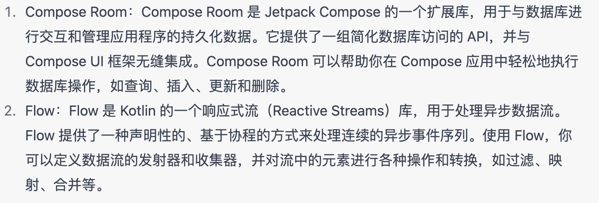
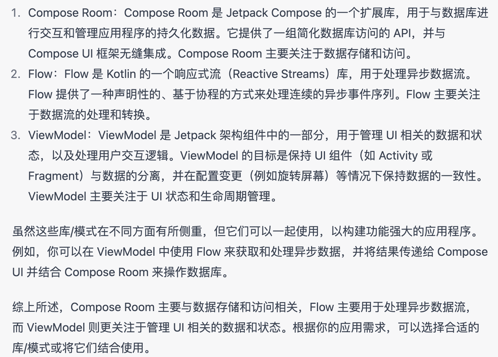

# Flow

数据流以协程为基础构建，可提供多个值。从概念上来讲，数据流是可通过异步方式进行计算处理的一组数据序列。所发出值的类型必须相同。








```md
import kotlinx.coroutines.*
import kotlinx.coroutines.flow.*

fun main() = runBlocking {
    val secretNumber = (1..10).random()
    var guessedCorrectly = false

    // 创建一个 flow 表示数字猜测
    val guessFlow = flow {
        repeat(10) {
            emit((1..10).random())
        }
    }

    // 处理流中的数据
    guessFlow.takeWhile { !guessedCorrectly }
        .collect { guess ->
            if (guess < secretNumber) {
                println("猜小了")
            } else if (guess > secretNumber) {
                println("猜大了")
            } else {
                println("猜对了！")
                guessedCorrectly = true  // 设置猜对标志为 true
            }
        }
}

```

## StateFlow
```md
<font style="color:#DF2A3F;">convert a Flow to a StateFlow</font>

<font style="color:#DF2A3F;"></font>

```


> 更新: 2023-07-04 15:07:43  
> 原文: <https://www.yuque.com/u3641/dxlfpu/sdbl7ow0m20g68d0>