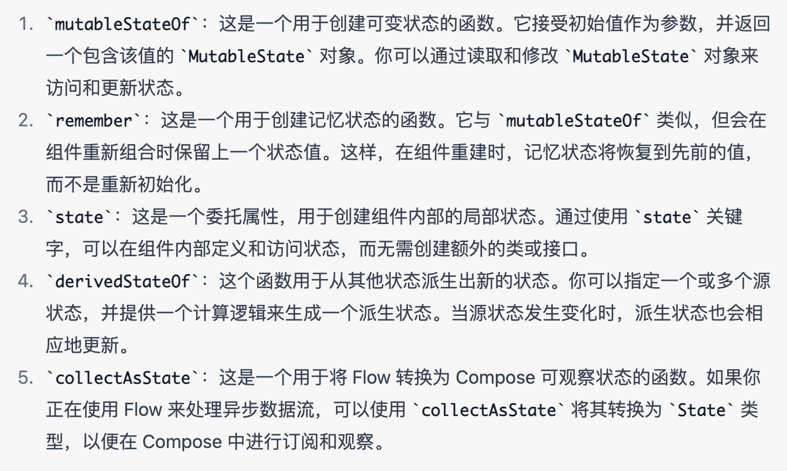

# Compose State


```kotlin
@Composable
fun StateDemo(){
    val countState = remember { mutableStateOf(0) }
    val countState = remember { mutableStateOf(0) }
    Column {
        Button(colors = ButtonDefaults.buttonColors(backgroundColor = MaterialTheme.colors.secondary), onClick = { countState.value++ }) {
            Text("count up")
        }
        Text("You have clicked the Button " + countState.value.toString() + " times")
    }
}

```


+ mutableStateOf
+ mutableStateListOf
+ mutableStateMapOf
+ 
+ toMutableStateList
+ toMutableStateMap
+ 
+ LaunchedEffect





**derivedStateOf 有点类似 computed 计算属性，派生状态**

****

# side-effect


**Other supported types of state**


+ Flow ： collectAsState()
+ Flow ： collectAsStateWithLifecycle()
+ LiveData ： observeAsState()
+ RxJava2 ： subscribeAsState()


# LiveData
LiveData 是一个在 Android 架构组件中广泛使用的类，用于以观察者模式提供数据。它可以在应用程序组件之间传递数据，并确保这些组件在数据发生变化时得到通知


在 Jetpack Compose 中，由于其基于函数式编程的特性，LiveData 的使用并不是主要推荐的方式。相反，Compose 推崇使用 State、MutableState、Flow 等更适合响应式 UI 的工具。Flow 提供了一种异步数据流的解决方案，并可以与 Compose 无缝结合。


然而，如果你需要在 Compose 和传统的 Android 架构组件之间进行交互，可以使用 LiveData 的转换器或将其包装到 MutableState 中，以便与 Compose 中的状态管理工具配合使用。


```kotlin
@Composable
fun LiveDataDemo(viewModel: LiveDataViewModel = viewModel()) {
    val title by viewModel.title.observeAsState("")
    TextField(title) {
      //传出输入的内容
        viewModel.onTitleChange(it)
    }
}

class LiveDataViewModel : ViewModel() {
    private val input = MutableLiveData("")
    val title: LiveData<String> = input
    //接收输入框传进来的内容
    fun onTitleChange(msg: String) {
       //告诉MutableLiveData数据发生了改变
        input.value = msg
    }
}

```

# State
```kotlin
class StateViewModel : ViewModel() {
    var title: String by mutableStateOf("")
        private set

    fun onNameChange(msg: String) {
        title = msg
    }
}

@Composable
fun StateDemo(viewModel: StateViewModel = viewModel()) {
    val title =  viewModel.title
    TextField(title) {
        viewModel.onNameChange(it)
    }
}

```

# Flow
```kotlin
class FlowViewModel : ViewModel() {
    private val input = MutableStateFlow("")
    val title: StateFlow<String> = input

    fun onNameChange(msg: String) {
        input.value = msg
    }
}

@Composable
private fun FlowExample(viewModel: FlowViewModel = viewModel()) {
    val title: String by viewModel.title.collectAsState()
    TextField(title) { viewModel.onNameChange(it) }
}

```


> 更新: 2023-07-04 19:00:52  
> 原文: <https://www.yuque.com/u3641/dxlfpu/bwx7rqeq985bima3>