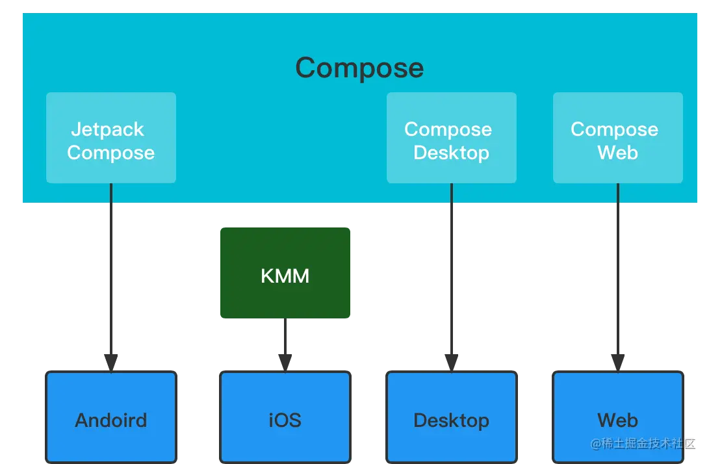
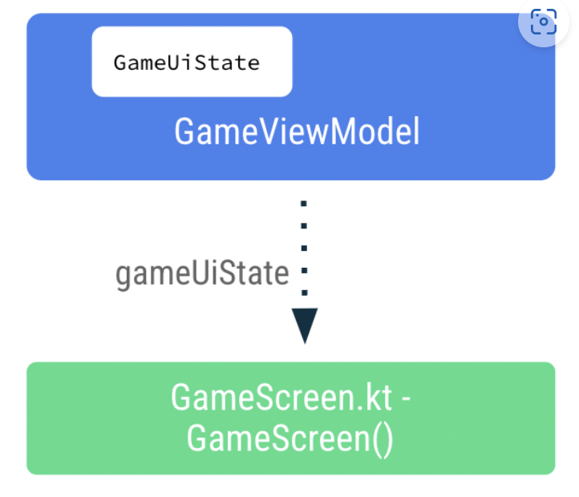

# Jetpack compose

# roadmap
[https://foso.github.io/Jetpack-Compose-Playground/cookbook/loadimage/](https://foso.github.io/Jetpack-Compose-Playground/cookbook/loadimage/)

# 声明式 UI VS 命令式 UI
[https://rengwuxian.com/jetpack-compose-3/](https://rengwuxian.com/jetpack-compose-3/)

[https://developer.android.com/jetpack/compose/tutorial?hl=zh-cn](https://developer.android.com/jetpack/compose/tutorial?hl=zh-cn)

[https://developer.android.com/jetpack/compose/documentation?hl=zh-cn](https://developer.android.com/jetpack/compose/documentation?hl=zh-cn)

```kotlin
var text = "Hello"

Column {
    Text(text)
    Image()
}
```


数据变，视图也会变，所谓的自动订阅值的是 Compose 通过订阅机制来自动更新，无需要像 Java 那样命令式的更新试图，用了很多 Kotin 的特性

# KMM
Compose 相信大家不会陌生，**其实 Compose 也可以分两部分看待， Jetpack Compose 和 Compose Multiplatform**：

+ 由 Android 官方维护的 Jetpack Compose
+ 由 JetBrains 维护的 [compose-jb](https://link.juejin.cn/?target=https%3A%2F%2Fgithub.com%2FJetBrains%2Fcompose-jb)实现的 Compose Multiplatform





iOS 还处于 alpha

web 处于 experiment


# Preview
```kotlin
@Preview
@Composable
fun Greeting(name: String) {
    Text(text = "Hello $name!")
}
```


# 基础组件
+ Alertdialog
+ Button
+ Card
+ Icon
+ Image
+ Text
+ TextField
+ 

# 布局组件
    - Box
    - Row
    - Column
    - Spacer
    - TopAppBar

# Dagger Hilt
# 架构
## 架构1
架构：MVI

inject：dagger hilt

network：retrofit

data：Room 、data store

task：work manager

navigation：compose-destinations ，这是国外一个开源封装库，简化了 compose navigation 的使用


Lifecycle + livedata + viewmodel 好用


## 架构2
Android 原生 Kotlin(Coroutines/serialization),

Jetpack(Compose/ViewModel/Room/Hilt/Navigation) 一把梭

跨端项目(含桌面) Flutter 状态管理 Riverpod


## 架构3
组件化+模块化（ ARouter +

网络请求 Kotlin+协程+Flow+Retrofit

Jetpack+MVVM 架构

ROOM

ViewBinding&DataBinding

热更 tinker

插件化 shadow

日志组件 mars 里的 xlog

sp MMKV

webview 腾讯 X5 内核


# composition and recomposition
合成和重组


## mutableStateOf()
Compose 会观察值的所有更改并触发重组以更新界面

```kotlin
var amountInput: MutableState<String> = mutableStateOf("0")
var amountInput = mutableStateOf("0")


TextField(
   value = amountInput.value,
   // onValueChange = {},
   onValueChange = { amountInput.value = it },
)
```

Compose 会跟踪每个读取状态 value 属性的**<font style="color:#DF2A3F;">可组合项</font>**，并在其 value 更改时**<font style="color:#DF2A3F;">触发重组</font>**

**<font style="color:#DF2A3F;"></font>**

## 使用 remember 函数保存状态
避免重组后值被清空

```kotlin
@Composable
fun EditNumberField() {
   var amountInput by remember { mutableStateOf("") }
   TextField(
       value = amountInput,
       onValueChange = { amountInput = it },
   )
}
```


## 状态提升 (state hoisting)
其他可组合项需要访问可组合项中的状态时，您需要考虑将可组合函数中的状态提升或提取出来

状态提升是一种将状态上移以使组件变为无状态的模式。


最普适的架构原则是：**分离关注点**和**通过模型驱动界面**。


# ViewModel
```kotlin
import androidx.lifecycle.ViewModel
import kotlinx.coroutines.flow.MutableStateFlow

class GameViewModel : ViewModel() {
}

data class GameUiState(
   val currentScrambledWord: String = ""
)


// Game UI state
private val _uiState = MutableStateFlow(GameUiState())
val uiState: StateFlow<GameUiState> = _uiState.asStateFlow()

```


StateFlow 可观察数据流，可发出当前状态更新和新状态更新。

其 value 属性反映了当前状态值。如需更新状态并将其发送到数据流



[https://github.com/google-developer-training/basic-android-kotlin-compose-training-unscramble/blob/main/app/src/main/java/com/example/unscramble/ui/GameViewModel.kt](https://github.com/google-developer-training/basic-android-kotlin-compose-training-unscramble/blob/main/app/src/main/java/com/example/unscramble/ui/GameViewModel.kt)


# Navigation
+ **<font style="color:rgb(92, 92, 92);">NavController</font>**<font style="color:rgb(92, 92, 92);">：负责在目标页面（即应用中的屏幕）之间导航。</font>
+ **<font style="color:rgb(92, 92, 92);">NavGraph</font>**<font style="color:rgb(92, 92, 92);">：用于映射要导航到的可组合项目标页面。</font>
+ **<font style="color:rgb(92, 92, 92);">NavHost</font>**<font style="color:rgb(92, 92, 92);">：此可组合项充当容器，用于显示 NavGraph 的当前目标页面。</font>

<font style="color:rgb(92, 92, 92);"></font>

## <font style="color:rgb(92, 92, 92);">定义路线</font>
```kotlin
enum class CupcakeScreen() {
    Start,
    Flavor,
    Pickup,
    Summary
}
```


## NavHost
```kotlin
@Composable
fun CupcakeApp(
    viewModel: OrderViewModel = viewModel(),
    navController: NavHostController = rememberNavController()
) {
    // Get current back stack entry
    val backStackEntry by navController.currentBackStackEntryAsState()
    // Get the name of the current screen
    val currentScreen = CupcakeScreen.valueOf(
        backStackEntry?.destination?.route ?: CupcakeScreen.Start.name
    )

    Scaffold(
        topBar = {
            CupcakeAppBar(
                currentScreen = currentScreen,
                canNavigateBack = navController.previousBackStackEntry != null,
                navigateUp = { navController.navigateUp() }
            )
        }
    ) { innerPadding ->
        val uiState by viewModel.uiState.collectAsState()

        NavHost(
            navController = navController,
            startDestination = CupcakeScreen.Start.name,
            modifier = Modifier.padding(innerPadding)
        ) {
            composable(route = CupcakeScreen.Start.name) {
                StartOrderScreen(
                    quantityOptions = DataSource.quantityOptions,
                    onNextButtonClicked = {
                        viewModel.setQuantity(it)
                        navController.navigate(CupcakeScreen.Flavor.name)
                    },
                    modifier = Modifier
                        .fillMaxSize()
                        .padding(dimensionResource(R.dimen.padding_medium))
                )
            }
            composable(route = CupcakeScreen.Flavor.name) {
                val context = LocalContext.current
                SelectOptionScreen(
                    subtotal = uiState.price,
                    onNextButtonClicked = { navController.navigate(CupcakeScreen.Pickup.name) },
                    onCancelButtonClicked = {
                        cancelOrderAndNavigateToStart(viewModel, navController)
                    },
                    options = DataSource.flavors.map { id -> context.resources.getString(id) },
                    onSelectionChanged = { viewModel.setFlavor(it) },
                    modifier = Modifier.fillMaxHeight()
                )
            }
            composable(route = CupcakeScreen.Pickup.name) {
                SelectOptionScreen(
                    subtotal = uiState.price,
                    onNextButtonClicked = { navController.navigate(CupcakeScreen.Summary.name) },
                    onCancelButtonClicked = {
                        cancelOrderAndNavigateToStart(viewModel, navController)
                    },
                    options = uiState.pickupOptions,
                    onSelectionChanged = { viewModel.setDate(it) },
                    modifier = Modifier.fillMaxHeight()
                )
            }
            composable(route = CupcakeScreen.Summary.name) {
                val context = LocalContext.current
                OrderSummaryScreen(
                    orderUiState = uiState,
                    onCancelButtonClicked = {
                        cancelOrderAndNavigateToStart(viewModel, navController)
                    },
                    onSendButtonClicked = { subject: String, summary: String ->
                        shareOrder(context, subject = subject, summary = summary)
                    },
                    modifier = Modifier.fillMaxHeight()
                )
            }
        }
    }
}

private fun cancelOrderAndNavigateToStart(
    viewModel: OrderViewModel,
    navController: NavHostController
) {
    viewModel.resetOrder()
    navController.popBackStack(CupcakeScreen.Start.name, inclusive = false)
}
```

> 导航逻辑不会向应用中的各个屏幕公开。所有导航行为都在 NavHost 中处理。
>

# 参考
[TextField | 你好 Compose](https://jetpackcompose.cn/docs/elements/textfield/)

[Asynchronous Flow | Kotlin](https://kotlinlang.org/docs/flow.html#representing-multiple-values)

[https://developer.android.com/jetpack/compose/state?hl=zh-cn](https://developer.android.com/jetpack/compose/state?hl=zh-cn)


> 更新: 2023-07-04 15:37:09  
> 原文: <https://www.yuque.com/u3641/dxlfpu/xem9ry28y09lba08>