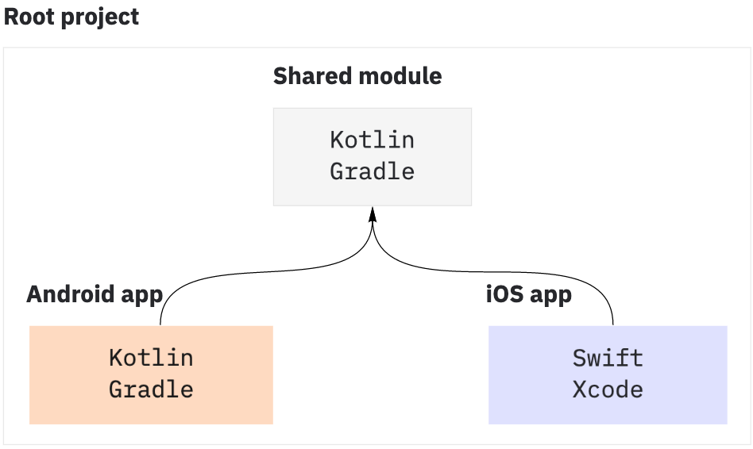
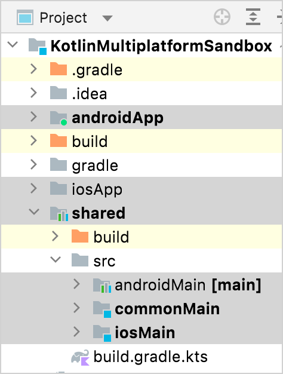
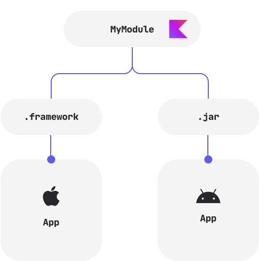

# KMM

# kotlin
```kotlin
fun main() {
    val name = "stranger"        // Declare your first variable
    println("Hi, $name!")        // ...and use it!
    print("Current count:")
    for (i in 0..10) {           // Loop over a range from 0 to 10
        print(" $i")
    }
}
```


# 目录结构




# 多平台
+ JVM
+ JS
+ NATIVE


# What Can Do?


# Compose Multiplatform Example
[https://github.com/JetBrains/compose-multiplatform/blob/master/examples/todoapp/common/compose-ui/src/desktopMain/kotlin/example/todo/common/ui/TodoMainPreview.kt](https://github.com/JetBrains/compose-multiplatform/blob/master/examples/todoapp/common/compose-ui/src/desktopMain/kotlin/example/todo/common/ui/TodoMainPreview.kt)


> 更新: 2023-04-25 11:00:39  
> 原文: <https://www.yuque.com/u3641/dxlfpu/fgvra0bfe49kf08a>