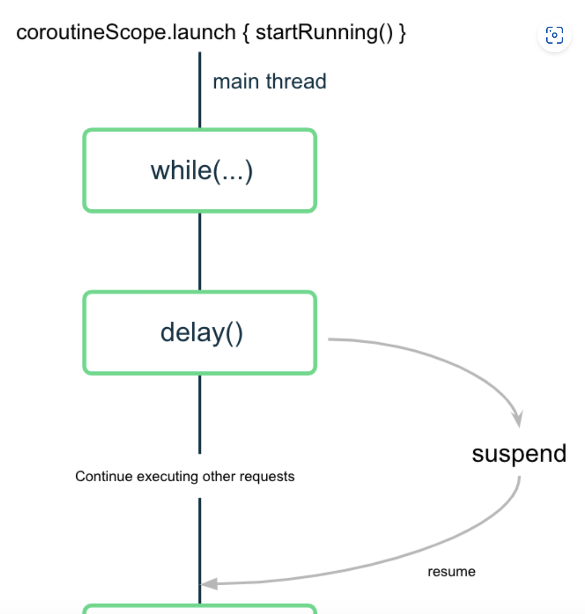
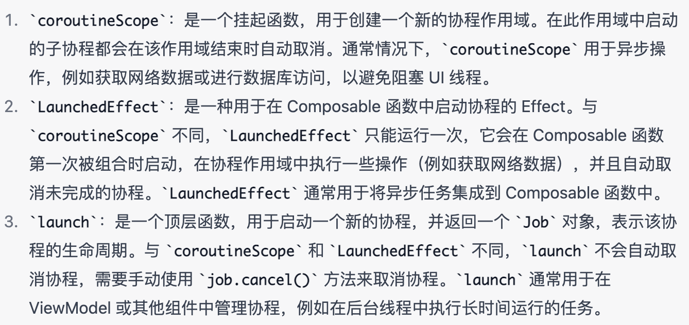
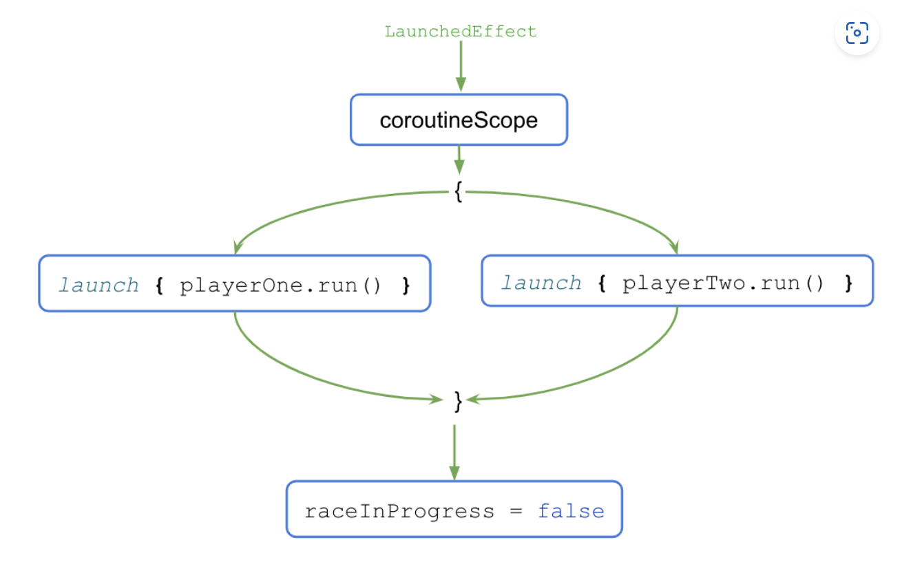

# coroutines 协程

# delay
delay() 实际上是 Kotlin 协程库提供的特殊挂起函数

```kotlin
import kotlinx.coroutines.*

fun main() {
    println("Weather forecast")
    delay(1000)
    println("Sunny")
}
```

****

# suspend function
```kotlin
import kotlinx.coroutines.*

fun main() {
    runBlocking {
        println("Weather forecast")
        // 同步调用
        printForecast()
        // 同步调用
        printTemperature()
    }
}

suspend fun printForecast() {
    delay(1000)
    println("Sunny")
}
```

runBlocking() 用于运行一个事件循环，该事件循环可在每项任务准备好恢复时从中断处继续执行任务，因此可以同时处理多项任务



# launch
如需并发执行任务，请向代码中添加多个 launch() 函数


```kotlin
import kotlinx.coroutines.*

fun main() {
    runBlocking {
        println("Weather forecast")
        launch {
            printForecast()
        }
        launch {
            printTemperature()
        }
        println("Have a good day!")
    }
}

suspend fun printForecast() {
    delay(1000)
    println("Sunny")
}

suspend fun printTemperature() {
    delay(1000)
    println("30\u00b0C")
}

//"Have a good day!" 先打印
```

# async
async() 函数会返回一个类型为 Deferred 的对象

**如果您关心协程何时完成并需要从中返回的值，请使用协程库中的 async() 函数。**

```kotlin
import kotlinx.coroutines.*

fun main() {
    runBlocking {
        println("Weather forecast")
        val forecast: Deferred<String> = async {
            getForecast()
        }
        val temperature: Deferred<String> = async {
            getTemperature()
        }
        println("${forecast.await()} ${temperature.await()}")
        println("Have a good day!")
    }
}

suspend fun getForecast(): String {
    delay(1000)
    return "Sunny"
}

Weather forecast
Have a good day!
Sunny
30°C
```

表现了 launch() 具有“触发后不理”的性质。您可以使用 launch() 触发一个新协程，而无需担心其工作何时完成。

# promise.all
```kotlin
import kotlinx.coroutines.*

fun main() {
    runBlocking {
        println("Weather forecast")
        println(getWeatherReport())
        println("Have a good day!")
    }
}

suspend fun getWeatherReport() = coroutineScope {
    val forecast = async { getForecast() }
    val temperature = async { getTemperature() }
    "${forecast.await()} ${temperature.await()}"
}

suspend fun getForecast(): String {
    delay(1000)
    return "Sunny"
}

suspend fun getTemperature(): String {
    delay(1000)
    return "30\u00b0C"
}

Weather forecast
Sunny 30°C
Have a good day!
```

# try-catch
```kotlin
import kotlinx.coroutines.*

fun main() {
    runBlocking {
        println("Weather forecast")
        println(getWeatherReport())
        println("Have a good day!")
    }
}

suspend fun getWeatherReport() = coroutineScope {
    val forecast = async { getForecast() }
    val temperature = async {
        try {
            getTemperature()
        } catch (e: AssertionError) {
            println("Caught exception $e")
            // 仍然返回
            "{ No temperature found }"
        }
    }

    "${forecast.await()} ${temperature.await()}"
}

suspend fun getForecast(): String {
    delay(1000)
    return "Sunny"
}

suspend fun getTemperature(): String {
    delay(500)
    throw AssertionError("Temperature is invalid")
    return "30\u00b0C"
}
```

# cancel
```kotlin
...

suspend fun getWeatherReport() = coroutineScope {
    val forecast = async { getForecast() }
    val temperature = async { getTemperature() }

    delay(200)
    temperature.cancel()

    "${forecast.await()}"
}

...
```

# 工作器线程
```kotlin
...

fun main() {
    runBlocking {
        launch {
            withContext(Dispatchers.Default) {
                delay(1000)
                println("10 results found.")
            }
        }
        println("Loading...")
    }
}
```

withContext(Dispatchers.Default) 块中的这部分代码是在一个默认调度程序工作器线程上的协程中执行的


默认调度程序工作器线程不是主线程


# LaunchedEffect
LaunchedEffect() 可组合项


LaunchedEffect 是 Jetpack Compose 中的一种 Effect，它会在 Composable 函数第一次被组合时启动一个协程，并在协程作用域中执行一些操作。通常情况下，LaunchedEffect 用于启动异步任务或进行耗时操作，例如获取网络数据、从本地存储读取数据等。


使用 LaunchedEffect 可以使异步操作与 UI 线程分离，避免阻塞界面响应，提高用户体验。LaunchedEffect 还可以自动取消未完成的协程，避免内存泄漏和资源浪费。


```kotlin
@Composable
fun LaunchedEffect(key: Any?, effect: suspend () -> Unit)

@Composable
fun MyScreen() {
    val data by remember { mutableStateOf("") }

    LaunchedEffect(Unit) {
        val result = fetchDataFromNetwork()
        data = result
    }

    Text(text = data)
}

```

# coroutineScope
```kotlin
LaunchedEffect(playerOne, playerTwo) {
    // 以并发方式启动两个协程，然后等待它们完成执行
    coroutineScope {
        launch { playerOne.run() }
        launch { playerTwo.run() }
    }
    raceInProgress = false
}
```






> 更新: 2023-06-27 10:25:55  
> 原文: <https://www.yuque.com/u3641/dxlfpu/qyxlnwrvx9wothtk>