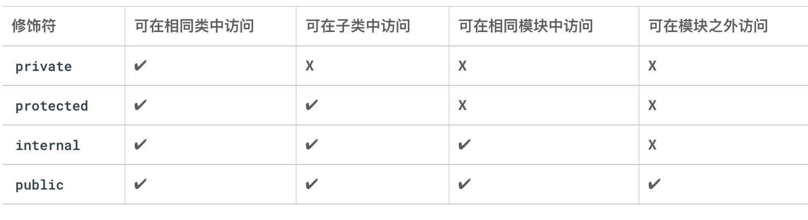

# Kotlin

# 开发者指南
[https://developer.android.com/kotlin/common-patterns?hl=zh-cn](https://developer.android.com/kotlin/common-patterns?hl=zh-cn)

# 关键字
val 关键字用于定义只读变量；其中的变量一旦赋值，就不能再更改。

var 关键字用于定义可变变量。

<font style="color:rgb(92, 92, 92);"></font>

```kotlin
val count: Int = 2
```


# roadmap
1. <font style="color:rgb(55, 65, 81);background-color:rgb(247, 247, 248);">基础语法和语言特性：</font>
    - <font style="color:rgb(55, 65, 81);background-color:rgb(247, 247, 248);">学习 Kotlin 的基本语法，包括变量、函数、条件语句、循环等。</font>
    - <font style="color:rgb(55, 65, 81);background-color:rgb(247, 247, 248);">理解 Kotlin 的空安全机制和类型推断特性。</font>
    - <font style="color:rgb(55, 65, 81);background-color:rgb(247, 247, 248);">掌握面向对象编程（OOP）的概念，如类、继承、多态等。</font>
2. <font style="color:rgb(55, 65, 81);background-color:rgb(247, 247, 248);">标准库和集合操作：</font>
    - <font style="color:rgb(55, 65, 81);background-color:rgb(247, 247, 248);">学习 Kotlin 标准库中常用的函数和工具类，例如字符串处理、文件操作、日期时间处理等。</font>
    - <font style="color:rgb(55, 65, 81);background-color:rgb(247, 247, 248);">熟悉 Kotlin 的集合框架，包括列表、集合、映射等，并掌握其常用操作和函数。</font>
    - <font style="color:rgb(55, 65, 81);background-color:rgb(247, 247, 248);">理解 Kotlin 中的函数式编程概念和相关的高阶函数。</font>
3. <font style="color:rgb(55, 65, 81);background-color:rgb(247, 247, 248);">协程和并发编程：</font>
    - <font style="color:rgb(55, 65, 81);background-color:rgb(247, 247, 248);">学习 Kotlin 的协程（Coroutines），了解它们在异步编程中的作用和优势。</font>
    - <font style="color:rgb(55, 65, 81);background-color:rgb(247, 247, 248);">了解协程的基本概念，如挂起函数、调度器、作用域等。</font>
    - <font style="color:rgb(55, 65, 81);background-color:rgb(247, 247, 248);">掌握协程的使用方法，包括并发任务、异步操作、数据流处理等。</font>
4. <font style="color:rgb(55, 65, 81);background-color:rgb(247, 247, 248);">Android 开发：</font>
    - <font style="color:rgb(55, 65, 81);background-color:rgb(247, 247, 248);">如果你有兴趣进行 Android 应用开发，学习 Kotlin 在 Android 开发中的应用。</font>
    - <font style="color:rgb(55, 65, 81);background-color:rgb(247, 247, 248);">了解 Kotlin Android 扩展（Kotlin Android Extensions）和 Jetpack 组件，如ViewModel、LiveData、Room 等。</font>
    - <font style="color:rgb(55, 65, 81);background-color:rgb(247, 247, 248);">学习使用 Kotlin 编写 Android UI 布局和交互逻辑。</font>
5. <font style="color:rgb(55, 65, 81);background-color:rgb(247, 247, 248);">高级主题和框架：</font>
    - <font style="color:rgb(55, 65, 81);background-color:rgb(247, 247, 248);">深入学习 Kotlin 的函数式编程概念，如 Lambda 表达式、函数组合、惰性求值等。</font>
    - <font style="color:rgb(55, 65, 81);background-color:rgb(247, 247, 248);">探索 Kotlin 的 DSL（Domain Specific Language）功能，并了解其在各种领域中的应用。</font>
    - <font style="color:rgb(55, 65, 81);background-color:rgb(247, 247, 248);">学习并实践使用流行的 Kotlin 框架，如Ktor（Web开发）、Exposed（数据库访问）等。</font>

# fun
```kotlin
fun birthdayGreeting(name: String = "Rover", age: Int): String {
    return "Happy Birthday, $name! You are now $age years old!"
}
```

# 字符串
```kotlin
fun main() {
    val numberOfAdults = "20"
    val numberOfKids = "30"
    val total = numberOfAdults + numberOfKids
    println("The total party size is: $total")

    val baseSalary = 5000
    val bonusAmount = 1000
    val totalSalary = "$baseSalary + $bonusAmount"
}
```

# 关键字
[https://kotlinlang.org/docs/keyword-reference.html#soft-keywords](https://kotlinlang.org/docs/keyword-reference.html#soft-keywords)


# 条件
when语句

```kotlin
fun main() {
    val trafficLightColor = "Black"

    when (trafficLightColor) {
        "Red" -> println("Stop")
    }
}
```


# ::
:: 是 Kotlin 中的一种语法，用于引用函数、属性或类等实体的名称而不执行它。它可以用于多种上下文中。


+ 引用函数
+ 引用属性


```kotlin
fun greet(name: String) {
    println("Hello, $name!")
}

val functionRef = ::greet // Function reference
functionRef("Alice") // Calls the greet() function with "Alice" as argument


class Person(val name: String)

val propertyRef = Person::name // Property reference
val person = Person("Alice")
println(propertyRef(person)) // Prints "Alice"

```

# null / ?. / 非 null 断言运算符
```kotlin
fun main() {
    var favoriteActor: String? = "Sandra Oh"
    favoriteActor = null

    // 可选操作符
    var favoriteActor: String? = "Sandra Oh"
    println(favoriteActor?.length)    

    // 非空判断
    var favoriteActor: String? = "Sandra Oh"
    println(favoriteActor!!.length)   

    // 或者使用 if-else 判断
    val favoriteActor: String? = "Sandra Oh"

    val lengthOfName = if(favoriteActor != null) {
      favoriteActor.length
    } else {
      0
    }    

    // 默认赋值
	val lengthOfName = favoriteActor?.length ?: 0    
}
```

# 类和对象
```kotlin
class SmartDevice {
    ...
}

class SmartDevice(val name: String, val category: String) {
    // empty body
    val name = "Android TV"
    var deviceStatus = "online"

    // getter / setter
    var speakerVolume = 2
    get() = field
    set(value) {
        field = value
    }
    
    fun turnOn() {

    }    
}

// 辅助构造函数
class SmartDevice(val name: String, val category: String) {
    var deviceStatus = "online"

    constructor(name: String, category: String, statusCode: Int) : this(name, category) {
        deviceStatus = when (statusCode) {
            0 -> "offline"
            1 -> "online"
            else -> "unknown"
        }
    }
    ...
}

// 继承
class SmartTvDevice(deviceName: String, deviceCategory: String) :
    SmartDevice(name = deviceName, category = deviceCategory) {

    var speakerVolume = 2
        set(value) {
            if (value in 0..100) {
                field = value
            }
    	}

    fun increaseSpeakerVolume() {
        speakerVolume++
        println("Speaker volume increased to $speakerVolume.")
    }        
}

fun main() {
    val smartTvDevice = SmartDevice()
    smartTvDevice.turnOn()
}
```


## 组合关系
```kotlin
// Smart Home HAS-A smart TV device and smart light.
class SmartHome(
    val smartTvDevice: SmartTvDevice,
    val smartLightDevice: SmartLightDevice
) {
    ...

}
```

## 覆盖父类的方法
open + override + super

```kotlin
open class SmartDevice {
    ...
    var deviceStatus = "online"

    open val deviceType = "unknown"

    open fun turnOn() {
        // function body
    }

    open fun turnOff() {
        // function body
    }
}

class SmartLightDevice(name: String, category: String) :
    SmartDevice(name = name, category = category) {

    override val deviceType = "Smart Light"

    var brightnessLevel = 0

    override fun turnOn() {
        deviceStatus = "on"

        // 调用父类方法
        super.turnOn()
        brightnessLevel = 2
        println("$name turned on. The brightness level is $brightnessLevel.")
    }

    override fun turnOff() {
        deviceStatus = "off"
        brightnessLevel = 0
        println("Smart Light turned off")
    }

    fun increaseBrightness() {
        brightnessLevel++
    }
}
```

## 可见性修饰符
属性、方法、类、构造函数


属性 private、protected 或 internal


Kotlin 提供了以下四种可见性修饰符：

+ public 默认的可见性修饰符
+ private
+ protected
+ internal



## 属性委托 by
```kotlin
class RangeRegulator(
    initialValue: Int,
    private val minValue: Int,
    private val maxValue: Int
) : ReadWriteProperty<Any?, Int> {
    var fieldData = initialValue

    override fun getValue(thisRef: Any?, property: KProperty<*>): Int {
        return fieldData
    }

    override fun setValue(thisRef: Any?, property: KProperty<*>, value: Int) {
        if (value in minValue..maxValue) {
            fieldData = value
        }
    }
}

class SmartTvDevice(deviceName: String, deviceCategory: String) :
    SmartDevice(name = deviceName, category = deviceCategory) {

    private var speakerVolume by RangeRegulator(initialValue = 0, minValue = 0, maxValue = 100)

    private var channelNumber by RangeRegulator(initialValue = 1, minValue = 0, maxValue = 200)

    ...
}
```

## 枚举类
```kotlin
enum class Difficulty {
    EASY, MEDIUM, HARD
}
```

## 泛型
```kotlin
class Question<T>(
    val questionText: String,
    val answer: T,
    val difficulty: String
)

fun main() {
    val question1 = Question<String>("Quoth the raven ___", "nevermore", "medium")
    val question2 = Question<Boolean>("The sky is green. True or false", false, "easy")
    val question3 = Question<Int>("How many days are there between full moons?", 28, "hard")
}
```

## 数据类
像 Question 这样的类只包含数据。它们没有任何用于执行操作的方法。这些类可以定义为“数据类”。通过将类定义为数据类

> Kotlin 编译器可以做出某些假设，并自动实现某些方法。例如，println() 函数会在后台调用 toString()。当您使用数据类时，系统会根据类的属性自动实现 toString() 和其他方法
>

```kotlin
data class Question<T>(
    val questionText: String,
    val answer: T,
    val difficulty: Difficulty
)
```

数据类也不能是 abstract、open、sealed 或 inner

## 单例对象
对象的语法与类的语法类似。只需使用 object 关键字（而不是 class 关键字）即可。单例对象不能包含构造函数，因为您无法直接创建实例。相反，所有属性都要在大括号内定义并被赋予初始值


```kotlin
object StudentProgress {
    var total: Int = 10
    var answered: Int = 3
}

fun main() {
    ...
    println("${StudentProgress.answered} of ${StudentProgress.total} answered.")
}
```

## 伴生对象
> 在 Kotlin 编程语言中，每个类都有一个伴生对象（Companion Object），它是一个单例对象，与类共享名称。在伴生对象内部定义的属性和方法可以像 Java 静态成员一样使用，而且可以通过类名直接访问，无需实例化该类。
>
> 可以将伴生对象用于存储那些在类级别上存在但又不需要特定实例来访问的成员，例如工厂方法或常量。
>

```kotlin
enum class Difficulty {
    MEDIUM,EASY,HARD
}
data class Question<T>(
    val questionText: String,
    val answer: T,
    val difficulty: Difficulty
)

class Quiz {
    val question1 = Question<String>("Quoth the raven ___", "nevermore", Difficulty.MEDIUM)
    val question2 = Question<Boolean>("The sky is green. True or false", false, Difficulty.EASY)
    val question3 = Question<Int>("How many days are there between full moons?", 28, Difficulty.HARD)

    companion object StudentProgress {
        var total: Int = 10
        var answered: Int = 3
    }
}


fun main() {
    println("${Quiz.answered} of ${Quiz.total} answered.")

}
```


```kotlin
class MyClass {
    companion object {
        const val CONSTANT_VALUE = "This is a constant value"

        fun create(): MyClass {
            return MyClass()
        }
    }
}

println(MyClass.CONSTANT_VALUE)
val instance = MyClass.create()

// 在这个示例中，MyClass 类具有一个名为 companion 的伴生对象，其中包括一个常量属性 CONSTANT_VALUE 和一个工厂方法 create()。

```

## 扩展类的属性和方法
```kotlin
class Quiz {
    companion object StudentProgress {
        var total: Int = 10
        var answered: Int = 3
    }
}

val Quiz.StudentProgress.progressText: String
    get() = "${answered} of ${total} answered"

fun main() {
    println(Quiz.progressText)
}
```

## interface
```kotlin
interface ProgressPrintable {
    val progressText: String
    fun printProgressBar()
}

class Quiz: ProgressPrintable {
    override val progressText: String
            get() = "${answered} of ${total} answered"

    override fun printProgressBar() {
        repeat(Quiz.answered) { print("▓") }
        repeat(Quiz.total - Quiz.answered) { print("▒") }
        println()
        println(progressText)
    }

    companion object StudentProgress {
        var total: Int = 10
        var answered: Int = 3
    }
}

fun main() {
    Quiz().printProgressBar()
}
```

## 函数作用域
```kotlin
fun printQuiz() {
    println(question1.questionText)
    println(question1.answer)
    println(question1.difficulty)
    println()
    println(question2.questionText)
    println(question2.answer)
    println(question2.difficulty)
    println()
    println(question3.questionText)
    println(question3.answer)
    println(question3.difficulty)
    println()
}

fun printQuiz() {
    question1.let {
        println(it.questionText)
        println(it.answer)
        println(it.difficulty)
    }
    println()
    question2.let {
        println(it.questionText)
        println(it.answer)
        println(it.difficulty)
    }
    println()
    question3.let {
        println(it.questionText)
        println(it.answer)
        println(it.difficulty)
    }
    println()
}   
```


**apply 在没有变量的情况下调用对象方法**

```kotlin


interface ProgressPrintable {
    val progressText: String
    fun printProgressBar()
}

enum class Difficulty {
    MEDIUM,EASY,HARD
}

data class Question<T>(
    val questionText: String,
    val answer: T,
    val difficulty: Difficulty
)

class Quiz: ProgressPrintable {
	val question1 = Question<String>("Quoth the raven ___", "nevermore", Difficulty.MEDIUM)
    val question2 = Question<Boolean>("The sky is green. True or false", false, Difficulty.EASY)
    val question3 = Question<Int>("How many days are there between full moons?", 28, Difficulty.HARD)
    
    override val progressText: String
            get() = "${answered} of ${total} answered"

    override fun printProgressBar() {
        repeat(Quiz.answered) { print("▓") }
        repeat(Quiz.total - Quiz.answered) { print("▒") }
        println()
        println(progressText)
    }

    companion object StudentProgress {
        var total: Int = 10
        var answered: Int = 3
    }

    fun printQuiz() {
        question1.let {
            println(it.questionText)
            println(it.answer)
            println(it.difficulty)
        }
        println()
        question2.let {
            println(it.questionText)
            println(it.answer)
            println(it.difficulty)
        }
        println()
        question3.let {
            println(it.questionText)
            println(it.answer)
            println(it.difficulty)
        }
        println()
    }    
}


fun main() {
    // println("${Quiz.answered} of ${Quiz.total} answered.")
    Quiz().apply {
    	printQuiz()
	}
}


```

# 函数
```kotlin
fun main() {
    val trickFunction = ::trick
    // wrong!
    val trickFunction = trick
}

fun trick() {
    println("No treats!")
}

// lambda

```

## lambda
```kotlin
fun main() {
    // correct! trick 现在引用的是变量，而不是函数名称
    val trickFunction = trick
    trickFunction()
}

val trick = {
    println("No treats!")
}

// 只有一个参数 $it
val coins: (Int) -> String = {
    "$it quarters"
}

// 尾随 lambda 语法
// 当函数类型是函数的最后一个参数时，您可以使用另一个简写选项来编写 lambda。
// 在这种情况下，您可以将 lambda 表达式放在右圆括号后面以调用函数
val treatFunction = trickOrTreat(false) { "$it quarters" }
```


## 返回值
返回值类型为 Unit，因为函数不返回任何内容。如果您的参数接受两个 Int 参数并返回 Int，则其数据类型为 (Int, Int) -> Int

# 集合
+ 如何创建和修改数组。
+ 如何使用 List 和 MutableList。
+ 如何使用 Set 和 MutableSet。
+ 如何使用 Map 和 MutableMap。


数组

```kotlin
val rockPlanets = arrayOf<String>("Mercury", "Venus", "Earth", "Mars")
val gasPlanets = arrayOf("Jupiter", "Saturn", "Uranus", "Neptune")
val solarSystem = rockPlanets + gasPlanets
println(solarSystem[0])
solarSystem[3] = "Little Earth"

```


List

列表会为您执行所有这些操作，但在后台，它只是一个在需要时换成新数组的数组

```kotlin
fun main() {
    val solarSystem = listOf("Mercury", "Venus", "Earth", "Mars", "Jupiter", "Saturn", "Uranus", "Neptune")
    println(solarSystem.size)
    
    println(solarSystem.get(3))
    println(solarSystem[3])
    
    println(solarSystem.indexOf("Pluto"))
    
    for (planet in solarSystem) {
        println(planet)
    }    

	solarSystem.add("Pluto")    

    solarSystem[3] = "Future Moon"

    solarSystem.removeAt(9)
    solarSystem.remove("Future Moon")

    println(solarSystem.contains("Pluto"))
    println("Future Moon" in solarSystem)
}
```


set

```kotlin
fun main() {
	val solarSystem = mutableSetOf("Mercury", "Venus", "Earth", "Mars", "Jupiter", "Saturn", "Uranus", "Neptune")
	println(solarSystem.size)

    solarSystem.add("Pluto")

}
```


map

```kotlin
val solarSystem = mutableMapOf(
    "Mercury" to 0,
    "Venus" to 0,
    "Earth" to 1,
    "Mars" to 2,
    "Jupiter" to 79,
    "Saturn" to 82,
    "Uranus" to 27,
    "Neptune" to 14
)

solarSystem["Pluto"] = 5

```


## 高阶函数
+ forEach
+ map
+ filter
+ groupBy
+ sortedBy
+ fold 可将集合转换为单个值。又称为 reduce


```kotlin
val softBakedMenu = cookies.filter {
    it.softBaked
}

val totalPrice = cookies.fold(0.0) {total, cookie ->
    total + cookie.price
}
```

# 官网
[https://kotlinlang.org/docs/basic-types.html#floating-point-types](https://kotlinlang.org/docs/basic-types.html#floating-point-types)


> 更新: 2023-07-04 15:39:42  
> 原文: <https://www.yuque.com/u3641/dxlfpu/un2u1hgldcuuh4ww>