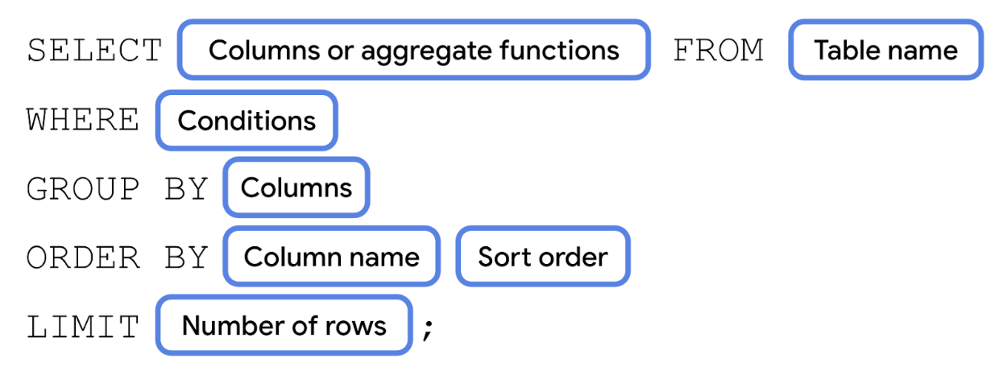
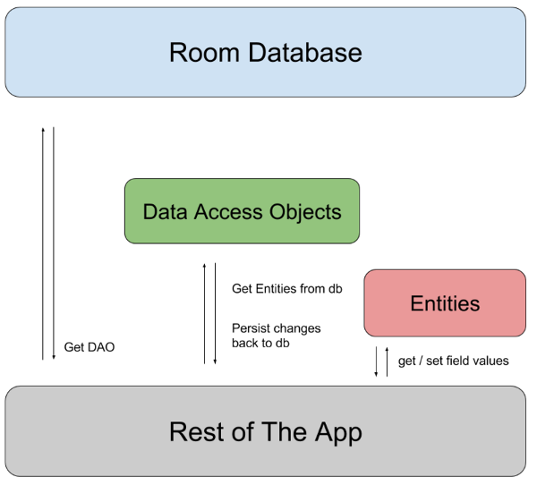
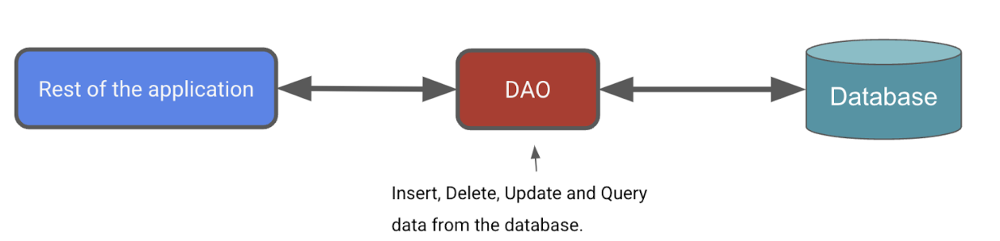

# Room

# 持久化
[https://developer.android.com/guide/topics/data?hl=zh-cn](https://developer.android.com/guide/topics/data?hl=zh-cn)

数据和文件

# SQL
SQLite 提供了一个关系型数据库

| **<font style="color:rgb(92, 92, 92);">Kotlin 数据类型</font>** | **<font style="color:rgb(92, 92, 92);">SQLite 数据类型</font>** |
| :--- | :--- |
| Int | <font style="color:rgb(92, 92, 92);">INTEGER</font> |
| String | <font style="color:rgb(92, 92, 92);">VARCHAR 或 TEXT</font> |
| Boolean | <font style="color:rgb(92, 92, 92);">BOOLEAN</font> |
| Float<font style="color:rgb(92, 92, 92);">、</font>Double | <font style="color:rgb(92, 92, 92);">REAL</font> |


<font style="color:rgb(92, 92, 92);">SQL 聚合函数示例包括：</font>

+ <font style="background-color:rgb(232, 234, 237);">COUNT()</font><font style="color:rgb(92, 92, 92);">：返回行总数，可与</font><font style="color:rgb(92, 92, 92);"> </font><font style="background-color:rgb(232, 234, 237);">*</font><font style="color:rgb(92, 92, 92);"> </font><font style="color:rgb(92, 92, 92);">配合使用以统计所有列。</font>
+ <font style="background-color:rgb(232, 234, 237);">SUM()</font><font style="color:rgb(92, 92, 92);">：返回所选列中所有行的值的总和。</font>
+ <font style="background-color:rgb(232, 234, 237);">AVG()</font><font style="color:rgb(92, 92, 92);">：返回所选列中所有值的平均值。</font>
+ <font style="background-color:rgb(232, 234, 237);">MIN()</font><font style="color:rgb(92, 92, 92);">：返回所选列中的最小值。</font>
+ <font style="background-color:rgb(232, 234, 237);">MAX()</font><font style="color:rgb(92, 92, 92);">：返回所选列中的最大值。</font>

<font style="color:rgb(92, 92, 92);"></font>

```sql
SELECT DISTINCT sender FROM email;

SELECT * FROM email
WHERE folder = 'inbox';
```




# Room
Room 是一个持久性库，属于 Android Jetpack 的一部分。Room 是 SQLite 数据库之上的一个抽象层


[https://developer.android.com/training/data-storage/room?hl=zh-cn](https://developer.android.com/training/data-storage/room?hl=zh-cn)


You need to know:


+ How to create and use composables.
+ How to navigate between composables, and pass data between them.
+ How to use architecture components including ViewModel, Flow, StateFlow and StateUi.
+ How to use coroutines for long-running tasks.
+ SQLite database and the SQLite query language





## @Entity 
对于每个 Entity 类，该应用都会创建一个数据库表来保存这些项

```kotlin
@Entity(tableName = "items")
data class Item(
    @PrimaryKey(autoGenerate = true)
    val id: Int = 0,
    val name: String,
    val price: Double,
    val quantity: Int
)

```

## @DAO
数据访问对象

数据访问对象 (DAO) 是一种模式，其作用是通过提供抽象接口将持久性层与应用的其余部分分离



**DAO 是 Room 的主要组件，负责定义用于访问数据库的接口。**

```kotlin
@Dao
interface UserDao {
    @Insert
    fun insertAll(vararg users: User)

    @Delete
    fun delete(user: User)

    @Query("SELECT * FROM user")
    fun getAll(): List<User>
}
```

## @Database
```kotlin
@Database(entities = [Item::class], version = 1, exportSchema = false)
abstract class InventoryDatabase : RoomDatabase() {

    abstract fun itemDao(): ItemDao

    companion object {
        @Volatile
        private var Instance: InventoryDatabase? = null

        fun getDatabase(context: Context): InventoryDatabase {
            // if the Instance is not null, return it, otherwise create a new database instance.
            return Instance ?: synchronized(this) {
                Room.databaseBuilder(context, InventoryDatabase::class.java, "item_database")
                    /**
                     * Setting this option in your app's database builder means that Room
                     * permanently deletes all data from the tables in your database when it
                     * attempts to perform a migration with no defined migration path.
                     */
                    .fallbackToDestructiveMigration()
                    .build()
                    .also { Instance = it }
            }
        }
    }
}
```


> 更新: 2023-07-04 15:07:45  
> 原文: <https://www.yuque.com/u3641/dxlfpu/clty2gt2wrws1m60>