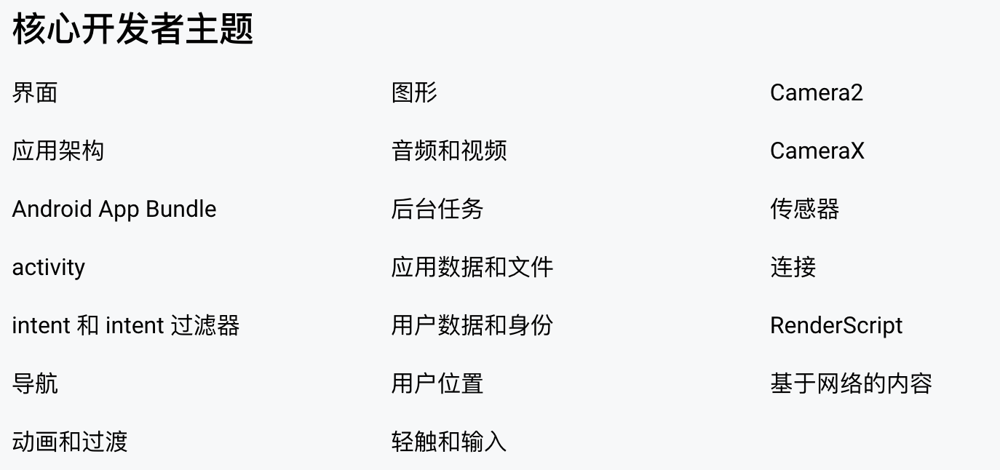

# android roadmap

# 开发者指南
[https://developer.android.com/guide?hl=zh-cn](https://developer.android.com/guide?hl=zh-cn)

+ 应用基础
    - 应用资源
        * 您可以通过 XML 文件定义 Activity 界面的动画、菜单、样式、颜色和布局
        * 支持许多不同的备用资源限定符
        * 您在 Android 项目中加入的每一项资源，SDK 构建工具均会定义唯一的整型 ID
    - 清单文件
    - 本地化
+ 设备
+ 应用架构
    - 指南
        * 界面层
        * 网域层
        * 数据层
    - 架构组件
        * 界面层
            + 生命周期包
                - ViewModel
                - LiveData
                    * 一种可观察的数据存储器类
        * 数据层
            + DataStore
                - Jetpack DataStore 是一种数据存储解决方案，允许您使用协议缓冲区存储键值对或类型化对象。DataStore 使用 Kotlin 协程和 Flow 以异步、一致的事务方式存储数据。
                - 如果您当前在使用 SharedPreferences 存储数据，请考虑迁移到 DataStore。
            + WorkManager
    - 入口
        * activity
        * 快捷方式
    - 导航
    - 依赖注入 DI
        * 类通常需要引用其他类，这些必需类称为依赖项
+ 界面
+ 核心
    - 兼容性
    - intent
    - 服务
    - 后台任务
    - 权限
    - 应用数据和文件
        * 存储空间
            + 应用专属
            + 共享存储
            + 数据库
            + 偏好设置 
+ 最佳实践
    - 测试
        * UI 测试，又叫插桩测试
        * 单元测试，又叫本地测试
    - 性能
    - 无障碍
    - 隐私
    - 安全
    - 数十亿用户
        * 低成本设备
            + 应用应在 RAM 不超过 1GB 的设备上流畅运行
            + 设备上应用的大小应小于 40MB
            + 以 60 帧/秒作为低成本设备上的目标

# 基础
## 应用组件
+ Activity
    - 例如，电子邮件应用可能有一个显示新电子邮件列表的 Activity、一个用于撰写电子邮件的 Activity 以及一个用于阅读电子邮件的 Activity
+ 服务
    - 用于因各种原因使应用在后台保持运行状态。它是一种在后台运行的组件
+ 广播接收器
+ 内容提供程序

## 应用资源
```kotlin
MyProject/
    src/
        MyActivity.java
    res/
        drawable/
            graphic.png
        layout/
            main.xml
            info.xml
        mipmap/
            icon.png
        values/
            strings.xml

```

## 应用清单文件 manifest





> 更新: 2023-06-28 18:03:16  
> 原文: <https://www.yuque.com/u3641/dxlfpu/rnmtg0wg5h4y2yfx>