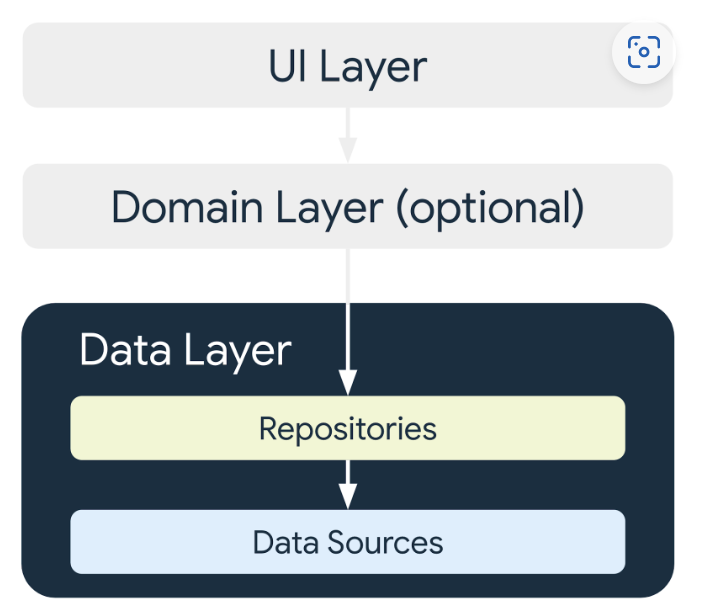
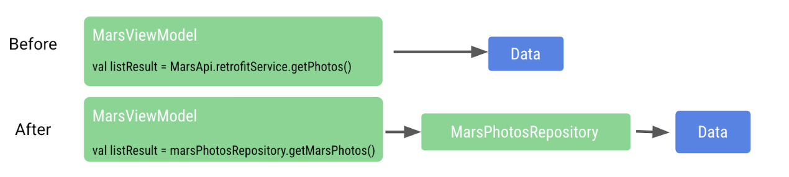

# retrofit

MarsViewModel

```kotlin
sealed interface MarsUiState {
    data class Success(val photos: List<MarsPhoto>) : MarsUiState
    object Error : MarsUiState
    object Loading : MarsUiState
}

class MarsViewModel(private val marsPhotosRepository: MarsPhotosRepository) : ViewModel() {
    /** The mutable State that stores the status of the most recent request */
    var marsUiState: MarsUiState by mutableStateOf(MarsUiState.Loading)
        private set

    /**
     * Call getMarsPhotos() on init so we can display status immediately.
     */
    init {
        getMarsPhotos()
    }

    /**
     * Gets Mars photos information from the Mars API Retrofit service and updates the
     * [MarsPhoto] [List] [MutableList].
     */
    fun getMarsPhotos() {
        viewModelScope.launch {
            marsUiState = MarsUiState.Loading
            marsUiState = try {
                MarsUiState.Success(marsPhotosRepository.getMarsPhotos())
            } catch (e: IOException) {
                MarsUiState.Error
            } catch (e: HttpException) {
                MarsUiState.Error
            }
        }
    }

    /**
     * Factory for [MarsViewModel] that takes [MarsPhotosRepository] as a dependency
     */
    companion object {
        val Factory: ViewModelProvider.Factory = viewModelFactory {
            initializer {
                val application = (this[APPLICATION_KEY] as MarsPhotosApplication)
                val marsPhotosRepository = application.container.marsPhotosRepository
                MarsViewModel(marsPhotosRepository = marsPhotosRepository)
            }
        }
    }
}
```

# JSON 解析
+ <font style="color:rgb(92, 92, 92);">在 Kotlin 中，数据序列化工具位于单独的组件</font><font style="color:rgb(92, 92, 92);"> </font>[kotlinx.serialization](https://github.com/Kotlin/kotlinx.serialization)<font style="color:rgb(92, 92, 92);"> </font><font style="color:rgb(92, 92, 92);">中。</font><font style="color:rgb(92, 92, 92);">kotlinx.serialization 提供了一系列库，用于将 JSON 字符串转换为 Kotlin 对象。</font>
+ <font style="color:rgb(92, 92, 92);">Kotlin 序列化转换器库是一个社区开发的库，适用于 Retrofit：</font>[retrofit2-kotlinx-serialization-converter](https://github.com/JakeWharton/retrofit2-kotlinx-serialization-converter#kotlin-serialization-converter)<font style="color:rgb(92, 92, 92);">。</font>

<font style="color:rgb(92, 92, 92);"></font>

## <font style="color:rgb(92, 92, 92);">gson</font>


# 界面层
这种方法属于关注点分离的设计原则

# 数据层
数据层由一个或多个仓库组成。仓库本身包含零个或多个数据源。





数据通过仓库类公开提供给应用，该类会对数据源进行抽象化处理


ViewModel 不再直接引用 MarsApi 代码





此方法有助于让代码检索与 ViewModel 松散耦合的数据。通过松散耦合，您可以对 ViewModel 或仓库进行更改，而不会对其他部分产生不利影响，只要仓库具有名为 getMarsPhotos() 的函数即可


# 依赖注入
```kotlin
interface Engine {
    fun start()
}

class GasEngine : Engine {
    override fun start() {
        println("GasEngine started!")
    }
}

class Car {
    // 调用类需要调用对象的构造函数，其中包含实现细节。如果构造函数发生更改，调用代码也需要做出更改。
    private val engine = GasEngine()

    fun start() {
        engine.start()
    }
}

fun main() {
    val car = Car()
    car.start()
}

// 另一种方法是将所需的对象作为参数传入。
class Car(private val engine: Engine) {
    fun start() {
        engine.start()
    }
}

fun main() {
    val engine = GasEngine()
    val car = Car(engine)
    car.start()
}


```

<font style="color:rgb(92, 92, 92);"></font>

<font style="color:rgb(92, 92, 92);">传入所需对象的过程称为依赖项注入 (DI)。这种方法也称为</font>[控制反转](https://en.wikipedia.org/wiki/Inversion_of_control)<font style="color:rgb(92, 92, 92);">。</font>

<font style="color:rgb(92, 92, 92);"></font>

## <font style="color:rgb(92, 92, 92);">容器</font>
容器是一个包含应用所需的依赖项的对象。这些依赖项在整个应用中使用，因此它们必须位于所有 activity 都可以使用的通用位置。您可以创建 Application 类的子类并存储对容器的引用。


```kotlin
/**
 * Dependency Injection container at the application level.
 */
interface AppContainer {
    val marsPhotosRepository: MarsPhotosRepository
}

/**
 * Implementation for the Dependency Injection container at the application level.
 *
 * Variables are initialized lazily and the same instance is shared across the whole app.
 */
class DefaultAppContainer : AppContainer {
    private val baseUrl = "https://android-kotlin-fun-mars-server.appspot.com/"

    /**
     * Use the Retrofit builder to build a retrofit object using a kotlinx.serialization converter
     */
    private val retrofit: Retrofit = Retrofit.Builder()
        .addConverterFactory(Json.asConverterFactory("application/json".toMediaType()))
        .baseUrl(baseUrl)
        .build()

    /**
     * Retrofit service object for creating api calls
     */
    private val retrofitService: MarsApiService by lazy {
        retrofit.create(MarsApiService::class.java)
    }

    /**
     * DI implementation for Mars photos repository
     */
    override val marsPhotosRepository: MarsPhotosRepository by lazy {
        NetworkMarsPhotosRepository(retrofitService)
    }
}
```


> 更新: 2023-06-27 19:09:10  
> 原文: <https://www.yuque.com/u3641/dxlfpu/qww6slbso545st9o>