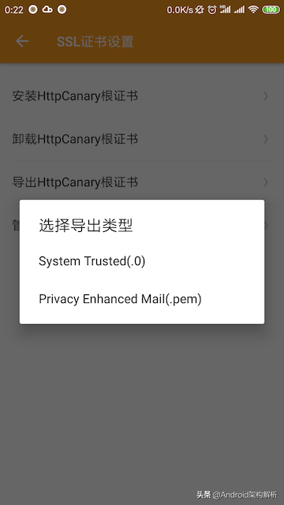

# android https 抓包

Android从7.0开始系统不再信任用户CA证书（应用targetSdkVersion >= 24时生效，如果targetSdkVersion < 24即使系统是7.0+依然会信任）。也就是说即使安装了用户CA证书，在Android 7.0+的机器上，targetSdkVersion >= 24的应用的HTTPS包就抓不到了。


如果我们想抓自己的App，只需要在AndroidManifest中配置networkSecurityConfig即可：

```txt
<?xml version="1.0" encoding="utf-8"?>
<network-security-config>
    <base-config cleartextTrafficPermitted="true">
        <trust-anchors>
            <certificates src="system" />
            <certificates src="user" />
        </trust-anchors>
    </base-config>
</network-security-config> 
```


## 安装到系统CA证书目录
对于Root的机器，这是最完美最佳的解决方案。如果把CA证书安装到系统CA证书目录中，那这个假CA证书就是真正洗白了，不是真的也是真的了。由于系统CA证书格式都是特殊的.0格式，我们必须将抓包工具内置的CA证书以这种格式导出，HttpCanary直接提供了这种导出选项。





> 更新: 2023-03-24 14:22:29  
> 原文: <https://www.yuque.com/u3641/dxlfpu/yhng7p>