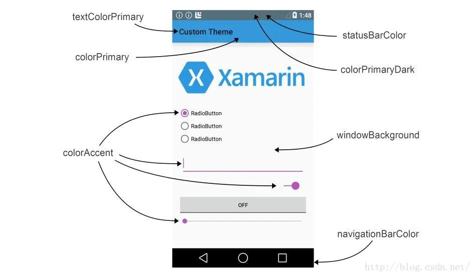
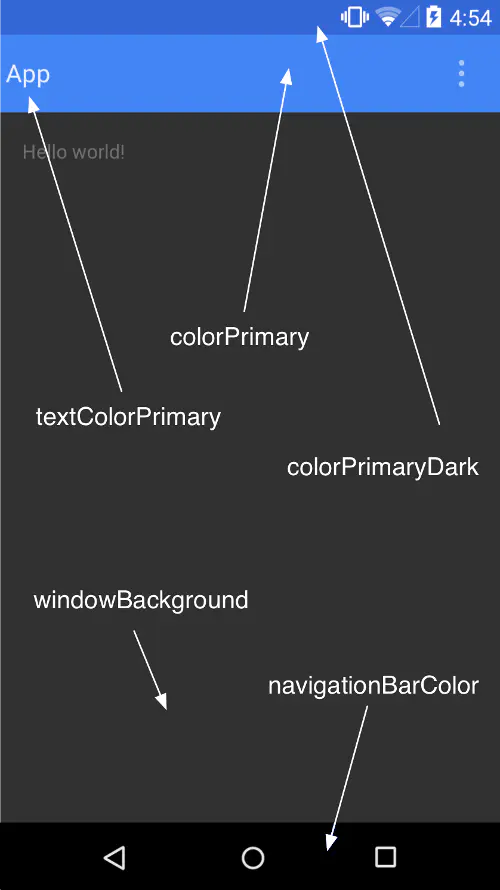

# app theme








```txt
<style name="AppTheme" parent="Theme.AppCompat.Light.NoActionBar">

    <!--状态栏颜色，应用的主要暗色调，statusBarColor默认使用该颜色-->
    <item name="android:colorPrimaryDark">@color/material_animations_primary_dark</item>
    <!--状态栏颜色，默认使用colorPrimaryDark-->
    <item name="android:statusBarColor">@color/material_animations_primary_dark</item>
    
    <!--Appbar背景色，应用的主要色调，actionBar默认使用该颜色-->
    <item name="android:colorPrimary">@color/material_animations_primary</item>
    
    <!--页面背景色-->
    <item name="android:windowBackground">@color/light_grey</item>
    
    <!--底部导航栏颜色-->
    <item name="android:navigationBarColor">@color/navigationColor</item>
    
    <!--应用的主要文字颜色，actionBar的标题文字默认使用该颜色-->
    <item name="android:textColorPrimary">@android:color/black</item>
    
    <!--ToolBar上的Title颜色-->
    <item name="android:textColorPrimaryInverse">@color/text_light</item>
    
    <!--应用的前景色，ListView的分割线，switch滑动区默认使用该颜色-->
    <item name="android:colorForeground">@color/colorForeground</item>
    <!--应用的背景色，popMenu的背景默认使用该颜色-->
    <item name="android:colorBackground">@color/colorForeground</item>
    
    <!--各个控制控件的默认颜色-->
    <item name="android:colorControlNormal">@color/colorControlNormal</item>
    <!--一般控件的选种效果默认采用该颜色-->
    <item name="android:colorAccent">@color/colorAccent</item>
    <!--控件选中时的颜色，默认使用colorAccent-->
    <item name="android:colorControlActivated">@color/colorControlActivated</item>
  
    <!--控件按压时的色调-->
    <item name="android:colorControlHighlight">@color/colorControlHighlight</item>
  
    <!--Button，textView的文字颜色-->
    <item name="android:textColor">@color/text_dark</item>
    
    <!--RadioButton checkbox等控件的文字-->
    <item name="android:textColorPrimaryDisableOnly">@color/text_dark</item>
    
    <!--默认按钮的背景颜色-->
    <item name="android:colorButtonNormal">@color/text_dark</item>
    
    <!--对话框的背景是否变暗-->
    <item name="android:backgroundDimEnabled">true</item>  

    <!--Activity 的切换动画。其引用的 activityAnim 也是 style ，需要继承 parent="@android:style/Animation.Translucent"-->
    <item name="android:windowAnimationStyle">@style/activityAnim</item>

    <!--title 标题栏字体设置-->
    <item name="android:titleTextAppearance">@style/MaterialAnimations.TextAppearance.Title</item>


    <!--允许使用transitions(过渡动画)-->
    <item name="android:windowContentTransitions">true</item>
    <!--是否覆盖执行，其实可以理解成前后两个页面是同步执行还是顺序执行-->
    <item name="android:windowAllowEnterTransitionOverlap">false</item>
    <!--与上面相同。即上一个设置了退出动画，这个设置了进入动画，两者是否同时执行。-->
    <item name="android:windowAllowReturnTransitionOverlap">false</item>
</style>
```


> 更新: 2023-03-24 14:22:28  
> 原文: <https://www.yuque.com/u3641/dxlfpu/qgxh6t>