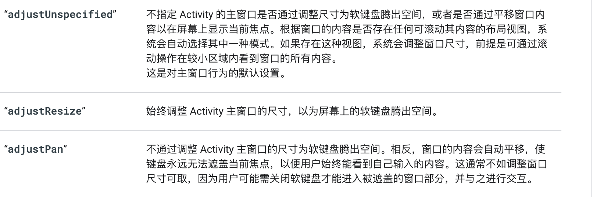

# 键盘

[https://developer.android.com/training/keyboard-input/visibility](https://developer.android.com/training/keyboard-input/visibility)

android:windowSoftInputMode = adjustPan

(enum) - Determines how the software keyboard will impact the layout of your application. This maps to the android:windowSoftInputMode property. Defaults to resize. Valid values: resize, pan.

# Pan

# Resize 默认
例如，要确保系统将布局大小调整为可用空间，以确保所有布局内容均可访问（尽管可能需要滚动），请使用 "adjustResize"：

# 编程的方式修改

[https://www.npmjs.com/package/react-native-android-keyboard-adjust](https://www.npmjs.com/package/react-native-android-keyboard-adjust)

# 参考
[https://www.jianshu.com/p/dddcaac97cdc](https://www.jianshu.com/p/dddcaac97cdc)

> 更新: 2023-03-24 14:20:58  
> 原文: <https://www.yuque.com/u3641/dxlfpu/ahg767>