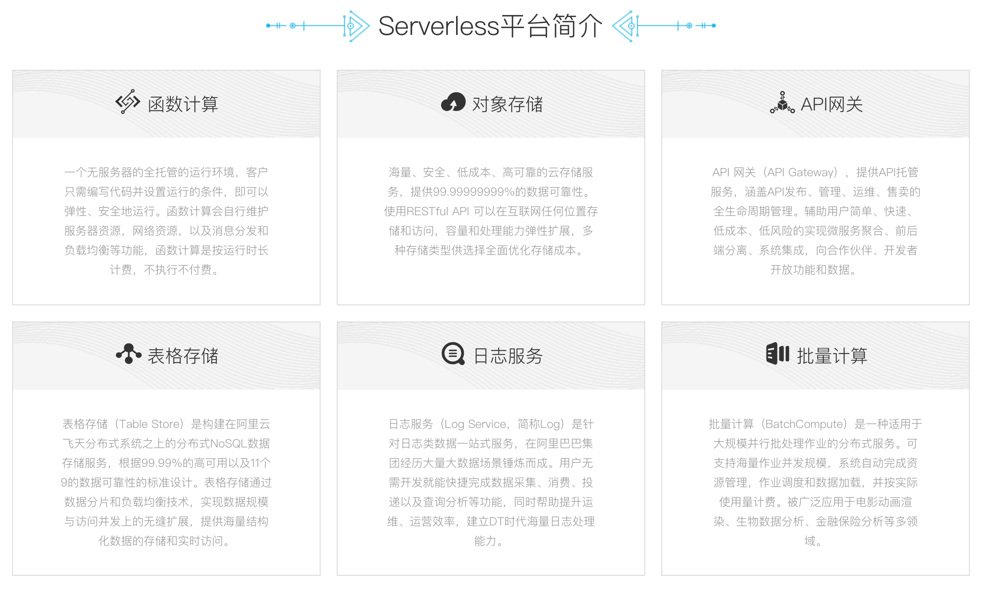
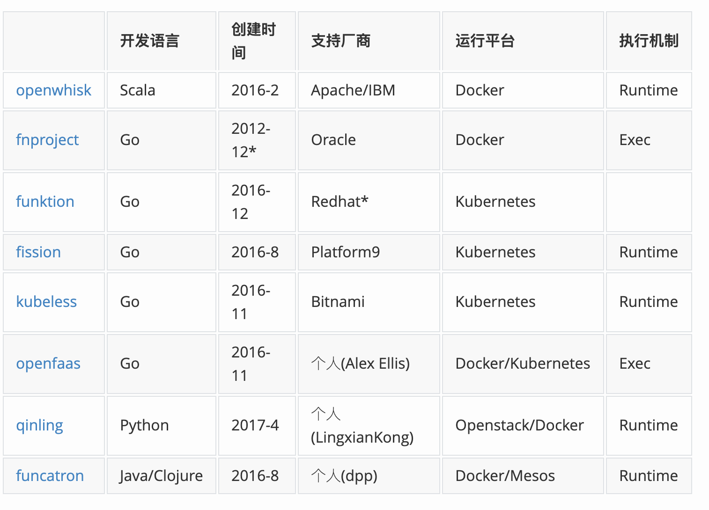
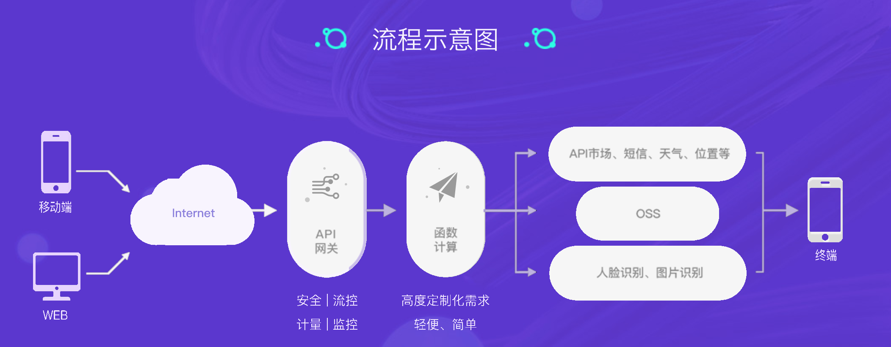
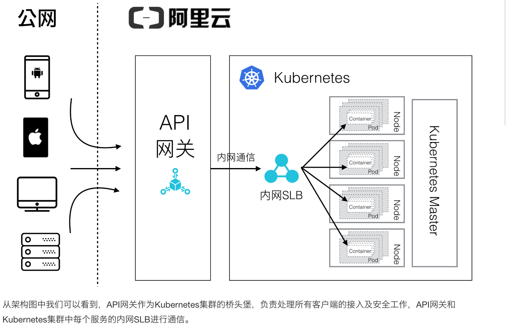
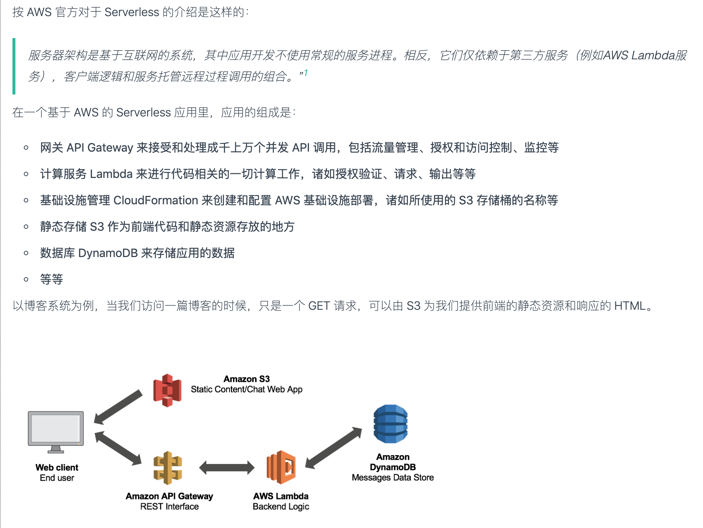

# Serverless

## 引言

今天听了Serverless在上线了的实践，算是对无服务有了个基本的了解。

云服务商提供的云函数运行环境，代表有阿里云函数、AWS Lambda

> 使用场景合适就行。不需要考虑 scaling，多爽
>

优势

1. 弹性伸缩 
2. 不用不需要付费 应对有峰谷的那种应用
3. 无需运维

## 一本电子书

[Serverless 架构应用开发指南 ](https://github.com/phodal/serverless)

## 上线了的应用

1. 生成静态Html 使用云函数 React server render 生成html
2. 处理图片裁剪 人像 黑白 格式转换 

## serverless平台

## 阿里云函数计算 FC

阿里云函数计算（Function Compute）是一个**事件驱动**的全托管计算服务。通过函数计算，您无需管理服务器等基础设施，只需编写代码并上传。函数计算会为您准备好计算资源，以弹性、可靠的方式运行您的代码。更棒的是，您只需要为代码实际运行消耗的资源付费 - 代码未运行则不产生费用。

## IaaS/PaaS/SaaS/FaaS

FaaS 功能即服务 函数即服务

Serverless 架构是结合了 FaaS 的 PaaS 平台

> FaaS 最开始是 2014 年一个叫做 hook.io 的网站提供的，顾名思义，这个网站最早的功能是托管 webhook Function。Webhook 这种场景，按调用次数付费是最易于理解的。之后大厂看到价值迅速跟进，AWS 同年推出 Lambda，2016 年 Google，Microsoft Azure 推出自己的 Cloud Function 服务，2017 年国内云厂商腾讯云，阿里云也跟进。
>

## 开源 FaaS 比较

### exec和runtime

1. Function 的调用和执行方式。一般有两种机制，一种是完全按需，每个请求由独立的进程（容器）完成，一种是保持一种常驻的运行环境。前者我们称为 Exec 模式，后者我们成为 Runtime 模式。

## 使用场景
1. 独立的服务 比如说渲染html 处理图片
2. 具有明显的波峰和波谷 访问量
3. 价格敏感 

## 事件驱动

可以是OSS的事件

可以是API网关的事件 [或者API网关在收到HTTP请求时自动触发函数处理请求。]

可以是time trigger

通过API&SDK来触发函数计算执行

## API网关

API 网关（API Gateway），提供API托管服务，涵盖API发布、管理、运维、售卖的全生命周期管理。辅助用户简单、快速、低成本、低风险的实现微服务聚合、前后端分离、系统集成，向合作伙伴、开发者开放功能和数据

函数计算携手API网关轻松实践Serverless架构

### API网关为K8s容器应用集群提供强大的接入能力

**Kubernetes 集群介绍**

Kubernetes（k8s）作为自动化容器操作的开源平台已经名声大噪，目前已经成为成为容器玩家主流选择。Kubernetes在容器技术的基础上，增加调度和节点集群间扩展能力，可以非常轻松地让你快速建立一个企业级容器应用集群

## 基于 AWS 的 Serverless 应用

## 
> 当我们创建一个博客的时候：
>
> 我们的请求先来到了 API Gateway，API Gateway 计费器 + 1
>
> 接着请求来到了 Lambda，进行数据处理，如生成 ID、创建时间等等，Lambda 计费器 + 1
>
> Lambda 在计算完后，将数据存储到 DynamoDB 上，DynamoDB 计费器 + 1
>
> 最后，我们会生成静态的博客到 S3 上，而 S3 只在使用的时候按存储收费。
>

## 云计算的发展

从Iaas 到 PaaS

**IaaS**

IaaS从本质上讲是服务器租赁并提供基础设施外包服务。就比如我们用的水和电一样 代表 EC2主机

PaaS

PaaS（Platform as a Service）是构建在IaaS之上的一种平台服务，提供操作系统安装、监控和服务发现等功能，用户只需要部署自己的应用即可，最早的一代是Heroku。Heroko是商业的PaaS

BaaS

后端即服务，一般是一个个的API调用后端或别人已经实现好的程序逻辑，比如身份验证服务Auth0

FaaS

现在当大家讨论Serverless的时候首先想到的就是FaaS，有点甚嚣尘上了。

FaaS是直接将程序部署上到平台上即可，当有事件到来时触发执行，执行完了就可以卸载掉

## 收费

+ Serverless 是按运行时间和内存来算钱的

> 更新: 2019-06-25 15:25:36  
> 原文: <https://www.yuque.com/u3641/dxlfpu/kynkrl>