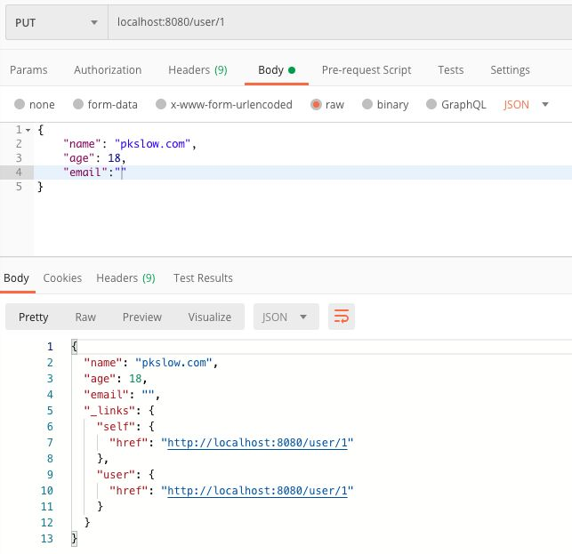

# Spring Data REST

Springboot + Spring MVC大大简化了Web应用的RESTful开发，而Spring Data REST更简单。Spring Data REST是建立在Data Repository之上的，它能直接把resository以HATEOAS风格暴露成Web服务，而不需要再手写Controller层。

# HATEOAS

> HATEOAS，即Hypermedia as the Engine of Application State ，它是一种更成熟的REST模型，在资源的表达中包含了链接信息，客户端可以根据链接来发现可执行的动作。
>

> 更新: 2021-05-17 22:18:19  
> 原文: <https://www.yuque.com/u3641/dxlfpu/nsvq88>