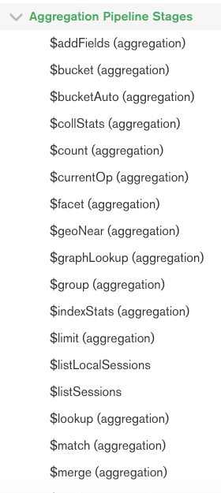
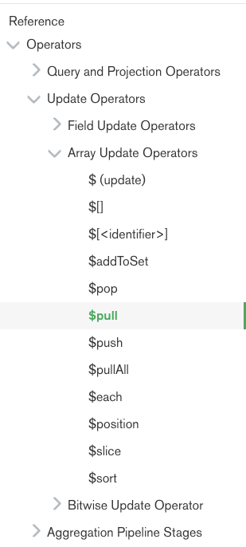

# mongodb

* [数据库命令](https://docs.aws.amazon.com/zh_cn/documentdb/latest/developerguide/mongo-apis.html#mongo-apis-database)
* [查询和投影运算符](https://docs.aws.amazon.com/zh_cn/documentdb/latest/developerguide/mongo-apis.html#mongo-apis-query)
* [更新运算符](https://docs.aws.amazon.com/zh_cn/documentdb/latest/developerguide/mongo-apis.html#mongo-apis-update)
* [Geospatial](https://docs.aws.amazon.com/zh_cn/documentdb/latest/developerguide/mongo-apis.html#mongo-apis-geospatial)
* [游标方法](https://docs.aws.amazon.com/zh_cn/documentdb/latest/developerguide/mongo-apis.html#mongo-apis-cursor)
* [聚合管道运算符](https://docs.aws.amazon.com/zh_cn/documentdb/latest/developerguide/mongo-apis.html#mongo-apis-aggregation-pipeline)
* [数据类型](https://docs.aws.amazon.com/zh_cn/documentdb/latest/developerguide/mongo-apis.html#mongo-apis-data-types)
* [索引和索引属性](https://docs.aws.amazon.com/zh_cn/documentdb/latest/developerguide/mongo-apis.html#mongo-apis-index)

# aggregate

```typescript
    .aggregate([
      {
        $group: {
          _id: "$_from",
          project: { $addToSet: "$ProjectName" },
        },
      },
      { $unwind: "$project" },
      {
        $project: {
          _id: 0,
          item: { $concat: ["$project", "-", "$_id"] },
        },
      },
    ])
```

管道


$match,$unwind,$project

<https://docs.mongodb.com/manual/reference/operator/aggregation-pipeline/>

## cheatsheet

<http://haydnjm.com/mongo-cheatsheet>

中文资料

<https://ithelp.ithome.com.tw/articles/10185952>

| 操作符號 | 功用 |
| :---: | :---: |
| `$project` | 選擇集合中要的欄位，並可進行修改。 |
| `$match` | 篩選操作，可以減少不需要的資料。 |
| `$group` | 可以欄位進行分組。 |
| `$unwind` | 拆開，可以將陣列欄位拆開成多個`document`<br/>。 |
| `$sort` | 可針對欄位進行排序 。 |
| `$limit` | 可針對回傳結果進行數量限制。 |
| `$skip` | 略過前`n`<br/>筆資料，在開始回傳 。 |

# Pipeline Stages

<https://docs.mongodb.com/manual/reference/operator/aggregation-pipeline/>



# Pipeline Operators

```typescript
db.sales.aggregate(
   [
     {
       $group:
         {
           _id: { day: { $dayOfYear: "$date"}, year: { $year: "$date" } },
           itemsSold: { $push:  { item: "$item", quantity: "$quantity" } }
         }
     }
   ]
)
```

# 连表查询

<https://blog.csdn.net/u011113654/article/details/80353013>

# 数组扁平化

<https://www.shuzhiduo.com/A/ZOJPVxxKdv/>

# 嵌套数组删除成员\[数组更新操作符]

<https://docs.mongodb.com/manual/reference/operator/update/pull/>



# aws 的 documentDB 很多不支持

* $$root
* $first
* mapReduce
* $reduce

参考  <https://docs.aws.amazon.com/zh_cn/documentdb/latest/developerguide/mongo-apis.html>


> 更新: 2021-03-30 14:06:25  
> 原文: <https://www.yuque.com/u3641/dxlfpu/eg29uc>