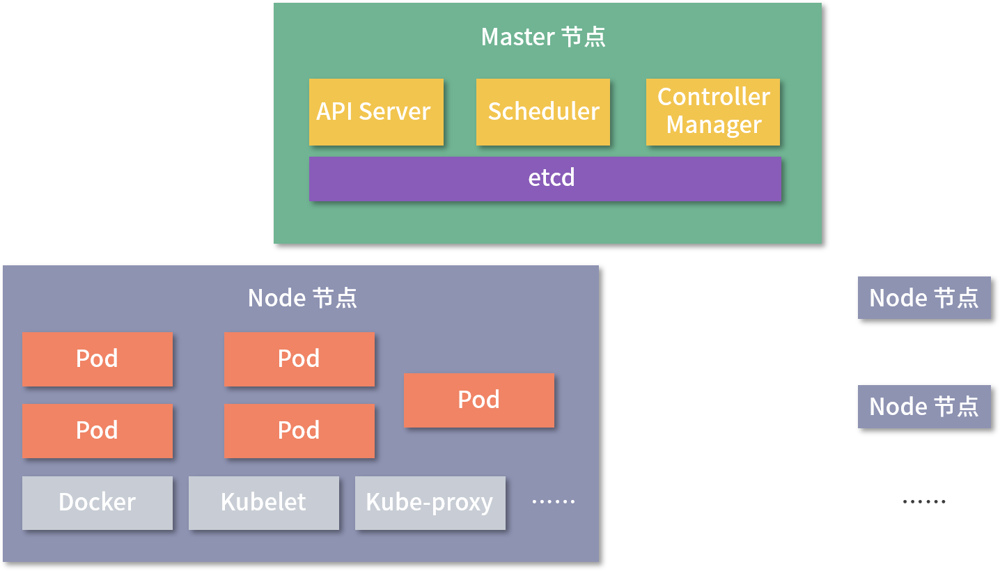

# Kubernetes

k8s

# 介绍

Kubernetes是由 Google 开源的，目的是管理公司内部运行的成千上万的服务器，降低应用程序部署管理的成本。Kubernetes 将基础设施抽象，简化了应用开发、部署和运维等工作，提高了硬件资源的利用率，是一款优秀的**容器管理和编排系统**。

Kubernetes 主要有由两类节点组成：

* Master 节点主要负责管理和控制，是 Kubernetes 的调度中心；
* Node 节点受 Master 节点管理，属于工作节点，负责运行具体的容器应用。

整体结构图如下所示：



# 栗子 🌰

启动一个 go 服务  编写 user-service.yaml

```yaml
apiVersion: v1 

kind: Pod 

metadata: 

  name: user-service 

  labels: 

    name: user-service 

spec: 

  containers:                    #定义user容器，开放10086端口 

    - name: user 

      image: user 

      ports: 

        - containerPort: 10086 

      imagePullPolicy: IfNotPresent 

    - name: mysql                     #定义MySQL容器，开放3306端口 

      image: mysql-for-user 

      ports: 

        - containerPort: 3306 

      env: 

        - name: MYSQL_ROOT_PASSWORD 

          value: "123456" 

      imagePullPolicy: IfNotPresent 

    - name: redis                     #定义Redis容器，开放6379端口 

      image: redis:5.0 

      ports: 

        - containerPort: 6379 

      imagePullPolicy: IfNotPresent 

```

在 Kubernetes 集群的 Node 节点中创建单个 Pod

>  kubectl create -f user-service.yaml

<font style="color:#404952;">查看 user-service Pod 的信息和进入到 Pod 中：</font>

<font style="color:#404952;"></font>

```bash
 kubectl get pod user-service  

 kubectl exec -ti user-service -n default  -- /bin/bash 
```

# 使用 Controller 管理 Pod

单个 Pod 不具备自我恢复的能力，可以使用 Controller 来管理 Pod，Controller 提供创建和管理多个 Pod 的能力，从而使得被管理的 Pod 具备自愈和更新的能力。

# 创建服务

将 MySQL 和 Redis 独立部署到 Kubernetes 上

user-redis-service.yaml

```yaml
apiVersion: v1  

kind: Service 

metadata:  

  name: user-redis-service 

spec: 

  selector:  

    name: user-redis 

  ports:   

  - protocol: TCP 

    port: 6379 

    targetPort: 6379 

    name: user-redis-tcp 

```

执行 kubectl create -f user-redis-service.yaml 命令，即可为 user-redis Pod 生成一个 Service。

Service 定义了一组 Pod 的逻辑集合和一个用于访问它们的策略，Kubernetes 集群会为 Service 分配一个固定的 Cluster IP，用于集群内部的访问。

# kubectl

Kubernetes 命令行工具，`kubectl`，使得你可以对 Kubernetes 集群运行命令。 你可以使用 `kubectl` 来部署应用、监测和管理集群资源以及查看日志。

安装完成后

> kubectl version --client

参考

<https://kubernetes.io/zh/docs/tasks/tools/install-kubectl/#install-with-homebrew-on-macos>

## 查看 pod

> kubectl -n infra-test get pod tctp-7b89f5b444-fqvtg

## 重启 pod 里的容器

<https://stackoverflow.com/questions/46123457/restart-container-within-pod>

## 找 pod

> kubectl -n infra-test get pod -l app=tctp

## 查看日志

查看指定pod中指定容器的日志

> kubectl -n infra-test logs -f tctp-7b89f5b444-fqvtg -c tctp

kubectl -n infra-test logs -c tctp -f tctp-7b89f5b444-fqvtg

## kubectl 查看pod中的容器


> 更新: 2021-03-29 17:56:33  
> 原文: <https://www.yuque.com/u3641/dxlfpu/zkbhgz>