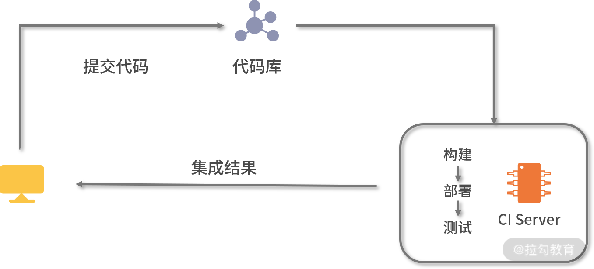

# ci

ci 持续集成 Continuous Integration


> <font style="color:#404952;">为了更快地发现和修复系统集成遇到的各类问题，它建议开发人员一天最少提交一次或者多次代码到代码库中，让自动化工具对提交的代码进行集成部署，并使用自动化测试工具检验代码是否正常运行，从而更快地发现代码中存在的问题并进行修复。</font>
>




Jenkins 是常用的持续集成工具。它采用 Java 开发，提供 Web 界面简化操作，并支持插件式扩展


# Pipeline


Jenkins 中提供多种方式进行构建工作，其中 Pipeline 是最为常用的方式之一。


Pipeline 是一套运行在 Jenkins 上的工作框架。它能够将多个节点中的任务连接起来，实现单个节点难以完成的复杂流程的编排和可视化工作。Pipeline 以代码的形式实现，它将一个流水线划分为多个 Stage，每个 Stage 代表了一组操作，比如构建、测试、部署等；而 Stage 内部又由多个 Step 组成，每一个 Step 就是基本的操作命令，比如打印日志 "echo" 等命令。


Pipeline 脚本是由 Groovy 语言实现，支持 Declarative（声明式）和 Scripted（脚本式）语法


# 🌰
```yaml
node { 

    script { 

        mysql_addr = '127.0.0.1' // service cluster ip 

        redis_addr = '127.0.0.1' // service cluster ip 

        user_addr = '127.0.0.1:30036' // nodeIp : port 

    } 

    stage('clone code from github') { 

        echo "first stage: clone code" 

        git url: "https://github.com/longjoy/micro-go-course.git" 

        script { 

            commit_id = sh(returnStdout: true, script: 'git rev-parse --short HEAD').trim() 

        } 

    } 

    stage('build image') { 

        echo "second stage: build docker image" 

        sh "docker build -t aoho/user:${commit_id} section11/user/" 

    } 

    stage('push image') { 

        echo "third stage: push docker image to registry" 

        sh "docker login -u aoho -p xxxxxx" 

        sh "docker push aoho/user:${commit_id}" 

    } 

    stage('deploy to Kubernetes') { 

        echo "forth stage: deploy to Kubernetes" 

        sh "sed -i 's/<COMMIT_ID_TAG>/${commit_id}/' user-service.yaml" 

        sh "sed -i 's/<MYSQL_ADDR_TAG>/${mysql_addr}/' user-service.yaml" 

        sh "sed -i 's/<REDIS_ADDR_TAG>/${redis_addr}/' user-service.yaml" 

        sh "kubectl apply -f user.yaml" 

    } 

    stage('http test') { 

        echo "fifth stage: http test" 

        sh "cd section11/user/transport && go test  -args ${user_addr}" 

    } 

} 

```


> 更新: 2021-03-01 10:30:59  
> 原文: <https://www.yuque.com/u3641/dxlfpu/ex7iar>