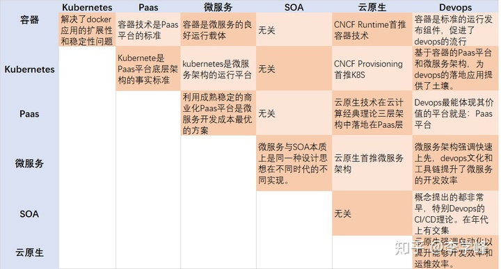

# 介绍

著名的CNCF（Cloud-Native Compute Foundation，云原生计算基金会）成立于2015年，由Google等大公司牵头，目前有100多家企业成员，其目的是在**容器、微服务及devops领域**里、通过一系列的规范和标准帮助企业和组织、在现代的云化环境中构建架构一致的应用。

基于容器和Kubernetes的平台提供了云原生应用的标准发布和运行环境；

基于容器的微服务架构定义了云原生应用的标准架构。

  
  
作者：李学峰  
链接：https://zhuanlan.zhihu.com/p/74483850  
来源：知乎  
著作权归作者所有。商业转载请联系作者获得授权，非商业转载请注明出处。

> 更新: 2021-09-07 10:59:36  
> 原文: <https://www.yuque.com/u3641/dxlfpu/vsrbu7>