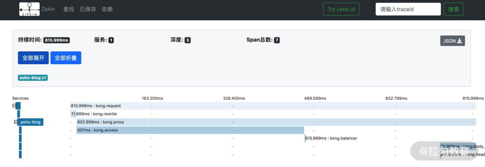

# kong

# install
[https://docs.konghq.com/install/docker/](https://docs.konghq.com/install/docker/)


安装教程 [https://learnku.com/articles/44446](https://learnku.com/articles/44446)


```bash
初始化数据库

docker run --rm \
    --network=kong-net \
  -e "KONG_DATABASE=postgres" \
  -e "KONG_PG_HOST=kong-database" \
  -e "KONG_CASSANDRA_CONTACT_POINTS=kong-database" \
  kong:0.13 kong migrations up
  
 启动 访问8081
 docker run -d --name kong \
  --network=kong-net \
  -e "KONG_DATABASE=postgres" \
  -e "KONG_PG_HOST=kong-database" \
  -e "KONG_CASSANDRA_CONTACT_POINTS=kong-database" \
  -e "KONG_PROXY_ACCESS_LOG=/dev/stdout" \
  -e "KONG_ADMIN_ACCESS_LOG=/dev/stdout" \
  -e "KONG_PROXY_ERROR_LOG=/dev/stderr" \
  -e "KONG_ADMIN_ERROR_LOG=/dev/stderr" \
  -e "KONG_ADMIN_LISTEN=0.0.0.0:8001, 0.0.0.0:8444 ssl" \
  -p 8000:8000 \
  -p 8443:8443 \
  -p 8001:8001 \
  -p 8444:8444 \
  kong:0.13
  
  访问dashboard http://localhost:8083/#!/
  docker run -d -p 8083:8080 \
        --network=kong-net \
    --name kong-dashboard \
     pgbi/kong-dashboard start \
      --kong-url http://kong:8001 \
      --basic-auth kong=kong
  
```


# dashboard
+ konga
    - [https://github.com/pantsel/konga](https://github.com/pantsel/konga)
+ kong-dashboard
    - pgbi/kong-dashboard
    - [https://github.com/PGBI/kong-dashboard](https://github.com/PGBI/kong-dashboard)


# 术语
+ **Route**：请求的转发规则，按照 Hostname 和 PATH，将请求转发给 Service。
+ **Services**：多个 Upstream 的集合，是 Route 的转发目标。
+ **Consumer**：API 的用户，记录用户信息。
+ **Plugin**：插件，可以是全局的，也可以绑定到 Service、Router 或者 Consumer。
+ **Certificate**：HTTPS 配置的证书。
+ **SNI**：域名与 Certificate 的绑定，指定了一个域名对应的 HTTPS 证书。
+ **Upstream**：上游对象用来表示虚拟主机名，拥有多个服务（目标）时，会对请求进行负载均衡。
+ **Target**：最终处理请求的 Backend 服务。


# 反向代理


Kong 默认通过 8000 端口处理代理的请求


# <font style="color:#505050;">prometheus 监控</font>
<font style="color:#505050;"></font>

**Prometheus 是一套开源的系统监控报警框架**。它启发于 Google 的 BorgMon 监控系统，由工作在 SoundCloud 的员工在 2012 年作为社区开源项目进行开发，并于 2015 年正式发布。

作为新一代的监控框架，Prometheus 适用于记录时间序列数据，并且它还具有强大的多维度数据模型、灵活而强大的查询语句、易于管理和伸缩等特点。


Kong 官方提供的 Prometheus 插件，可用的 metric（指标）有如下：


+ **状态码**。上游服务返回的 HTTP 状态码。
+ **时延柱状图**。Kong 中的时延都将被记录，包括请求（完整请求的时延）、Kong（Kong 用来路由、验证和运行其他插件所花费的时间）和上游（上游服务所花费时间来响应请求）。
+ **Bandwidth**。流经 Kong 的总带宽（出口/入口）。
+ **DB 可达性**。Kong 节点是否能访问其 DB。
+ **Connections**。各种 Nginx 连接指标，如 Active、读取、写入和接收连接。


Prometheus 插件导出的度量标准，可以在 **Grafana**（一个跨平台的开源的度量分析和可视化工具）中绘制，“Prometheus + Grafana” 的组合是目前较为流行的监控系统。


# 链路追踪 Zipkin 插件


**Zipkin 是由 Twitter 开源的分布式实时链路追踪组件。**<font style="color:#404952;"> Zipkin 收集来自各个异构系统的实时监控数据，用来追踪与分析微服务架构下的请求，应用系统则需要向 Zipkin 报告链路信息。</font>

<font style="color:#404952;"></font>




# 限流、熔断、降级


微服务网关还承担了很多基础的功能，如安全认证、限流、分析监控等功能，因此还需要应用 Kong 的插件来实现这些功能。


> 更新: 2021-03-03 10:32:36  
> 原文: <https://www.yuque.com/u3641/dxlfpu/wm5rw8>