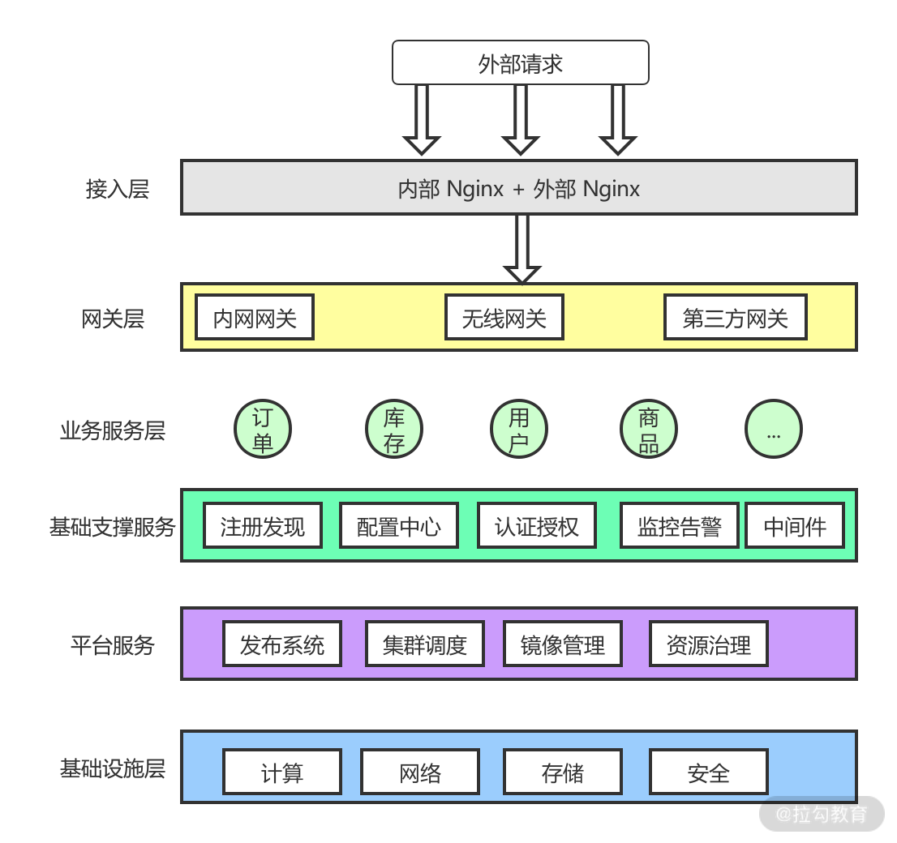
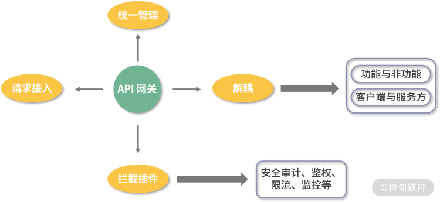

# 功能

微服务架构图

> **微服务网关就是一个处于应用程序或服务之前的系统，用来管理授权、访问控制和流量限制等**
>

# Kong

在业内流行的微服务网关组件中，基于 Nginx 的**Kong**表现突出。

****

**Kong 是 Mashape 开源的高性能、高可用 API 网关**，也可以认为是 API 服务管理层。

它可以通过插件扩展已有功能，这些插件（使用 **Lua** 编写）在 API 请求响应循环的生命周期中被执行。除此之外，Kong 本身还提供了包括 HTTP 基本认证、密钥认证、CORS、TCP、UDP、文件日志、API 请求限流、请求转发及 Nginx 监控等**基本功能**。

# 网关四大功能

+ **请求接入**。管理所有接入请求，作为所有 API 接口的请求入口。在生产环境中，为了保护内部系统的安全性，往往内网与外网都是隔离的，服务端应用都是运行在内网环境中，为了安全，一般不允许外部直接访问。网关可以通过校验规则和配置白名单，对外部请求进行初步过滤，这种方式更加动态灵活。
+ **统一管理**。可以提供统一的监控工具、配置管理和接口的 API 文档管理等基础设施。例如，统一配置日志切面，并记录对应的日志文件。
+ **解耦**。可以使得微服务系统的各方能够独立、自由、高效、灵活地调整，而不用担心给其他方面带来影响。软件系统的整个过程中包括不同的角色，有服务的开发提供方、服务的用户、运维人员、安全管理人员等，每个角色的职责和关注点都不同。微服务网关可以很好地解耦各方的相互依赖关系，让各个角色的用户更加专注自己的目标。
+ **拦截插件**。服务网关层除了处理请求的路由转发外，还需要负责认证鉴权、限流熔断、监控和安全防范等，这些功能的实现方式，往往随着业务的变化不断调整。这就要求网关层提供一套机制，可以很好地支持这种动态扩展。拦截策略提供了一个扩展点，方便通过扩展机制对请求进行一系列加工和处理。同时还可以提供统一的安全、路由和流控等公共服务组件。

> 更新: 2021-03-03 10:35:58  
> 原文: <https://www.yuque.com/u3641/dxlfpu/ghwohw>