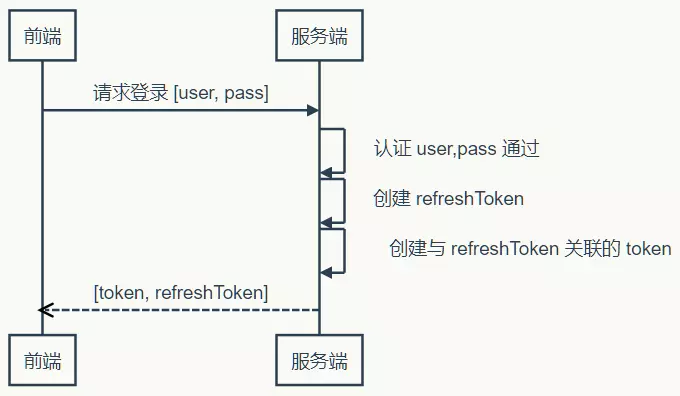
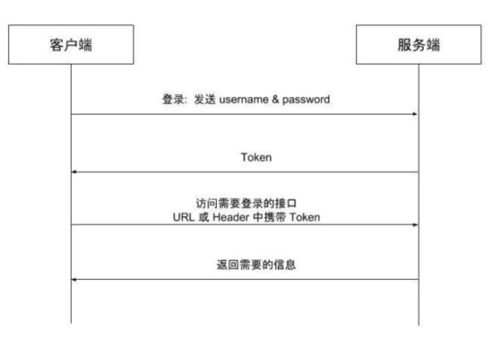

# token的来龙去脉

## 流程


前后端分离实践中基于 Token 的认证





## 为什么要用Token


Token 完全由应用管理，所以它可以避开同源策略

Token 可以避免 CSRF 攻击

Token 可以是无状态的，可以在多个服务间共享


## 需不需要 RefreshToken


第一次登陆，下发Token和RefreshToken


一旦 Token 过期，服务端就反馈给前端，前端使用 Refresh Token 申请一个全新 Token 继续使用


Refresh Token 过期怎么办。不过很显然，Refresh Token 既然已经过期，就该要求用户重新登录了


Refresh Token 每次使用的时候，都更新它的过期时间，直到与它的创建时间相比，已经超过了非常长的一段时间


## 分离认证服务 - 单点登录


**使用同样的密钥和算法来认证 Token 的有效性**

****

## JWT


json web token


### 鉴权流程



和cookie/session的区别


### Node实现


```javascript
const md5 = require("crypto-js/md5");
const jwt = require("jsonwebtoken");
const mongoose = require("mongoose");
```


创建用户，数据库保存md5加盐后的字符串，还要保存salt


```javascript
/**
 * @description 创建用户
 */
router.post("/user", async (ctx, next) => {
  const { username = "", password = "", age, isAdmin } = ctx.request.body || {};
  if (username === "" || password === "") {
    ctx.status = 401;
    return (ctx.body = {
      success: false,
      code: 10000,
      msg: "用户名或者密码不能为空"
    });
  }
  // 先对密码md5
  const md5PassWord = md5(String(password)).toString();
  // 生成随机salt
  const salt = String(Math.random()).substring(2, 10);
  // 加盐再md5
  const saltMD5PassWord = md5(`${md5PassWord}:${salt}`).toString();
  try {
    // 类似用户查找,保存的操作一般我们都会封装到一个实体里面,本demo只是演示为主, 生产环境不要这么写
    const searchUser = await User.findOne({ name: username });
    if (!searchUser) {
      const user = new User({
        name: username,
        password: saltMD5PassWord,
        salt,
        isAdmin,
        age
      });
      const result = await user.save();
      ctx.body = {
        success: true,
        msg: "创建成功"
      };
    } else {
      ctx.body = {
        success: false,
        msg: "已存在同名用户"
      };
    }
  } catch (error) {
    // 一般这样的我们在生成环境处理异常都是直接抛出 异常类, 再有全局错误处理去处理
    ctx.body = {
      success: false,
      msg: "serve is mistakes"
    };
  }
});

作者：小诺哥
链接：https://juejin.im/post/5d9aadbf51882509334fb48b
来源：掘金
著作权归作者所有。商业转载请联系作者获得授权，非商业转载请注明出处。
```


 一般客户端对密码需要md5加密传输过


```javascript
/**
 * @description 用户登陆
 */
router.post("/login", async (ctx, next) => {
  const { username = "", password = "" } = ctx.request.body || {};
  if (username === "" || password === "") {
    ctx.status = 401;
    return (ctx.body = {
      success: false,
      code: 10000,
      msg: "用户名或者密码不能为空"
    });
  }
  // 一般客户端对密码需要md5加密传输过来, 这里我就自己加密处理,假设客户端不加密。
  // 类似用户查找,保存的操作一般我们都会封装到一个实体里面,本demo只是演示为主, 生产环境不要这么写
  try {
    // username在注册时候就不会允许重复
    const searchUser = await User.findOne({ name: username });
    if (!searchUser) {
      ctx.body = {
        success: false,
        msg: "用户不存在"
      };
    } else {
      // 需要去数据库验证用户密码
      const md5PassWord = md5(String(password)).toString();
      const saltMD5PassWord = md5(
        `${md5PassWord}:${searchUser.salt}`
      ).toString();
      if (saltMD5PassWord === searchUser.password) {
        // Payload: 负载, 不建议存储一些敏感信息
        const payload = {
          id: searchUser._id
        };
        const token = jwt.sign(payload, config.secret, {
          expiresIn: "2h"
        });
        ctx.body = {
          success: true,
          data: {
            token
          }
        };
      } else {
        ctx.body = {
          success: false,
          msg: "密码错误"
        };
      }
    }
  } catch (error) {
    ctx.body = {
      success: false,
      msg: "serve is mistakes"
    };
  }
});

作者：小诺哥
链接：https://juejin.im/post/5d9aadbf51882509334fb48b
来源：掘金
著作权归作者所有。商业转载请联系作者获得授权，非商业转载请注明出处。
```

****

### 解决了什么问题？
> + 服务端不再需要存储与用户鉴权相关的信息,鉴权信息会被加密到token中,服务器只需要读取token中包含的用户信息即可。
> + 避免了共享Session不易扩展的问题
> + 不依赖于Cookie, 有效避免Cookie带来的CORS攻击问题
> + 通过CORS有效解决跨域问题
>
> ## 关于JWT与Token的认识
> 
>
> 作者：小诺哥
>

> 链接：https://juejin.im/post/5d9aadbf51882509334fb48b
>

> 来源：掘金
>

> 著作权归作者所有。商业转载请联系作者获得授权，非商业转载请注明出处。
>


> 更新: 2021-03-01 10:36:11  
> 原文: <https://www.yuque.com/u3641/dxlfpu/nw07xg>