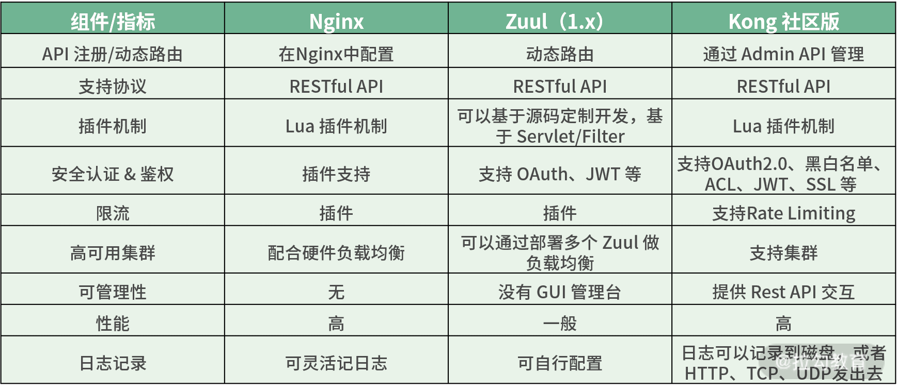

# 选型

业界有很多流行的 API 网关，比如开源的就有 Nginx、Netflix Zuul、Kong 等。Kong 有商业版，与此类似的商业版网关还有 GoKu API Gateway 和 Tyk 等。

总体来说，

Zuul 复杂度较低，上手简单，可以自定义开发，但是高并发场景下的性能相对较差；

Nginx 性能经受得住考验，配合 Lua 可以引入各种插件，但是功能性相对较弱，需要开发者自身去完善很多功能；

Kong 基于 Nginx、OpenResty 和 Lua，如果对性能要求高，需要对外开放的场景，建议考虑使用 Kong。

> 更新: 2021-03-03 10:31:01  
> 原文: <https://www.yuque.com/u3641/dxlfpu/hxuvre>