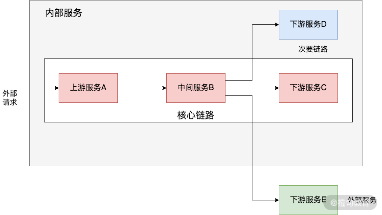
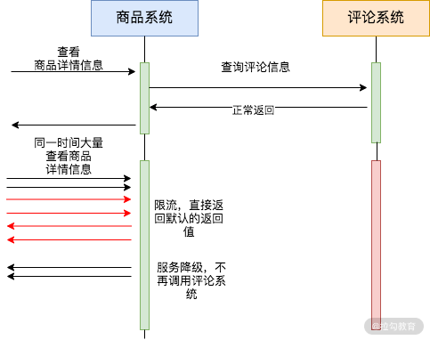
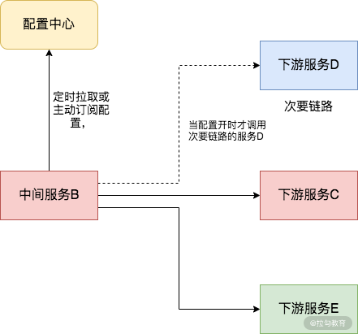

# 高可用

两种常用的高可用设计：

+ **冗余设计，** 如何降低分布式中出现单点故障的可能性；
+ **熔断设计，** 如何防止服务雪崩，保护服务调用者的资源。

其他高可用设计和方案，包括限流设计、降级设计、无状态设计和重试设计等

# 熔断

雪崩

> 在分布式系统中，一次完整的请求可能需要经过多个服务模块的通力合作，请求在多个服务中传递，服务对服务的调用会产生新的请求，这些请求共同组成了这次请求的调用链。当调用链中的某个环节，特别是下游服务不可用时，将会导致上游服务调用方不可用，最终将这种不可用的影响扩大到整个系统，导致整个分布式系统的不可用，引发**服务雪崩现象**。
>

熔断主要预防的服务雪崩现象的形成和危害，以及推荐使用的断路器中间件Hystrix

## Hystrix

Hystrix 是 Netflix 开源的一个优秀的服务间断路器。它能够在服务提供者出现故障时，隔离服务调用者和服务提供者，防止服务级联失败；同时提供失败回滚逻辑，使系统快速从异常中恢复。

# 系统服务定位

如上图所示，外部请求通过网关直接访问上流服务 A，服务 A、服务 B 和服务 C 是核心链路服务，服务 D 是次要链路服务，服务 E 是外部服务。

当应对大流量的时候，

+ 服务A需要限流
+ 服务B需要降级
    - 一般服务 B 需要断路器来提供熔断机制以保护自己不被外部服务 E 拖垮。

# 接口限流和降级

限流和降级都是为了保护下游服务提供者不被大流量请求冲垮而采取的手段，但是二者也是有一定区别的。

限流是为了应对突发的大流量，保护系统不被冲垮；而服务降级则是以牺牲部分非核心服务来提高系统的整体性能

+ 限流方案能预防突发的大流量，保护系统不被冲垮，但是其在处理瞬时流量时，大多数时候会**拒绝掉系统无法处理的过量流量**，服务的处理能力并没有过多改变，这就可能会导致<u>拒绝掉一些关键业务请求的尴尬情况</u>发生
+ 而降级设计能够**暂时提高系统某些关键服务的处理能力**，从而承载更多的请求访问，当然它会牺牲其他次要功能的资源。

限流基于令牌桶算法，可以直接使用 Golang 标准库自带的 x/time/rate 组件

## 业务场景

商品详情页面需要展示下游评论系统的实时评论信息，但是实时的评论信息相对来说并不是不可或缺的，紧急情况下可以不显示。

## 降级案例

降级的手段有很多，比如有一种降级方案就是通过断路器打开和被限流时返回的默认固化的数据或者处理逻辑来实现的。除此之外，还可以使用配置中心提供动态开关的手段进行服务降级。

> 更新: 2021-03-03 11:37:57  
> 原文: <https://www.yuque.com/u3641/dxlfpu/xlu1kz>