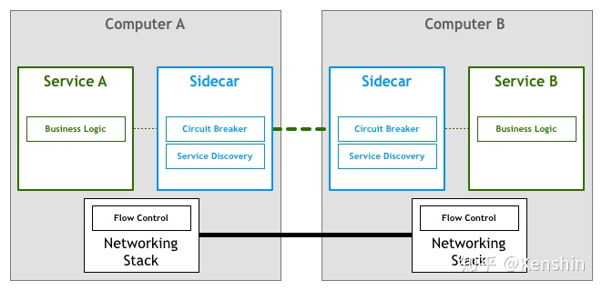
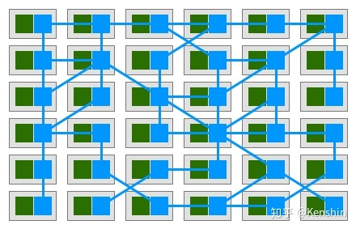
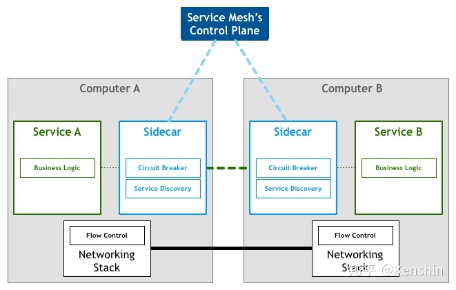

# 服务网格

Service Mesh


> **一言以蔽之：Service Mesh是微服务时代的TCP协议。**
>


```markdown
服务网格是一个基础设施层，用于处理服务间通信。云原生应用有着复杂的服务拓扑，服务网格保证请求在这些拓扑中可靠地穿梭。在实际应用当中，服务网格通常是由一系列轻量级的网络代理组成的，它们与应用程序部署在一起，但对应用程序透明。
```


# 现在微服务的问题


+ 追踪和解决框架出现的问题非易事
+ <font style="color:#F5222D;">微服务的定义，一个重要的特性就是语言无关，但是现在一些框架却和语言强相关</font>
+ 服务会因为和业务无关的lib库升级而被迫升级【框架以lib库的形式和服务联编】

  


# Service Mesh 的优点


+ 屏蔽分布式系统通信的复杂性(负载均衡、服务发现、认证授权、监控追踪、流量控制等等)，服务只用关注业务逻辑；
+ 真正的语言无关，服务可以用任何语言编写，只需和Service Mesh通信即可；
+ 对应用透明，Service Mesh组件可以单独升级；


# Service Mesh 的问题


+ Service Mesh组件以代理模式计算并转发请求，一定程度上会降低通信系统性能，并增加系统资源开销；
+ Service Mesh组件接管了网络流量，因此服务的整体稳定性依赖于Service Mesh，同时额外引入的大量Service Mesh服务实例的运维和管理也是一个挑战；


# Service Mesh 的理念


Service Mesh应运而生，屏蔽了分布式系统的诸多复杂性，让开发者可以回归业务，聚焦真正的价值


# 第一代Service Mesh


以Linkerd，Envoy，NginxMesh为代表的代理模式（边车模式）应运而生


> <font style="color:rgb(18, 18, 18);">它将分布式服务的通信抽象为单独一层，在这一层中实现负载均衡、服务发现、认证授权、监控追踪、流量控制等分布式系统所需要的功能，作为一个和服务对等的代理服务，和服务部署在一起，接管服务的流量</font>
>





蓝色的是代理服务


# 第二代Service Mesh
以Istio为代表的第二代Service Mesh


> <font style="color:rgb(18, 18, 18);">演化出了集中式的控制面板，所有的单机代理组件通过和控制面板交互进行网络拓扑策略的更新和单机数据的汇报</font>
>




> 更新: 2021-05-04 13:54:19  
> 原文: <https://www.yuque.com/u3641/dxlfpu/glc1wt>