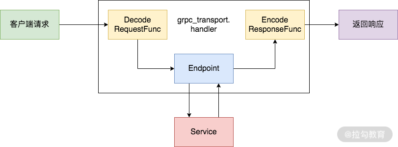
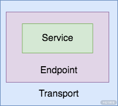

# go-kit

[https://github.com/go-kit/kit](https://github.com/go-kit/kit)

**Go kit** is a **programming toolkit** for building microservices (or elegant monoliths) in Go. We solve common problems in distributed systems and application architecture so you can focus on delivering business value.

Go kit是一个用于在Go中构建微服务(或优雅的单体)的编程工具包。我们解决分布式系统和应用程序体系结构中的常见问题，因此您可以专注于交付业务价值。

Go-kit 推荐使用 Transport、Endpoint 和 Service 这 3 层结构来组织项目。

# 
# gRPC

+ Transport 层，主要负责网络传输，例如处理HTTP、gRPC、Thrift等相关的逻辑。
+ Endpoint 层，主要负责 request/response 格式的转换，以及公用拦截器相关的逻辑。作为 Go-kit 的核心，Endpoint 层采用类似洋葱的模型，提供了对日志、限流、熔断、链路追踪和服务监控等方面的扩展能力。接收用户网络请求并将其转为 Endpoint 可以处理的对象，然后交由 Endpoint 层执行，最后再将处理结果转为响应对象返回给客户端
    - 解码器
    - 编码器，把处理结果转换为响应对象

**Go-kit 和 gRPC 结合的关键在于需要将 gRPC 集成到 Go-kit 的 Transport 层**

Service 在最内层，Endpoint 在中间，Transport在最外侧，所以 Transport 是最容易进行变更的一层，越往内层逻辑应该越贴近领域逻辑。

# 使用了 x/time/rate 来进行限流
除了限流外，Endpoint 的 Middleware 还可以和 Hystrix 结合提供熔断能力，和 ZipkinTracer 结合提供服务链路追踪能力、自定义接口调用统计指标或打印日志。

> 更新: 2021-04-27 14:23:04  
> 原文: <https://www.yuque.com/u3641/dxlfpu/itcg4v>