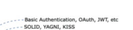
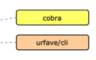
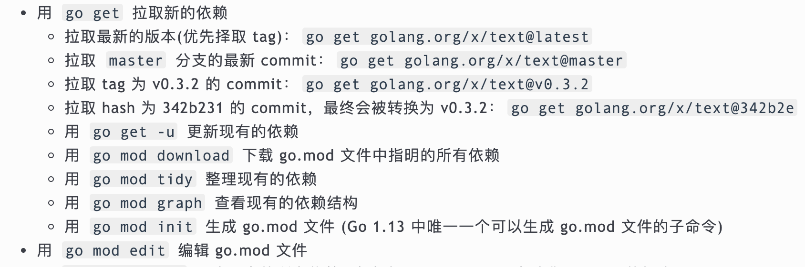
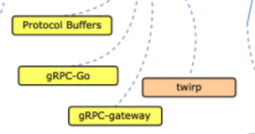
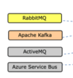
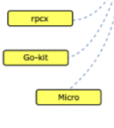
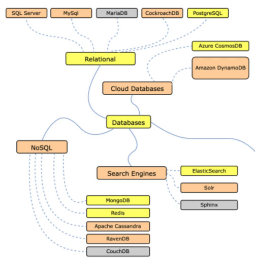
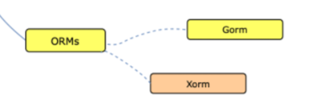

# go

# 基础

GOROOT 和 GOPATH

利用 go env 查看环境变量

# 安全

## OAuth

## JWT

# CLI

# 微服务

## RPC

## 消息队列

## 微服务框架

# 数据库

## 关系数据库
## 搜索引擎
## 非关系数据库

## ORM

# 
# Web 框架 gin

> 更新: 2021-02-03 12:45:40  
> 原文: <https://www.yuque.com/u3641/dxlfpu/scpkfv>