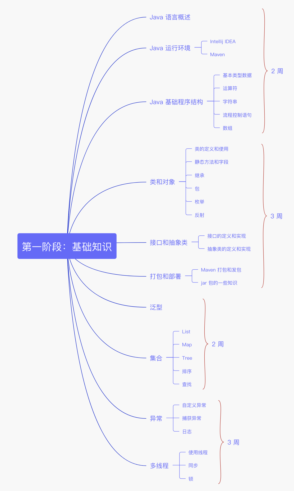

# Java SE

Java是一种高级，健壮，安全和面向对象的编程语言


Java 属于强类型，JS 是弱类型


JavaScript：一种动态编程语言


Typescript的出现，使得 JS 更靠近 Java 了




# install


install jdk 14


> brew cask install java
>


install jdk 8


```plain
brew cask install adoptopenjdk/openjdk/adoptopenjdk8
```


[https://mkyong.com/java/how-to-install-java-on-mac-osx/](https://mkyong.com/java/how-to-install-java-on-mac-osx/)


# 基本语法
+ 源文件名必须和类名相同
+ 主方法入口：
    - 所有的 Java 程序由 public static void main(String[] args) 方法开始执行。


# 修饰符
使用修饰符来修饰类中方法和属性

+ 访问控制修饰符 : default, public , protected, private
+ 非访问控制修饰符 : final, abstract, static, synchronized


# 面向对象


Java 是基于类的，JS 是面向原型的


+ 封装
+ 继承
+ 多态
+ 组合
+ 封装
+ 类
+ 对象
+ 实例
+ 方法
+ 重载


## 多态


JS 只能通过判断入参来解决


```java
class Cat {
    // 当输入字符串时，直接显示
    public String bark(String sound) {
        return sound;
    }
    // 当为输入时，输出默认值
    public String bark() {
        return "...";
    }
}
public class Test {
    public static void main(String[] args) {
        Cat cat = new Cat();
        System.out.println(cat.bark()); // "..."
        System.out.println(cat.bark("miao~")); // "miao~"
    }
}
```


## 继承和接口
呗继承的类称为超类（super class），派生类称为子类（subclass）。

接口只定义派生要用到的方法，但是方法的具体实现完全取决于派生类。


# 数据类型和运算符


Java：提供了8种基本类型


+ 4种数字类型：byte，short，int，long
+ 2种浮点类型：float，double
+ 1种字符类型：char
+ 1种布尔类型：boolean


JS


number

string

boolean

undefined、null

symbol


# 参考


[Building a RESTful Web Service with Spring Boot Actuator](https://spring.io/guides/gs/actuator-service/)


[https://spring.io/guides/tutorials/rest/](https://spring.io/guides/tutorials/rest/)


[https://spring.io/guides/gs/rest-service/](https://spring.io/guides/gs/rest-service/)


> 更新: 2021-03-28 16:45:11  
> 原文: <https://www.yuque.com/u3641/dxlfpu/ehu9h3>