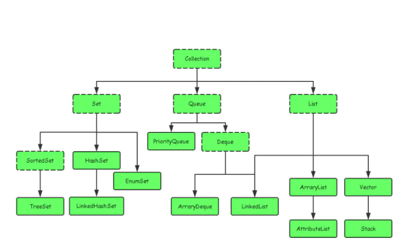
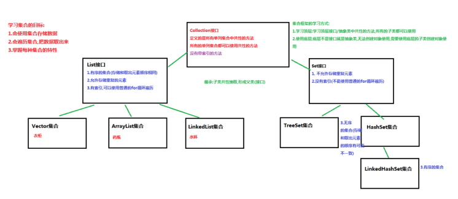
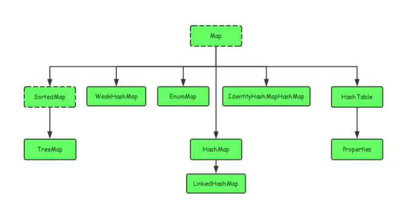

# 集合

·

在 JS 里面，我们有 Object、Array、Set 和 Map


在 JAVA 里面，





数组

```java
public class Main {
    public static void main(String[] args) {
        String[] names = {"ABC", "XYZ", "zoo"};
        String s = names[1];
        names[1] = "cat";
        System.out.println(s); // s是"XYZ"还是"cat"?
    }
}

```

java.util.ArrayList

java.util.LinkedList


## Set


java.util.Set

java.util.HashSet;

java.util.LinkedHashSet;


## Map


java.util.HashMap;

java.util.Map;



```java
public static  void show01(){
    Map<String,String> map = new HashMap<>();
    String v1 = map.put("李晨","范冰冰1");
    System.out.println(v1);
    String v2 = map.put("李晨","范冰冰2");
    System.out.println(v2);
    System.out.println(map);

    map.put("冷锋","龙小云");
    map.put("杨过","小龙女");
    map.put("尹志平","小龙女");
    System.out.println(map);
}
```


> 更新: 2021-04-20 22:53:32  
> 原文: <https://www.yuque.com/u3641/dxlfpu/vmw1eu>