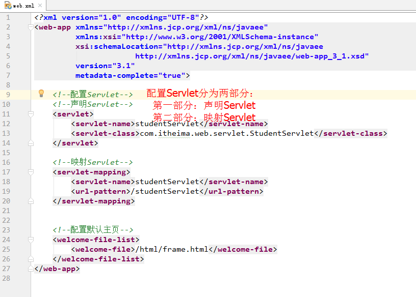
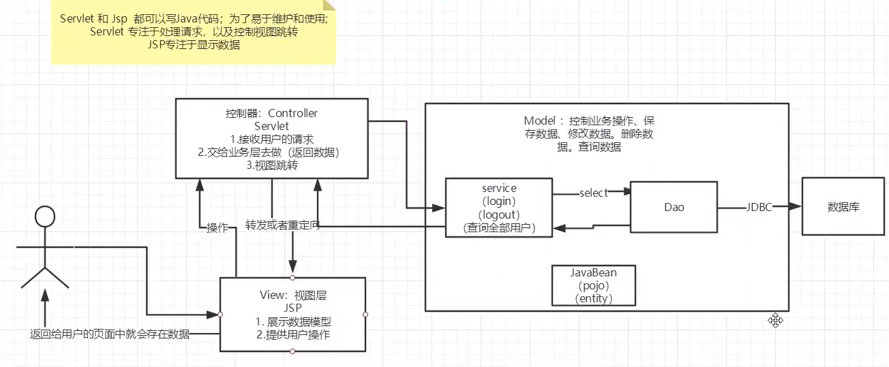

# JavaWeb

三大件：Servlet、Tomcat、JSP，不过JSP不太常用了，因为前后端分离。


# Servlet
## 最简单的 Servlet


使用 Servlet API 编写 Web Controller，基本上就是重写 doGet 和 doPost

```java
// WebServlet注解表示这是一个Servlet，并映射到地址/:
@WebServlet(urlPatterns = "/")
public class HelloServlet extends HttpServlet {
    protected void doGet(HttpServletRequest req, HttpServletResponse resp)
            throws ServletException, IOException {
        // 设置响应类型:
        resp.setContentType("text/html");
        // 获取输出流:
        PrintWriter pw = resp.getWriter();
        // 写入响应:
        pw.write("<h1>Hello, world!</h1>");
        // 最后不要忘记flush强制输出:
        pw.flush();
    }
}
```

> <font style="color:#262626;">Servlet对象由Servlet容器（如Tomcat）帮我们创建，不需要我们new</font>
>


**Tomcat 称为 Servlet 容器。**


web.xml 文件，放在 src/main/webapp/WEB-INF 目录下，配置路由





## Servlet 重定向
```java
@WebServlet(urlPatterns = "/hi")
public class RedirectServlet extends HttpServlet {
    protected void doGet(HttpServletRequest req, HttpServletResponse resp) throws ServletException, IOException {
        // 构造重定向的路径:
        String name = req.getParameter("name");
        String redirectToUrl = "/hello" + (name == null ? "" : "?name=" + name);
        // 发送重定向响应:
        resp.sendRedirect(redirectToUrl);
    }
}
```


## Servlet  映射
```java

<servlet>
    <servlet-name>servletDemo3</servlet-name>
    <servlet-class>com.itheima.web.servlet.ServletDemo3</servlet-class>
    <!--配置Servlet的创建顺序，当配置此标签时，Servlet就会改为应用加载时创建
        配置项的取值只能是正整数（包括0），数值越小，表明创建的优先级越高
    -->
    <load-on-startup>1</load-on-startup>
</servlet>
<servlet-mapping>
    <servlet-name>servletDemo3</servlet-name>
    <url-pattern>/servletDemo3</url-pattern>
</servlet-mapping>
```

## ServletContext


```java
String getInitParameter(String key) : 类似于根据key获取value
String getContextPath() : 获取项目的虚拟路径
String getRealPath(String path): 获取文件的真实(服务器)路径
域对象：共享数据
        1. setAttribute(String name,Object value)
        2. getAttribute(String name)
        3. removeAttribute(String name)
    
// 获取项目的虚拟路径
public class ServletContextDemo2 extends HttpServlet {
    protected void doPost(HttpServletRequest request, HttpServletResponse response) throws ServletException, IOException {
        /*
            测试ServletContext常用方法
            String getContextPath() : 获取项目的虚拟路径
         */
        //获取ServletContext
        ServletContext context = super.getServletContext();
        //获取项目虚拟路径
        String path = context.getContextPath();
        System.out.println("虚拟路径为: "+path);
    }
    protected void doGet(HttpServletRequest request, HttpServletResponse response) throws ServletException, IOException {
        this.doPost(request,response);
    }
}
```

## ServletConfig


不太常用，是 Servle t的配置参数对象，可以调用一些方法，读取 Servet 的配置


**演示Servlet的初始化参数对象**

```java
/**
 * 演示Servlet的初始化参数对象
 * @author 黑马程序员
 * @Company http://www.itheima.com
 */
public class ServletDemo8 extends HttpServlet {
    //定义Servlet配置对象ServletConfig
    private ServletConfig servletConfig;
    /**
     * 在初始化时为ServletConfig赋值
     * @param config
     * @throws ServletException
     */
    @Override
    public void init(ServletConfig config) throws ServletException {
        this.servletConfig = config;
    }
    /**
     * doGet方法输出一句话
     * @param req
     * @param resp
     * @throws ServletException
     * @throws IOException
     */
    @Override
    protected void doGet(HttpServletRequest req, HttpServletResponse resp) throws ServletException, IOException {
        //1.输出ServletConfig
        System.out.println(servletConfig);
        //2.获取Servlet的名称
        String servletName= servletConfig.getServletName();
        System.out.println(servletName);
        //3.获取字符集编码
        String encoding = servletConfig.getInitParameter("encoding");
        System.out.println(encoding);
        //4.获取所有初始化参数名称的枚举
        Enumeration<String> names = servletConfig.getInitParameterNames();
        //遍历names
        while(names.hasMoreElements()){
            //取出每个name
            String name = names.nextElement();
            //根据key获取value
            String value = servletConfig.getInitParameter(name);
            System.out.println("name:"+name+",value:"+value);
        }
        //5.获取ServletContext对象
        ServletContext servletContext = servletConfig.getServletContext();
        System.out.println(servletContext);
    }
    /**
     * 调用doGet方法
     * @param req
     * @param resp
     * @throws ServletException
     * @throws IOException
     */
    @Override
    protected void doPost(HttpServletRequest req, HttpServletResponse resp) throws ServletException, IOException {
        doGet(req,resp);
    }
}
```


配置 Servlet，使用 init-param 标签


```java
<!--配置ServletDemo8-->
<servlet>
    <servlet-name>servletDemo8</servlet-name>
    <servlet-class>com.itheima.web.servlet.ServletDemo8</servlet-class>
    <!--配置初始化参数-->
    <init-param>
        <!--用于获取初始化参数的key-->
        <param-name>encoding</param-name>
        <!--初始化参数的值-->
        <param-value>UTF-8</param-value>
    </init-param>
    <!--每个初始化参数都需要用到init-param标签-->
    <init-param>
        <param-name>servletInfo</param-name>
        <param-value>This is Demo8</param-value>
    </init-param>
</servlet>
<servlet-mapping>
    <servlet-name>servletDemo8</servlet-name>
    <url-pattern>/servletDemo8</url-pattern>
</servlet-mapping>
```

## 基于注解开发Servlet
使用Servlet3.1版本的规范时，脱离了web.xml进行注解开发


参考这里 [https://www.yuque.com/yuchenhuang/dgl7mw/9f418c940abdd1769b9cadedf9c48073#39546de1](https://www.yuque.com/yuchenhuang/dgl7mw/9f418c940abdd1769b9cadedf9c48073#39546de1)

## req 
```java
/**
 * 请求对象的各种信息获取
 * @author 黑马程序员
 * @Company http://www.itheima.com
 */
public class RequestDemo1 extends HttpServlet {
    public void doGet(HttpServletRequest request, HttpServletResponse response)
            throws ServletException, IOException {
        //本机地址：服务器地址
        String localAddr = request.getLocalAddr();
        //本机名称：服务器名称
        String localName = request.getLocalName();
        //本机端口：服务器端口
        int localPort = request.getLocalPort();
        //来访者ip
        String remoteAddr = request.getRemoteAddr();
        //来访者主机
        String remoteHost = request.getRemoteHost();
        //来访者端口
        int remotePort = request.getRemotePort();
        //统一资源标识符
        String URI = request.getRequestURI();
        //统一资源定位符
        String URL = request.getRequestURL().toString();
        //获取查询字符串
        String queryString = request.getQueryString();
        //获取Servlet映射路径
        String servletPath = request.getServletPath();
        
        // 获取请求头信息
        String value = request.getHeader("Accept-Encoding");
        System.out.println("getHeader():"+value);
        
        // 获取请求参数
        String username = request.getParameter("username");
    	String password = request.getParameter("password");
    	String gender = request.getParameter("gender");

    }
    public void doPost(HttpServletRequest request, HttpServletResponse response)
            throws ServletException, IOException {
        doGet(request, response);
    }
}
```

## res
```java
public class ResponseDemo4 extends HttpServlet {
    public void doGet(HttpServletRequest request, HttpServletResponse response)
            throws ServletException, IOException {
        
        // 缓存头
        String str = "设置缓存时间";
        response.setDateHeader("Expires",System.currentTimeMillis()+1*60*60*1000);
        response.setContentType("text/html;charset=UTF-8");
        response.getOutputStream().write(str.getBytes());
        
        
        //1.设置响应状态码
		//response.setStatus(302);
        //2.定向到哪里去: 其实就是设置响应消息头，Location
		//response.setHeader("Location", "ResponseDemo7");
        //使用重定向方法
        response.sendRedirect("ResponseDemo7");//此行做了什么事，请看上面
    }
    public void doPost(HttpServletRequest request, HttpServletResponse response)
            throws ServletException, IOException {
        doGet(request, response);
    }
}
```

# JSP


还记得 res.end 吗？错了，是 PrintWriter。


```java
PrintWriter pw = resp.getWriter();
pw.write("<html>");
pw.write("<body>");
pw.write("<h1>Welcome, " + name + "!</h1>");
pw.write("</body>");
pw.write("</html>");
pw.flush();
```

模版放到这里/src/main/webapp，类似 template 目录


hello.jsp

```java
<html>
<head>
    <title>Hello World - JSP</title>
</head>
<body>
    <%-- JSP Comment --%>
    <h1>Hello World!</h1>
    <p>
    <%
         out.println("Your IP address is ");
    %>
    <span style="color:red">
        <%= request.getRemoteAddr() %>
    </span>
    </p>
</body>
</html>
```


JSP在执行前首先被编译成一个Servlet。本质上就是一个Servlet


在Tomcat的临时目录下，可以找到一个hello_jsp.java的源文件


# <font style="color:#666666;">Filter 过滤器</font>


> 为了把一些公用逻辑从各个Servlet中抽离出来，JavaEE的Servlet规范还提供了一种Filter组件，即过滤器，它的作用是，在HTTP请求到达Servlet之前，可以被一个或多个Filter预处理，类似打印日志、登录检查等逻辑，完全可以放到Filter中。
>


常见应用场景：URL级别的权限控制；过滤敏感词汇；中文乱码问题等等。

```java
@WebFilter("/*")
public class LogFilter implements Filter {
    public void doFilter(ServletRequest request, ServletResponse response, FilterChain chain)
            throws IOException, ServletException {
        
        HttpServletRequest req = (HttpServletRequest) request;
        String requestURI = req.getRequestURI();
        chain.doFilter(request, response);
    }
}
```

配置过滤器

```java
<!--配置过滤器-->
<filter>
    <filter-name>LogFilter</filter-name>
    <filter-class>com.itheima.web.filter.LogFilter</filter-class>
</filter>
<filter-mapping>
    <filter-name>FilterDemo1</filter-name>
    <url-pattern>/*</url-pattern>
</filter-mapping>
```

# Listener 监听器
> 把初始化数据库连接池等工作放到contextInitialized()回调方法中，把清理资源的工作放到contextDestroyed()回调方法中
>

```java
@WebListener
public class AppListener implements ServletContextListener {
    // 在此初始化WebApp,例如打开数据库连接池等:
    public void contextInitialized(ServletContextEvent sce) {
        System.out.println("WebApp initialized.");
    }

    // 在此清理WebApp,例如关闭数据库连接池等:
    public void contextDestroyed(ServletContextEvent sce) {
        System.out.println("WebApp destroyed.");
    }
}
```

配置监听器

```java
<!--配置监听器-->
<listener>
    <listener-class>com.itheima.web.listener.ServletContextListenerDemo</listener-class>
</listener>
```

# MVC





> 更新: 2021-04-19 10:22:55  
> 原文: <https://www.yuque.com/u3641/dxlfpu/udlf1k>