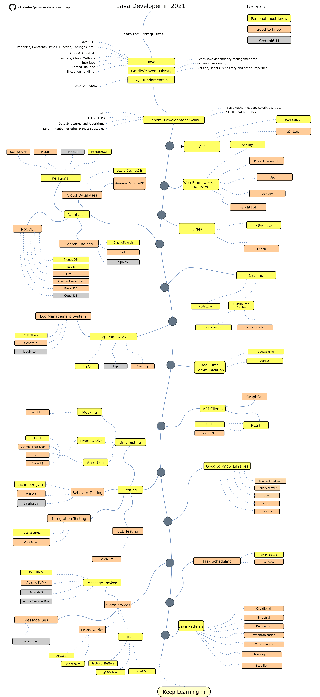

# Java roadmap

当谈到Java的学习路线时，这里提供以下建议：

掌握Java基础：从Java基础开始学习，包括面向对象编程的基本概念、关键字、变量和数据类型、控制流和异常处理等。推荐阅读Java编程思想等经典教材。

学习常用Java库和框架：Java中有很多常用的库和框架，比如Spring、Hibernate、MyBatis等，这些框架能够提升日常工作效率，建议在掌握Java语言基础之后，逐个学习这些框架，并结合实战项目进行练习。

学习数据库：掌握基本的SQL语句，学习数据库管理系统和SQL查询优化等知识。建议学习MySQL或Oracle等数据库。

学习Web开发：掌握Java Web开发技术，如Servlet、JSP等。熟练掌握Web框架，Spring MVC等。推荐通过实战项目学习，如搭建一个简单的Web项目。

学习分布式和并发编程：了解Java中的并发编程相关知识，如线程、锁和多线程编程。同时，研究分布式计算、负载均衡、服务发现等知识。

学习高级Java特性：学习高级Java特性，如泛型、注解、反射等。这些特性可以提高代码的模块化和可复用性，能让你写出更多的高质量代码。

学习开源框架源码：研究业界流行的Java开源框架源码，如Spring、MyBatis等，能够提升对Java编程的理解和熟练度，同时锻炼对代码的debugging和优化能力。

不断增加实战经验：上面所提到的内容都只是理论，如果你想在Java领域立足，还需要不断实践和经验总结。要积极参与Java相关开源项目和社区，参加一些编程竞赛和hackathon等，提高自己的编程水平和综合能力。

希望以上的建议能对Java的学习有所帮助。

> 更新: 2023-08-11 17:17:10  
> 原文: <https://www.yuque.com/u3641/dxlfpu/glkc73>