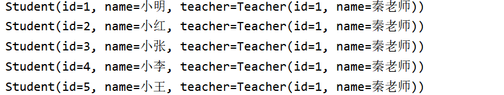

# MyBatis

MyBatis


```java
// pojo
User getUserById(int id);

// mapper
<select id="getUserById" parameterType="int" resultType="edu.cqupt.pojo.User">
	select * from mybatis.user where id = #{id}
</select>

// test
@Test
public void getUserById(){
    SqlSession sqlSession = MybatisUtils.getSqlSession();
    UserMapper mapper = sqlSession.getMapper(UserMapper.class);
    User user = mapper.getUserById(2);
    System.out.println(user);
}
```

# resultMap
```java
<!--结果集映射-->
<resultMap id="UserMap" type="User">
    <!--column数据库中的字段，property实体类中的属性-->
    <result column="id" property="id"/>
    <result column="name" property="name"/>
    <result column="pwd" property="password"/>
</resultMap>

<select id="getUserById" resultMap="UserMap">
    select * from mybatis.user where id = #{id}
</select>
```

# 配置
+ configuration（配置）
+ properties（属性）
+ settings（设置）
+ typeAliases（类型别名）
+ typeHandlers（类型处理器）
+ objectFactory（对象工厂）
+ plugins（插件）
+ environments（环境配置）
+ environment（环境变量）
+ transactionManager（事务管理器）
+ dataSource（数据源）
+ databaseIdProvider（数据库厂商标识）
+ mappers（映射器）


# 日志
• 配置log4j为日志的实现

```java
<settings>
    <setting name="logImpl" value="LOG4J"/>
</settings>
```

配置文件

+ **log4j.properties**

```java
#将等级为DEBUG的日志信息输出到console和file这两个目的地，console和file的定义在下面的代码
log4j.rootLogger=DEBUG,console,file
#控制台输出的相关设置
log4j.appender.console = org.apache.log4j.ConsoleAppender
log4j.appender.console.Target = System.out
log4j.appender.console.Threshold=DEBUG
log4j.appender.console.layout = org.apache.log4j.PatternLayout
log4j.appender.console.layout.ConversionPattern=[%c]-%m%n
#文件输出的相关设置
log4j.appender.file = org.apache.log4j.RollingFileAppender
log4j.appender.file.File=./log/kuang.log
log4j.appender.file.MaxFileSize=10mb
log4j.appender.file.Threshold=DEBUG
log4j.appender.file.layout=org.apache.log4j.PatternLayout
log4j.appender.file.layout.ConversionPattern=[%p][%d{yy-MM-dd}][%c]%m%n
#日志输出级别
log4j.logger.org.mybatis=DEBUG
log4j.logger.java.sql=DEBUG
log4j.logger.java.sql.Statement=DEBUG
log4j.logger.java.sql.ResultSet=DEBUG
log4j.logger.java.sql.PreparedStatement=DEBUG
```

# 分页
## 使用Limit分页
## RowBounds 分页
## PageHelper 插件


# 使用注解开发
```java
public interface UserMapper {

    @Select("select * from user")
    List<User> getUsers();

    // 方法存在多个参数，所有的参数前面必须加上 @Param("id")注解
    @Select("select * from user where id = #{id}")
    User getUserByID(@Param("id") int id);


    @Insert("insert into user(id,name,pwd) values (#{id},#{name},#{password})")
    int addUser(User user);

    
    @Update("update user set name=#{name},pwd=#{password} where id = #{id}")
    int updateUser(User user);

    
    @Delete("delete from user where id = #{uid}")
    int deleteUser(@Param("uid") int id);
}
```

# Lombok


```java
@Getter and @Setter
@FieldNameConstants
@ToString
@EqualsAndHashCode
@AllArgsConstructor, @RequiredArgsConstructor and @NoArgsConstructor
@Log, @Log4j, @Log4j2, @Slf4j, @XSlf4j, @CommonsLog, @JBossLog, @Flogger
@Data
@Builder
@Singular
@Delegate
@Value
@Accessors
@Wither
@SneakyThrows
```

# 复杂查询
## 一对多查询
```java
// 按查询嵌套处理
<select id="getTeacher2" resultMap="TeacherStudent2">
    select * from mybatis.teacher where id = #{tid}
</select>

<resultMap id="TeacherStudent2" type="Teacher">
    <collection property="students" javaType="ArrayList" ofType="Student" select="getStudentByTeacherId" column="id"/>
</resultMap>

<select id="getStudentByTeacherId" resultType="Student">
    select * from mybatis.student where tid = #{tid}
</select>
```


```java
    <!--按结果嵌套查询-->
    <select id="getTeacher" resultMap="TeacherStudent">
        select s.id sid, s.name sname, t.name tname,t.id tid
        from student s,teacher t
        where s.tid = t.id and t.id = #{tid}
    </select>

    <resultMap id="TeacherStudent" type="Teacher">
        <result property="id" column="tid"/>
        <result property="name" column="tname"/>
        <!--复杂的属性，我们需要单独处理 对象： association 集合： collection
        javaType="" 指定属性的类型！
        集合中的泛型信息，我们使用ofType获取
        -->
        <collection property="students" ofType="Student">
            <result property="id" column="sid"/>
            <result property="name" column="sname"/>
            <result property="tid" column="tid"/>
        </collection>
    </resultMap>
```

## 多对一查询


## 联表查询
也可以使用子查询

```java
<!--
    思路:
        1. 查询所有的学生信息
        2. 根据查询出来的学生的tid，寻找对应的老师！  子查询
    -->

<select id="getStudent" resultMap="StudentTeacher">
    select * from student
</select>

<resultMap id="StudentTeacher" type="Student">
    <result property="id" column="id"/>
    <result property="name" column="name"/>
    
    <!--复杂的属性，我们需要单独处理 对象： association 集合： collection -->
    <association property="teacher" column="tid" javaType="Teacher" select="getTeacher"/>
</resultMap>

<select id="getTeacher" resultType="Teacher">
    select * from teacher where id = #{id}
</select>
```




## 总结：
+ 关联 - association 多对一
+ 集合 - collection   【一对多】


# 动态 SQL


```java
if
choose (when, otherwise)
trim (where, set)
foreach
```

## IF
```java
<select id="queryBlogIF" parameterType="map" resultType="blog">
    select * from mybatis.blog where 1=1
    <if test="title != null">
        and title = #{title}
    </if>
    <if test="author != null">
        and author = #{author}
    </if>
</select>
```

## choose (when, otherwise)
## trim (where, set)
## foreach
构建 IN 条件语句

```java
   <select id="queryBlogForeach" parameterType="map" resultType="Blog">
        select * from blog
        <where>
             <foreach item="id" collection="ids"
                      open="and (" separator="or" close=")">
                  id = #{id}
             </foreach>
        </where>
    </select>
    
                 
 @Test
    public void queryBlogForeach(){
        SqlSession sqlSession = MybatisUtils.getSqlSession();
        BlogMapper mapper = sqlSession.getMapper(BlogMapper.class);
        Map map = new HashMap();
        List<String> ids = new ArrayList<String>();
        ids.add("bce7cc1ca483454eb925c1c0e6037d5f");
        ids.add("3a0b7bbb3faa4bbaad1dcc151fb29769");
        ids.add("c6c0616e8f82403cb336696a6f6729af");
        map.put("ids",ids);
        mapper.  queryBlogForeach(map);
        sqlSession.close();
    }                 
```

## SQL片段
```java
<sql id="if-title-author">
    <if test="title != null">
        title = #{title}
    </if>
    <if test="author != null">
        and author = #{author}
    </if>
</sql>

<select id="queryBlogIF" parameterType="map" resultType="blog">
    select * from mybatis.blog
    <where>
        <include refid="if-title-author"></include>
    </where>
</select>
```


# Dynamic SQL


干掉mapper.xml！MyBatis新特性动态SQL真香！


Dynamic SQL更倾向于使用Java API来实现SQL操作，传统的方式更倾向于在mapper.xml中手写SQL来实现SQL操作。


> 更新: 2021-05-12 16:51:41  
> 原文: <https://www.yuque.com/u3641/dxlfpu/kdy56h>