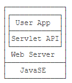
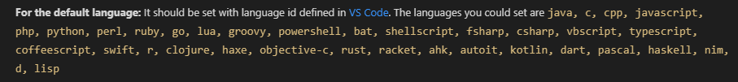
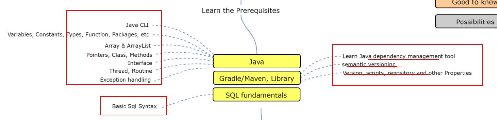
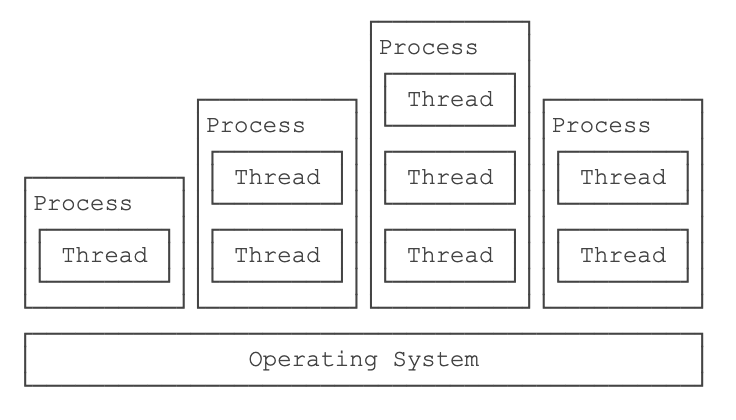
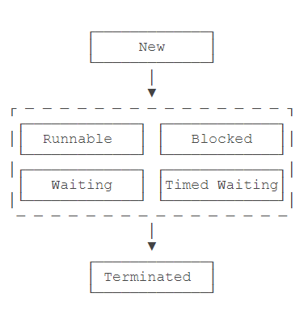
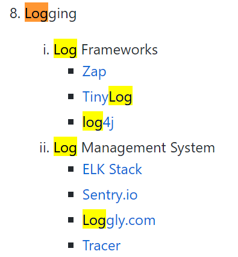
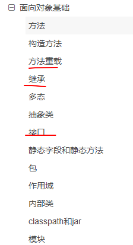
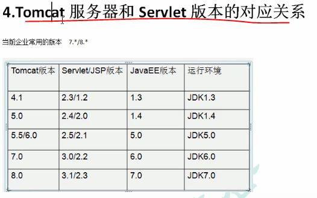
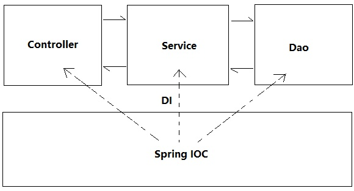
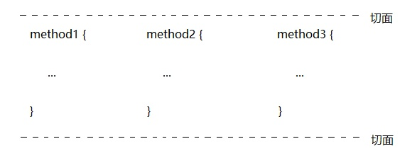

# java

# JavaSE

语言核心，基于标准JDK的开发都是JavaSE，即Java Platform Standard Edition

# JavaEE

> JavaEE并不是一个软件产品，它更多的是一种软件架构和设计思想。我们可以把JavaEE看作是在JavaSE的基础上，开发的一系列基于服务器的组件、API标准和通用架构。

JavaEE最核心的组件就是基于Servlet标准的Web服务器，开发者编写的应用程序是基于Servlet API并运行在Web服务器内部的：



目前流行的<font style="color:#F5222D;">基于Spring的轻量级JavaEE开发架构</font>，使用最广泛的是Servlet和JMS，以及一系列开源组件。

# 语言之美



# 基础语法



* 变量、常量、函数、包
* 数组、数组列表
* 指针、类、方法
* 接口
* 线程、Routine
* 错误处理

## 数据类型

**集合**

java.util

* List
  * ArrayList
  * LinkedList
    * Queue
  * Vector 线程安全
* Set
* Map
  * HashTable 线程安全

## 流程控制

## 运算符

## 其他

日期和时间

# 高级语法

## 注解

注解是干嘛的？

什么是注解（Annotation）？注解是放在Java源码的类、方法、字段、参数前的一种特殊“注释”：

```java
@Resource("hello")
public class Hello {
    @Inject
    int n;

    @PostConstruct
    public void hello(@Param String name) {
        System.out.println(name);
    }

    @Override
    public String toString() {
        return "Hello";
    }
}
```

使用@interface语法来定义注解（Annotation）

有一些注解可以修饰其他注解，这些注解就称为元注解（meta annotation）

## 泛型

## 反射

# 进阶

## 文件读写

## JSON 序列化和反序列化

## 并发

进程和线程的关系就是：一个进程可以包含一个或多个线程，但至少会有一个线程。



Java 多线程

> Java语言内置了多线程支持：一个Java程序实际上是一个JVM进程，JVM进程用一个主线程来执行`main()`方法，在`main()`方法内部，我们又可以启动多个线程。此外，JVM还有负责垃圾回收的其他工作线程等。

线程的状态



线程同步，synchronized，加锁

* 线程安全
*

## 网络

TCP

UDP

HTTP

RPC

## 错误处理

抛出异常

处理异常

自定义异常

## 数据库 JDBC

* 查询
* 更新
* 事务
* 连接池

## 日志



* Log4j

## OO



面向对象基础

* 继承
* 多态
* 抽象
* 接口
* 静态
* 包 package

Java 核心类

## 日期和时间

旧API转新API

# Java Web

**<font style="color:#666666;">Web开发的基础</font>**

1. Servlet规范定义了几种标准组件：Servlet、JSP、Filter和Listener；
2. Servlet的标准组件总是运行在**Servlet容器**中，如Tomcat、Jetty、WebLogic等

**war**

war，表示Java Web Application Archive

## Tomcat



## Servlet


**Tomcat这样的Web服务器也称为Servlet容器**

**<font style="color:#666666;"></font>**

## JSP

JSP和Servlet有什么区别？其实它们没有任何区别，因为JSP在执行前首先被编译成一个Servlet。

JSP本身目前已经很少使用，我们只需要了解其基本用法即可。

JSP对页面开发不友好，更好的替代品是模板引擎?

#

# Maven

## 命令

```javascript
mvn compile
mvn clean
```

## 目录结构

一个使用Maven管理的普通的Java项目，它的目录结构默认如下：

```plain
a-maven-project
├── pom.xml
├── src
│   ├── main
│   │   ├── java
│   │   └── resources
│   └── test
│       ├── java
│       └── resources
└── target
```

## 常用的插件

* maven-shade-plugin：打包所有依赖包并生成可执行jar；
* cobertura-maven-plugin：生成单元测试覆盖率报告；
* findbugs-maven-plugin：对Java源码进行静态分析以找出潜在问题。

## 发布包

```plain
how-to-become-rich
├── maven-repo        <-- Maven本地文件仓库
├── pom.xml           <-- 项目文件
├── src
│   ├── main
│   │   ├── java      <-- 源码目录
│   │   └── resources <-- 资源目录
│   └── test
│       ├── java      <-- 测试源码目录
│       └── resources <-- 测试资源目录
└── target            <-- 编译输出目录
```

## Nexus

是一个支持Maven仓库的软件，由Sonatype开发，有免费版和专业版两个版本，很多大公司内部都使用Nexus作为自己的私有Maven仓库，而这个central.sonatype.org相当于面向开源的一个Nexus公共服务。

# 直接上框架吧

> Spring Boot和Spring的关系就是整车和零部件的关系，它们不是取代关系，试图跳过Spring直接学习Spring Boot是不可能的。
>
> Spring Boot的目标就是提供一个开箱即用的应用程序架构，我们基于Spring Boot的预置结构继续开发，省时省力。

## Spring

Spring 主要功能包括IoC容器、AOP支持、事务支持、MVC开发以及强大的第三方集成功能等

* IoC ??
* AOP 面向切面？？黑人问好
* 事务支持 ??
* MVC

Spring Framework主要包括几个模块：

* 支持IoC和AOP的容器；
* 支持JDBC和ORM的数据访问模块；
* 支持声明式事务的模块；
* 支持基于Servlet的MVC开发；
* 支持基于Reactive的Web开发；
* 以及集成JMS、JavaMail、JMX、缓存等其他模块。

### IoC

控制反转

> <font style="color:#121212;">控制权的反转，之前主动权在业务层，每次用户提出需求业务层就需要跟着做出改变，现在我们把主动权交给了用户，它传进什么，就得到什么样的结果，这样业务代码就不用跟着改变了。</font>



### AOP

面向切面【<font style="color:#121212;">交叉业务的编程问题即为面向切面编程</font>】

在 OOP 中，我们以类(class)作为我们的基本单元，而 AOP 中的基本单元是 Aspect(切面)

> OOP把系统看作多个对象的交互，AOP把系统分解为不同的关注点，或者称之为切面（Aspect）。

一些常用功能如权限检查、日志、事务等，从每个业务方法中剥离出来。

**<font style="color:#121212;">主要思路应用动态代理</font>**

**<font style="color:#121212;"></font>**



原先不用AOP时，交叉业务的代码直接硬编码在**方法内部的前后**，而AOP则是把交叉业务写在**方法调用前后**。

### <font style="color:#121212;">数据库</font>

**<font style="color:#121212;"></font>**

**<font style="color:#121212;">Jdbc</font>**

**<font style="color:#121212;"></font>**

Spring提供了JdbcTemplate来简化JDBC操作；

> <font style="color:#666666;">编写示例代码或者测试代码时，我们强烈推荐使用</font>[HSQLDB](http://hsqldb.org/)<font style="color:#666666;">这个数据库，它是一个用Java编写的关系数据库，可以以内存模式或者文件模式运行，本身只有一个jar包，非常适合演示代码或者测试代码。</font>

**<font style="color:#666666;">DAO</font>**

<font style="color:#666666;">类以实现Data Access Object模式</font>

**数据库访问框架 ORM/ODM**

Hibernate、JPA和MyBatis这些数据库访问框架

### Spring MVC

<font style="color:#121212;">现在搭 ssm 太麻烦，基本都是用 SpringBoot 了</font>

***

> <font style="color:#666666;">直接使用Servlet进行Web开发好比直接在JDBC上操作数据库，比较繁琐，更好的方法是在Servlet基础上封装MVC框架</font>

## Spring Boot

> Spring Boot是一个基于Spring的套件，它帮我们预组装了Spring的一系列组件，以便以尽可能少的代码和配置来开发基于Spring的Java应用程序。

## MyBatis

使用MyBatis访问MySQL


> 更新: 2021-04-13 09:33:16  
> 原文: <https://www.yuque.com/u3641/dxlfpu/wayznu>