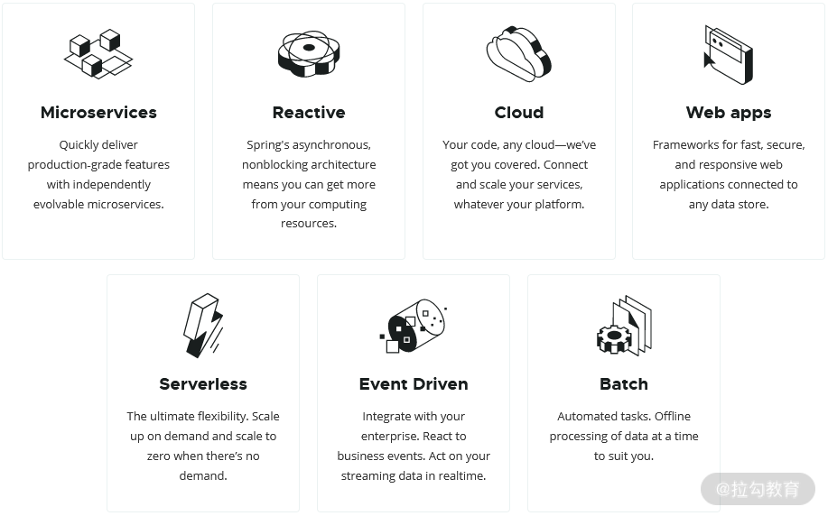
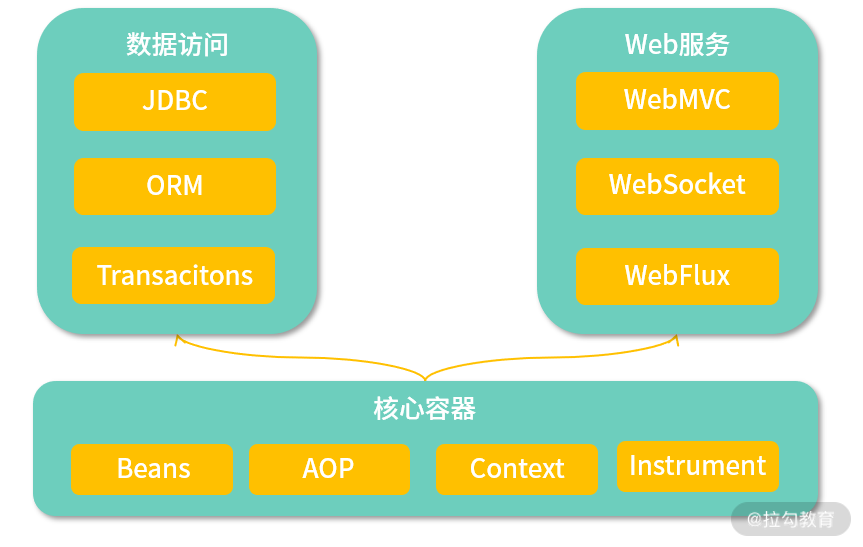
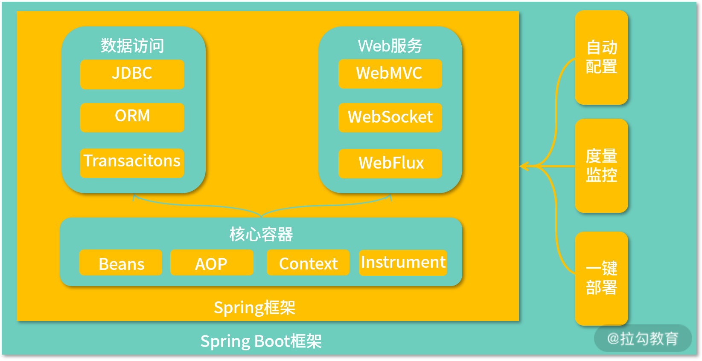
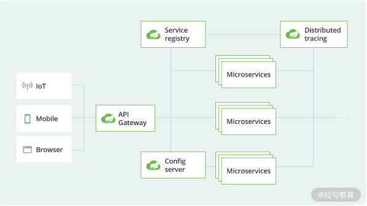
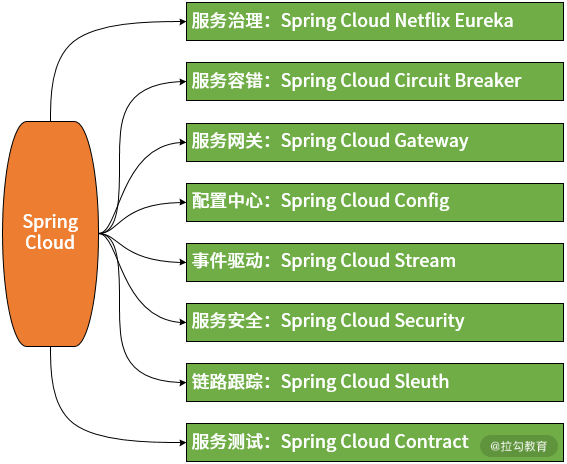
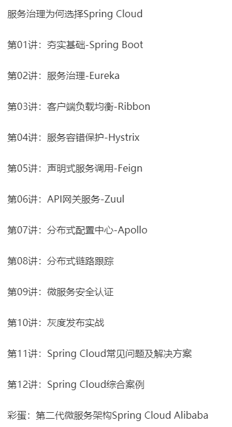

# spring

# spring 七大核心





响应式编程是 Spring 5 引入的最大创新，代表了一种系统架构设计和实现的技术方向。


我们现在能看到的 Spring 家族技术体系都是在 Spring Framework 基础上逐步演进而来的。


# Spring Framework 技术架构图





# spring boot 架构图





开发一个 HelloWorld，只要这么几行

```javascript
@SpringBootApplication

@RestController

public class DemoApplication {

 

    @GetMapping("/helloworld")

	public String hello() { 

	    return "Hello World!";

	}

 

	public static void main(String[] args) {

        SpringApplication.run(DemoApplication.class, args);

    }

}

```

**<font style="background-color:#FADB14;">Spring Boot 的核心功能就是自动配置。</font>**

**<font style="background-color:#FADB14;"></font>**

事实上，Spring Boot 的运行过程同样还是依赖于 Spring MVC，但是它把原本需要开发人员指定的各种配置项设置了默认值，并内置在了运行时环境中，例如默认的服务器端口就是 8080，如果我们不需要对这些配置项有定制化需求，就可以不做任何的处理，采用既定的开发约定即可。这就是 Spring Boot 所倡导的约定优于配置（Convention over Configuration）设计理念。


# spring cloud 核心架构图





Spring Cloud 的核心组件如下图所示：





基于 Spring Boot 的开发便利性，Spring Cloud 巧妙地简化了微服务系统基础设施的开发过程，Spring Cloud 包含上图中所展示的服务发现注册、API 网关、配置中心、消息总线、负载均衡、熔断器、数据监控等。





# Spring 5 与响应式编程


随着 Spring 5 的正式发布，我们迎来了响应式编程（Reactive Programming）的全新发展时期。Spring 5 中内嵌了与数据管理相关的响应式数据访问、与系统集成相关的响应式消息通信以及与 Web 服务相关的响应式 Web 框架等多种响应式组件，从而极大地简化了响应式应用程序的开发过程和开发难度。


> 更新: 2021-04-13 16:46:58  
> 原文: <https://www.yuque.com/u3641/dxlfpu/fvk54c>