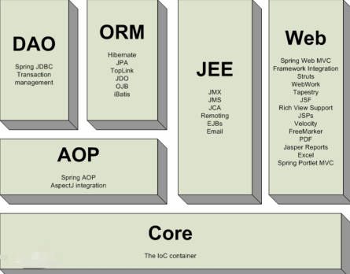
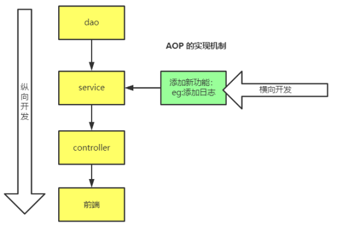
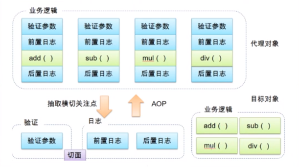
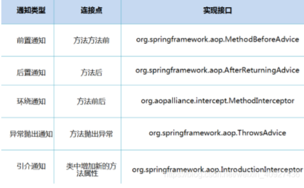

# spring

<font style="color:rgb(102, 102, 102);">Spring Framework主要包括几个模块：</font>

+ <font style="color:rgb(102, 102, 102);">支持IoC和AOP的容器；</font>
+ <font style="color:rgb(102, 102, 102);">支持JDBC和ORM的数据访问模块；</font>
+ <font style="color:rgb(102, 102, 102);">支持声明式事务的模块；</font>
+ <font style="color:rgb(102, 102, 102);">支持基于Servlet的MVC开发；</font>
+ <font style="color:rgb(102, 102, 102);">支持基于Reactive的Web开发；</font>
+ <font style="color:rgb(102, 102, 102);">以及集成JMS、JavaMail、JMX、缓存等其他模块。</font>


Spring就是一个轻量级的控制反转（IOC）和面向切面编程（AOP）的容器（框架）！



# Ioc


<font style="color:#F5222D;">控制反转</font>：IOC——Inversion of Control，指的是将对象的创建权交给 Spring 去创建。使用 Spring 之前，对象的创建都是由我们自己在代码中new创建。而使用 Spring 之后。对象的创建都是由给了 Spring 框架。


> 通常new一个实例，控制权由程序员控制，而"控制反转"是指new实例工作不由程序员来做而是交给Spring容器来做
>


IoC又称为依赖注入（DI：Dependency Injection）

+ 将组件的创建+配置与组件的使用相分离

## 装配bean


通过XML文件来配置

```java
// beans.xml
<?xml version="1.0" encoding="UTF-8"?>
<beans xmlns="http://www.springframework.org/schema/beans"
       xmlns:xsi="http://www.w3.org/2001/XMLSchema-instance"
       xsi:schemaLocation="http://www.springframework.org/schema/beans
        https://www.springframework.org/schema/beans/spring-beans.xsd">
     
    <bean id="hello" class="edu.cqupt.poio.Hello">
         <!--给对象中的属性设置一个值-->
         <property name="str" value="Spring"/>
     </bean>
     
    <bean id="dataSource" class="HikariDataSource" />
	// 把id为dataSource的组件通过属性dataSource注入到下面组件中
    <bean id="bookService" class="BookService">
        <property name="dataSource" ref="dataSource" />
    </bean>        
</beans>
```

总结： 在配置文件加载的时候，Spring容器中管理的对象就已经被初始化了。一旦容器初始化完毕，我们就直接从容器中获取Bean使用它们。


## 使用注解装配Bean


XML的写法非常繁琐，我们可以使用Annotation配置，可以完全不需要XML，让Spring自动扫描Bean并组装它们，实现自动装配


+ @Component
+ @Configuration
+ @Autowired
+ @ComponentScan
+ @Bean
+ @Qualifier
+ @Order


```java
// UserService
@Component
public class UserService {
    @Autowired
    MailService mailService;

    ...
}


// AppConfig
@Configuration
@ComponentScan
public class AppConfig {
    public static void main(String[] args) {
        ApplicationContext context = new AnnotationConfigApplicationContext(AppConfig.class);
        UserService userService = context.getBean(UserService.class);
        User user = userService.login("bob@example.com", "password");
        System.out.println(user.getName());
    }
}
```

保证：

+ 每个Bean被标注为@Component并正确使用@Autowired注入；
+ 配置类被标注为@Configuration和@ComponentScan；
+ 所有Bean均在指定包以及子包内。

# AOP


AOP技术看上去比较神秘，但实际上，它本质就是一个动态代理，让我们把一些常用功能如权限检查、日志、事务等，从每个业务方法中剥离出来。





静态代理

动态代理

+ 动态代理的代理类是动态生成的，不是我们直接写好的，动态生成代理类


**利用反射**

```java
import java.lang.reflect.InvocationHandler;
import java.lang.reflect.Method;
import java.lang.reflect.Proxy;

// 等会我们用这个类，自动生成代理类
public class ProxyInVocationHandler implements InvocationHandler {

    private Object target;
    public void setTarget(Object target) {
        this.target = target;
    }
    public Object getProxy(){// 生成得到代理类
        return Proxy.newProxyInstance(this.getClass().getClassLoader(),
                target.getClass().getInterfaces(),this);
    }
    // 动态代理的本质，就是使用反射机制实现
    // 处理代理实例，并返回结果
    public Object invoke(Object proxy, Method method, Object[] args) throws Throwable {
        log(method.getName());
        Object result = method.invoke(target,args);
        return  result;
    }
    // 给代理添加功能
    public void log(String msg){
        System.out.println("[Debug]:执行了" + msg + "方法。");
    }
}
```

<font style="color:#F5222D;">Spring的AOP实现就是基于JVM的动态代理。</font>




SpringAOP中，通过Advice定义横切逻辑，Spring中支持5种类型的Advice:





Aop 在 不改变原有代码的情况下 , 去增加新的功能。


+ Before
+ Around
+ After

```java
@Aspect
@Component
public class LoggingAspect {
    // 在执行UserService的每个方法前执行:
    @Before("execution(public * com.itranswarp.learnjava.service.UserService.*(..))")
    public void doAccessCheck() {
        System.err.println("[Before] do access check...");
    }

    // 在执行MailService的每个方法前后执行:
    @Around("execution(public * com.itranswarp.learnjava.service.MailService.*(..))")
    public Object doLogging(ProceedingJoinPoint pjp) throws Throwable {
        System.err.println("[Around] start " + pjp.getSignature());
        Object retVal = pjp.proceed();
        System.err.println("[Around] done " + pjp.getSignature());
        return retVal;
    }
}
```


我们使用AOP非常简单，一共需要三步：

1. 定义执行方法，并在方法上通过AspectJ的注解告诉Spring应该在何处调用此方法；
2. 标记@Component和@Aspect；
3. 在@Configuration类上标注@EnableAspectJAutoProxy。


## 使用注解装配AOP
## Mybatis-Spring
+ 编写数据源配置
+ sqlSessionFactory
+ sqlSessionTemplate


```java
<?xml version="1.0" encoding="UTF-8"?>
<beans xmlns="http://www.springframework.org/schema/beans"
       xmlns:xsi="http://www.w3.org/2001/XMLSchema-instance"
       xsi:schemaLocation="http://www.springframework.org/schema/beans
        https://www.springframework.org/schema/beans/spring-beans.xsd">

        <!--DataSource: 使用Spring的数据源替换mybatis的配置 c3p0 dbcp druid
            我们使用Spring提供的jdbc-->
        <bean id="dataSource" class="org.springframework.jdbc.datasource.DriverManagerDataSource">
            <property name="driverClassName" value="com.mysql.jdbc.Driver"/>
            <property name="url" value="jdbc:mysql://localhost:3306/mybatis?useSSL=true&amp;useUnicode=true&amp;characterEncoding=UTF-8"/>
            <property name="username" value="root"/>
            <property name="password" value="123456"/>
        </bean>
        <!--SqlSessionFactory-->
        <bean id="sqlSessionFactory" class="org.mybatis.spring.SqlSessionFactoryBean">
            <property name="dataSource" ref="dataSource" />
            <!--绑定Mybatis配置文件-->
            <property name="configLocation" value="classpath:mybatis-config.xml"/>
            <property name="mapperLocations" value="classpath:edu/cqupt/mapper/*.xml"/>
        </bean>

        <!--SqlSessionTemplate 就是我们使用的的SqlSession-->
        <bean id="sqlSession" class="org.mybatis.spring.SqlSessionTemplate">
            <!--只能使用构造器注入SqlSessionFactory 因为他没有set方法-->
            <constructor-arg index="0" ref="sqlSessionFactory"/>
        </bean>

</beans>
```

或者，使用 sqlSessionFactory

```java
<bean id="userMapper" class="edu.cqupt.mapper.UserMapperImpl">
	<property name="sqlSessionFactory" ref="sqlSessionFactory"/>
</bean>

// 1 继承 SqlSessionDaoSupport
// 2 使用getSqlSession()方法获得SqlSession
public class UserMapperImpl extends SqlSessionDaoSupport implements UserMapper {
    public List<User> selectUser() {
        UserMapper mapper = getSqlSession().getMapper(UserMapper.class);
        return mapper.selectUser();
    }
}
```


> 更新: 2021-04-29 09:58:16  
> 原文: <https://www.yuque.com/u3641/dxlfpu/wklhtp>