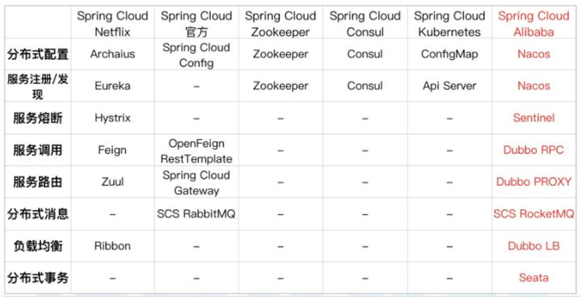
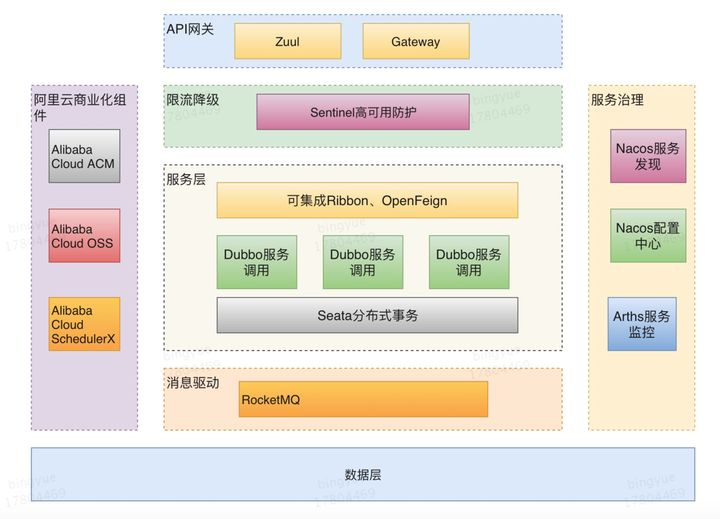

# spring cloud alibaba

# 已经包含的组件

**Sentinel**

阿里巴巴开源产品，把流量作为切入点，从流量控制、熔断降级、系统负载保护等多个维度保护服务的稳定性。

**Nacos**

阿里巴巴开源产品，一个更易于构建云原生应用的动态服务发现、配置管理和服务管理平台。

**RocketMQ**

Apache RocketMQ™ 基于 Java 的高性能、高吞吐量的分布式消息和流计算平台。

**Dubbo**

Apache Dubbo™ 是一款高性能 Java RPC 框架。

**Seata**

阿里巴巴开源产品，一个易于使用的高性能微服务分布式事务解决方案。

**Alibaba Cloud OSS**

阿里云对象存储服务（Object Storage Service，简称 OSS），是阿里云提供的海量、安全、低成本、高可靠的云存储服务。您可以在任何应用、任何时间、任何地点存储和访问任意类型的数据。

**Alibaba Cloud SchedulerX**

阿里中间件团队开发的一款分布式任务调度产品，支持周期性的任务与固定时间点触发任务。

**Alibaba Cloud SMS**

覆盖全球的短信服务，友好、高效、智能的互联化通讯能力，帮助企业迅速搭建客户触达通道。

参考

[Spring Cloud Alibaba 新一代微服务解决方案](https://zhuanlan.zhihu.com/p/98874444)

> 更新: 2021-05-04 13:30:18  
> 原文: <https://www.yuque.com/u3641/dxlfpu/ew7vo2>