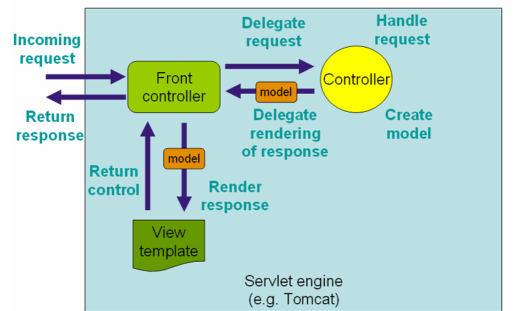
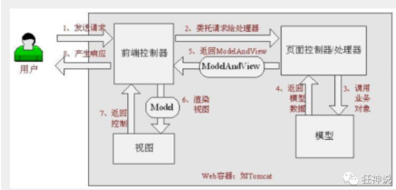
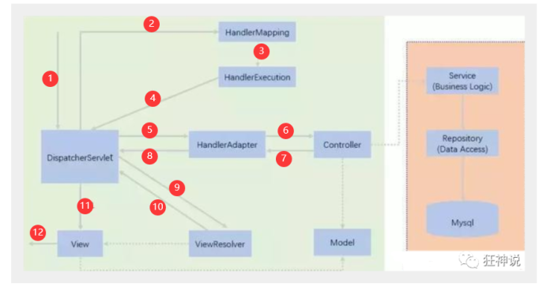

# spring mvc

SpringMVC的特点：

• 轻量级，简单易学

• 高效、基于请求响应的MVC框架

• 与Spring兼容性好，无缝结合，我们可以将SpringMVC中所有用到的bean，注册到Spring中

• 约定大于配置

• 功能强大：RESTful风格、数据验证、格式化、本地化、主题等

• 简洁、灵活


中心控制器

Spring的web框架围绕DispatcherServlet设计。DispatcherServlet的作用是将请求分发到不同的处理器。


流程



解释一下



主要



**实线表示SpringMVC框架提供的技术，不需要开发者实现，虚线表示需要开发者实现。**


在pom.xml文件引入相关的依赖：主要有Spring框架核心库、Spring MVC、servlet , JSTL


# 注解


## 配置 web.xml
```java
<build>
   <resources>
       <resource>
           <directory>src/main/java</directory>
           <includes>
               <include>**/*.properties</include>
               <include>**/*.xml</include>
           </includes>
           <filtering>false</filtering>
       </resource>
       <resource>
           <directory>src/main/resources</directory>
           <includes>
               <include>**/*.properties</include>
               <include>**/*.xml</include>
           </includes>
           <filtering>false</filtering>
       </resource>
   </resources>
</build>
```


m


## v
```html
// hello.jsp
<%@ page contentType="text/html;charset=UTF-8" language="java" %>
<html>
<head>
   <title>SpringMVC</title>
</head>
<body>
${msg}
</body>
</html>
```


## c
```java
package edu.cqupt.controller;

import org.springframework.stereotype.Controller;
import org.springframework.ui.Model;
import org.springframework.web.bind.annotation.RequestMapping;

@Controller
//@RequestMapping("/hello")  //localhost:8080/hello/h1
public class HelloController {
    @RequestMapping("/h1")
    public String hello(Model model){
        //封装数据
        model.addAttribute("msg","Hello,SpringMVCAnnotation");
        return "hello"; // 会被视图解析器处理
    }
}
```

+ @Controller是为了让Spring IOC容器初始化时自动扫描到；
+ @RequestMapping是为了映射请求路径，这里因为类与方法上都有映射所以访问时应该是/HelloController/hello；
+ 方法中声明Model类型的参数是为了把Action中的数据带到视图中；
+ 方法返回的结果是视图的名称hello，加上配置文件中的前后缀变成WEB-INF/jsp/**hello**.jsp。


总结

> 实现步骤其实非常的简单：
>
> 1. 新建一个web项目
> 2. 导入相关jar包
> 3. 编写web.xml , 注册DispatcherServlet
> 4. 编写springmvc配置文件
> 5. 接下来就是去创建对应的控制类 , controller
> 6. 最后完善前端视图和controller之间的对应
> 7. 测试运行调试
>

# 手动
```html
// web.xml
<?xml version="1.0" encoding="UTF-8"?>
<web-app xmlns="http://xmlns.jcp.org/xml/ns/javaee"
        xmlns:xsi="http://www.w3.org/2001/XMLSchema-instance"
        xsi:schemaLocation="http://xmlns.jcp.org/xml/ns/javaee http://xmlns.jcp.org/xml/ns/javaee/web-app_4_0.xsd"
        version="4.0">

   <!--1.注册DispatcherServlet-->
   <servlet>
       <servlet-name>springmvc</servlet-name>
       <servlet-class>org.springframework.web.servlet.DispatcherServlet</servlet-class>
       <!--关联一个springmvc的配置文件:【servlet-name】-servlet.xml-->
       <init-param>
           <param-name>contextConfigLocation</param-name>
           <param-value>classpath:springmvc-servlet.xml</param-value>
       </init-param>
       <!--启动级别-1-->
       <load-on-startup>1</load-on-startup>
   </servlet>

   <!--/ 匹配所有的请求；（不包括.jsp）-->
   <!--/* 匹配所有的请求；（包括.jsp）-->
   <servlet-mapping>
       <servlet-name>springmvc</servlet-name>
       <url-pattern>/</url-pattern>
   </servlet-mapping>

</web-app>

// springmvc-servlet.xml
// springmvc 配置文件
<?xml version="1.0" encoding="UTF-8"?>
<beans xmlns="http://www.springframework.org/schema/beans"
       xmlns:xsi="http://www.w3.org/2001/XMLSchema-instance"
       xsi:schemaLocation="http://www.springframework.org/schema/beans
       http://www.springframework.org/schema/beans/spring-beans.xsd">
    <bean class="org.springframework.web.servlet.handler.BeanNameUrlHandlerMapping"/>
    <bean class="org.springframework.web.servlet.mvc.SimpleControllerHandlerAdapter"/>
    <!--视图解析器:DispatcherServlet给他的ModelAndView
        1. 获取了ModelAndView的数据
        2. 解析ModelAndView的视图名字
        3. 拼接视图名字，找到对应的视图
        4. 将数据渲染到当前视图上--> 
    <bean class="org.springframework.web.servlet.view.InternalResourceViewResolver" id="InternalResourceViewResolver">
        <!--前缀-->
        <property name="prefix" value="/WEB-INF/jsp/"/>
        <!--后缀-->
        <property name="suffix" value=".jsp"/>
    </bean>
    <!--Handler-->
    <bean id="/hello" class="edu.cqupt.controller.HelloController"/>
</beans>
```

```java
// hello.controller
package edu.cqupt.controller;

import org.springframework.web.servlet.ModelAndView;
import org.springframework.web.servlet.mvc.Controller;

import javax.servlet.http.HttpServletRequest;
import javax.servlet.http.HttpServletResponse;

//注意：这里我们先导入Controller接口
public class HelloController implements Controller {

    public ModelAndView handleRequest(HttpServletRequest request, HttpServletResponse response) throws Exception {
        //ModelAndView 模型和视图
        ModelAndView mv = new ModelAndView();

        //封装对象，放在ModelAndView中。Model
        mv.addObject("msg","HelloSpringMVC!");
        //封装要跳转的视图，放在ModelAndView中
        mv.setViewName("hello"); //: /WEB-INF/jsp/hello.jsp
        return mv;
    }
}
```


> 更新: 2021-04-29 10:12:08  
> 原文: <https://www.yuque.com/u3641/dxlfpu/qpg49w>