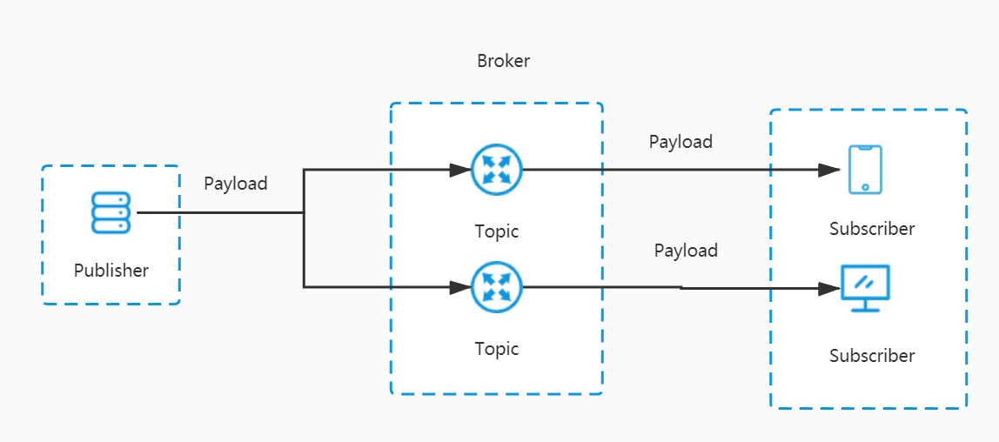

# tools

# 数据库迁移
Flyway是一款数据库迁移工具，它让数据库迁移变得更加简单。它能像Git一样对数据库进行版本控制，支持命令行工具、Maven插件、第三方工具（比如SpringBoot）等多种使用方式。


# <font style="color:rgb(52, 73, 94);">Java代码功能增强库</font>
Lombok是一款Java代码功能增强库，在Github上已有9.8k+Star。它会自动集成到你的编辑器和构建工具中，从而使你的Java代码更加生动有趣。通过Lombok的注解，你可以不用再写getter、setter、equals等方法，Lombok将在编译时为你自动生成。


最近IDEA 2020最后一个版本发布了，已经内置了Lombok插件，SpringBoot 2.1.x之后的版本也在Starter中内置了Lombok依赖。


@NonNull

@Data

@Value


# MyBatis Generator


MyBatis Generator（简称MBG）是MyBatis官方提供的代码生成工具。可以通过数据库表直接生成实体类、单表CRUD代码、mapper.xml文件，从而解放我们的双手！


generatorConfig.xml文件中对MBG进行配置

```xml
<?xml version="1.0" encoding="UTF-8"?>
<!DOCTYPE generatorConfiguration
        PUBLIC "-//mybatis.org//DTD MyBatis Generator Configuration 1.0//EN"
        "http://mybatis.org/dtd/mybatis-generator-config_1_0.dtd">

<generatorConfiguration>
    <properties resource="generator.properties"/>
    <context id="MySqlContext" targetRuntime="MyBatis3" defaultModelType="flat">
        <property name="beginningDelimiter" value="`"/>
        <property name="endingDelimiter" value="`"/>
        <property name="javaFileEncoding" value="UTF-8"/>
        <!--生成mapper.xml时覆盖原文件-->
        <plugin type="org.mybatis.generator.plugins.UnmergeableXmlMappersPlugin" />
        <!-- 为模型生成序列化方法-->
        <plugin type="org.mybatis.generator.plugins.SerializablePlugin"/>
        <!-- 为生成的Java模型创建一个toString方法 -->
        <plugin type="org.mybatis.generator.plugins.ToStringPlugin"/>
        <!--可以自定义生成model的代码注释-->
        <commentGenerator type="com.macro.mall.tiny.mbg.CommentGenerator">
            <!-- 是否去除自动生成的注释 true：是 ： false:否 -->
            <property name="suppressAllComments" value="true"/>
            <property name="suppressDate" value="true"/>
            <property name="addRemarkComments" value="true"/>
        </commentGenerator>
        <!--配置数据库连接-->
        <jdbcConnection driverClass="${jdbc.driverClass}"
                        connectionURL="${jdbc.connectionURL}"
                        userId="${jdbc.userId}"
                        password="${jdbc.password}">
            <!--解决mysql驱动升级到8.0后不生成指定数据库代码的问题-->
            <property name="nullCatalogMeansCurrent" value="true" />
        </jdbcConnection>
        <!--指定生成model的路径-->
        <javaModelGenerator targetPackage="com.macro.mall.tiny.mbg.model" targetProject="mall-tiny-generator\src\main\java"/>
        <!--指定生成mapper.xml的路径-->
        <sqlMapGenerator targetPackage="com.macro.mall.tiny.mbg.mapper" targetProject="mall-tiny-generator\src\main\resources"/>
        <!--指定生成mapper接口的的路径-->
        <javaClientGenerator type="XMLMAPPER" targetPackage="com.macro.mall.tiny.mbg.mapper"
                             targetProject="mall-tiny-generator\src\main\java"/>
        <!--生成全部表tableName设为%-->
        <table tableName="ums_admin">
            <generatedKey column="id" sqlStatement="MySql" identity="true"/>
        </table>
        <table tableName="ums_role">
            <generatedKey column="id" sqlStatement="MySql" identity="true"/>
        </table>
        <table tableName="ums_admin_role_relation">
            <generatedKey column="id" sqlStatement="MySql" identity="true"/>
        </table>
        <table tableName="ums_resource">
            <generatedKey column="id" sqlStatement="MySql" identity="true"/>
        </table>
        <table tableName="ums_resource_category">
            <generatedKey column="id" sqlStatement="MySql" identity="true"/>
        </table>
    </context>
</generatorConfiguration>

```

# es 支持 sql 查询


Elasticsearch 6.3 以后已经支持SQL查询了，不用学Query DSL了，虽然也不难


```bash
POST /_sql?format=txt
{
  "query": "SELECT account_number,address,age,balance FROM account LIMIT 10"
}

```

# mysql 同步 es


MySQL如何实时同步数据到ES？试试这款阿里开源的神器！


canal主要用途是对MySQL数据库增量日志进行解析，提供增量数据的订阅和消费，简单说就是可以对MySQL的增量数据进行实时同步，支持同步到MySQL、Elasticsearch、HBase等数据存储中去。


[https://github.com/alibaba/canal/wiki](https://github.com/alibaba/canal/wiki)

# spring boot 常用依赖
第三方依赖

```xml
<dependencies>
    <!--SpringBoot整合MyBatis数据存储功能依赖-->
    <dependency>
        <groupId>org.mybatis.spring.boot</groupId>
        <artifactId>mybatis-spring-boot-starter</artifactId>
        <version>${mybatis-version.version}</version>
    </dependency>
    <!--SpringBoot整合PageHelper分页功能依赖-->
    <dependency>
        <groupId>com.github.pagehelper</groupId>
        <artifactId>pagehelper-spring-boot-starter</artifactId>
        <version>${pagehelper-starter.version}</version>
    </dependency>
    <!--SpringBoot整合Druid数据库连接池功能依赖-->
    <dependency>
        <groupId>com.alibaba</groupId>
        <artifactId>druid-spring-boot-starter</artifactId>
        <version>${druid.version}</version>
    </dependency>  
    <!--SpringBoot整合Springfox的Swagger API文档功能依赖-->
    <dependency>
        <groupId>io.springfox</groupId>
        <artifactId>springfox-boot-starter</artifactId>
        <version>${springfox-version}</version>
    </dependency>
    <!--SpringBoot整合MyBatis-Plus数据存储功能依赖-->  
    <dependency>
        <groupId>com.baomidou</groupId>
        <artifactId>mybatis-plus-boot-starter</artifactId>
        <version>${mybatis-plus-version}</version>
    </dependency>
    <!--SpringBoot整合Knife4j API文档功能依赖--> 
    <dependency>
        <groupId>com.github.xiaoymin</groupId>
        <artifactId>knife4j-spring-boot-starter</artifactId>
        <version>${knife4j-version}</version>
    </dependency>        
</dependencies>

```

官方依赖

```xml
<dependencies>
    <!--SpringBoot整合Web功能依赖-->
    <dependency>
        <groupId>org.springframework.boot</groupId>
        <artifactId>spring-boot-starter-web</artifactId>
    </dependency>
    <!--SpringBoot整合Actuator功能依赖-->
    <dependency>
        <groupId>org.springframework.boot</groupId>
        <artifactId>spring-boot-starter-actuator</artifactId>
    </dependency>
    <!--SpringBoot整合AOP功能依赖-->
    <dependency>
        <groupId>org.springframework.boot</groupId>
        <artifactId>spring-boot-starter-aop</artifactId>
    </dependency>
    <!--SpringBoot整合测试功能依赖-->
    <dependency>
        <groupId>org.springframework.boot</groupId>
        <artifactId>spring-boot-starter-test</artifactId>
        <scope>test</scope>
    </dependency>
    <!--SpringBoot整合注解处理功能依赖-->
    <dependency>
        <groupId>org.springframework.boot</groupId>
        <artifactId>spring-boot-configuration-processor</artifactId>
        <optional>true</optional>
    </dependency>
    <!--SpringBoot整合Spring Security安全功能依赖-->
    <dependency>
        <groupId>org.springframework.boot</groupId>
        <artifactId>spring-boot-starter-security</artifactId>
    </dependency>
    <!--SpringBoot整合Redis数据存储功能依赖-->
    <dependency>
        <groupId>org.springframework.boot</groupId>
        <artifactId>spring-boot-starter-data-redis</artifactId>
    </dependency>
    <!--SpringBoot整合Elasticsearch数据存储功能依赖-->
    <dependency>
        <groupId>org.springframework.boot</groupId>
        <artifactId>spring-boot-starter-data-elasticsearch</artifactId>
    </dependency>
    <!--SpringBoot整合MongoDB数据存储功能依赖-->
    <dependency>
        <groupId>org.springframework.boot</groupId>
        <artifactId>spring-boot-starter-data-mongodb</artifactId>
    </dependency>
    <!--SpringBoot整合AMQP消息队列功能依赖-->
    <dependency>
        <groupId>org.springframework.boot</groupId>
        <artifactId>spring-boot-starter-amqp</artifactId>
    </dependency>
    <!--SpringBoot整合Quartz定时任务功能依赖-->
    <dependency>
        <groupId>org.springframework.boot</groupId>
        <artifactId>spring-boot-starter-quartz</artifactId>
    </dependency>
    <!--SpringBoot整合JPA数据存储功能依赖-->
    <dependency>
        <groupId>org.springframework.boot</groupId>
        <artifactId>spring-boot-starter-data-jpa</artifactId>
    </dependency>
    <!--SpringBoot整合邮件发送功能依赖-->
    <dependency>
        <groupId>org.springframework.boot</groupId>
        <artifactId>spring-boot-starter-mail</artifactId>
    </dependency>
</dependencies>

```

# Quartz 
SpringBoot官方支持任务调度框架，轻量级用起来也挺香！


概念


+ <font style="color:rgb(52, 73, 94);">Scheduler（调度器）：Quartz中的任务调度器，通过Trigger和JobDetail可以用来调度、暂停和删除任务。</font>
+ <font style="color:rgb(52, 73, 94);">Trigger（触发器）：Quartz中的触发器，可以通过CRON表达式来指定任务执行的时间，时间到了会自动触发任务执行。</font>
+ <font style="color:rgb(52, 73, 94);">JobDetail（任务详情）：Quartz中需要执行的任务详情，包括了任务的唯一标识和具体要执行的任务，可以通过JobDataMap往任务中传递数据。</font>
+ <font style="color:rgb(52, 73, 94);">Job（任务）：Quartz中具体的任务，包含了执行任务的具体方法。</font>

<font style="color:rgb(52, 73, 94);"></font>

# RabbitMQ启用MQTT
<font style="color:rgb(52, 73, 94);">MQTT（Message Queuing Telemetry Transport，消息队列遥测传输协议），是一种基于发布/订阅（publish/subscribe）模式的</font><font style="color:rgb(233, 105, 0);background-color:rgb(248, 248, 248);">轻量级</font><font style="color:rgb(52, 73, 94);">通讯协议，该协议构建于</font><font style="color:rgb(233, 105, 0);background-color:rgb(248, 248, 248);">TCP/IP</font><font style="color:rgb(52, 73, 94);">协议上。MQTT最大优点在于，可以以极少的代码和有限的带宽，为连接远程设备提供实时可靠的消息服务。</font>

<font style="color:rgb(52, 73, 94);"></font>



## [MQTT相关概念](http://www.macrozheng.com/#/reference/rabbitmq_mqtt_start?id=mqtt%e7%9b%b8%e5%85%b3%e6%a6%82%e5%bf%b5)
+ <font style="color:rgb(52, 73, 94);">Publisher（发布者）：消息的发出者，负责发送消息。</font>
+ <font style="color:rgb(52, 73, 94);">Subscriber（订阅者）：消息的订阅者，负责接收并处理消息。</font>
+ <font style="color:rgb(52, 73, 94);">Broker（代理）：消息代理，位于消息发布者和订阅者之间，各类支持MQTT协议的消息中间件都可以充当。</font>
+ <font style="color:rgb(52, 73, 94);">Topic（主题）：可以理解为消息队列中的路由，订阅者订阅了主题之后，就可以收到发送到该主题的消息。</font>
+ <font style="color:rgb(52, 73, 94);">Payload（负载）；可以理解为发送消息的内容。</font>
+ <font style="color:rgb(52, 73, 94);">QoS（消息质量）：全称Quality of Service，即消息的发送质量，主要有</font><font style="color:rgb(233, 105, 0);background-color:rgb(248, 248, 248);">QoS 0</font><font style="color:rgb(52, 73, 94);">、</font><font style="color:rgb(233, 105, 0);background-color:rgb(248, 248, 248);">QoS 1</font><font style="color:rgb(52, 73, 94);">、</font><font style="color:rgb(233, 105, 0);background-color:rgb(248, 248, 248);">QoS 2</font><font style="color:rgb(52, 73, 94);">三个等级，下面分别介绍下：</font>
    - <font style="color:rgb(52, 73, 94);">QoS 0（Almost Once）：至多一次，只发送一次，会发生消息丢失或重复；</font>
    - <font style="color:rgb(52, 73, 94);">QoS 1（Atleast Once）：至少一次，确保消息到达，但消息重复可能会发生；</font>
    - <font style="color:rgb(52, 73, 94);">QoS 2（Exactly Once）：只有一次，确保消息只到达一次。</font>

# mybatis-plus
MyBatis-Plus 提供了代码生成器，可以一键生成controller、service、mapper、model、mapper.xml代码，同时提供了丰富的CRUD操作方法，让我们实现单表CRUD几乎不用手写SQL实现！


# Java工具类库 Hutool
Hutool是一个小而全的Java工具类库


# Filebeat 日志搬运工


主要搬运 es、mysql、nginx 等第三方中间件日志


> 更新: 2021-05-12 17:59:41  
> 原文: <https://www.yuque.com/u3641/dxlfpu/psf1tm>