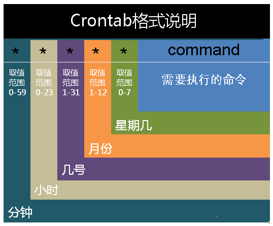

# cron

linux内置的cron进程能帮我们实现这些需求，cron搭配shell脚本

```java
crontab [-u username]　　　　//省略用户表表示操作当前用户的crontab
    -e      (编辑工作表)
    -l      (列出工作表里的命令)
    -r      (删除工作作)
```


时间有分、时、日、月、周五种




```java
// 每晚9:30 重启smb
30 21 * * * /etc/init.d/smb restart

// 每小时重启smb
0 */1 * * * /etc/init.d/smb restart

/etc/init.d/cron start
/etc/init.d/cron stop
/etc/init.d/cron restart

// 测试定时任务
*/2 * * * * date >> ~/time.log
```

操作符

+ * 取值范围内的所有数字/ 每过多少个数字
+ - 从X到Z
+ ，散列数字


参考


[https://linuxtools-rst.readthedocs.io/zh_CN/latest/tool/crontab.html](https://linuxtools-rst.readthedocs.io/zh_CN/latest/tool/crontab.html)


> 更新: 2021-04-27 16:09:53  
> 原文: <https://www.yuque.com/u3641/dxlfpu/dpbh0a>