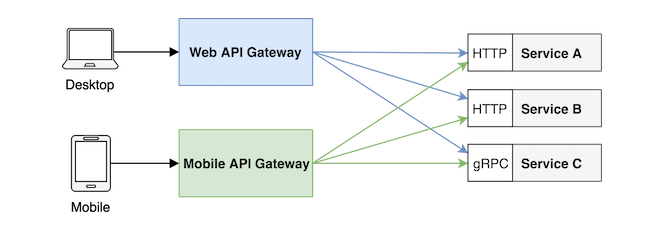

# API 网关

> 外部客户端访问微服务架构中的服务时，服务端会对认证和传输有一些常见的要求。API 网关提供共享层来处理服务协议之间的差异，并满足特定客户端（如桌面浏览器、移动设备和老系统）的要求
>




# express-http-proxy
[**http://www.inode.club/node/APIGateway.html#node-js-api-%E7%BD%91%E5%85%B3**](http://www.inode.club/node/APIGateway.html#node-js-api-%E7%BD%91%E5%85%B3)

```javascript
// https://www.npmjs.com/package/express-http-proxy

// 在 Node.js 中，您可以使用 http-proxy 软件包简单地代理对特定服务的请求，也可以使用更多丰富功能的 express-gateway 来创建 API 网关。

const express = require('express')
const httpProxy = require('express-http-proxy')
const app = express()

const userServiceProxy = httpProxy('https://user-service')

// 身份认证
app.use((req, res, next) => {
  // TODO: 身份认证逻辑
  next()
})

// 代理请求
app.get('/users/:userId', (req, res, next) => {
  userServiceProxy(req, res, next)
})

```


# express-gateway
https://www.express-gateway.io/docs/


> 更新: 2023-08-02 10:21:12  
> 原文: <https://www.yuque.com/u3641/dxlfpu/uvfspl4z2lg2ieyr>