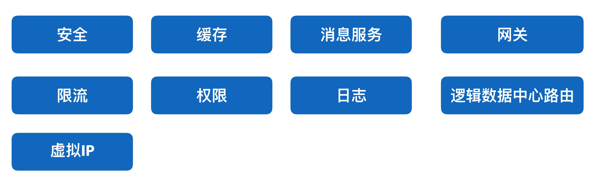
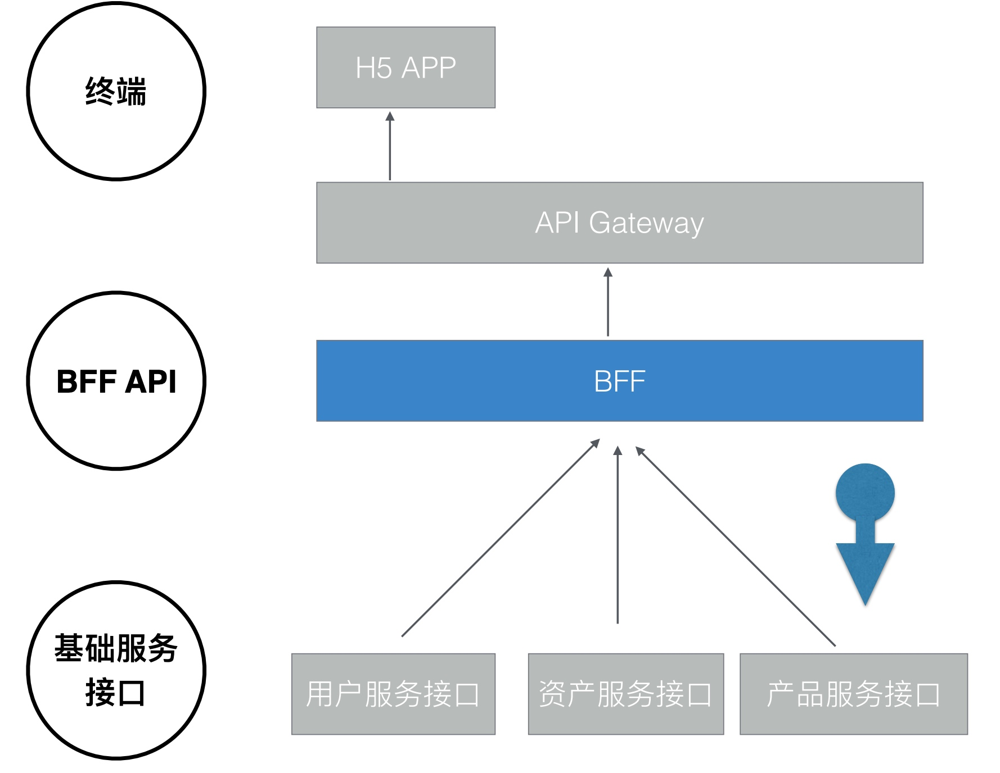
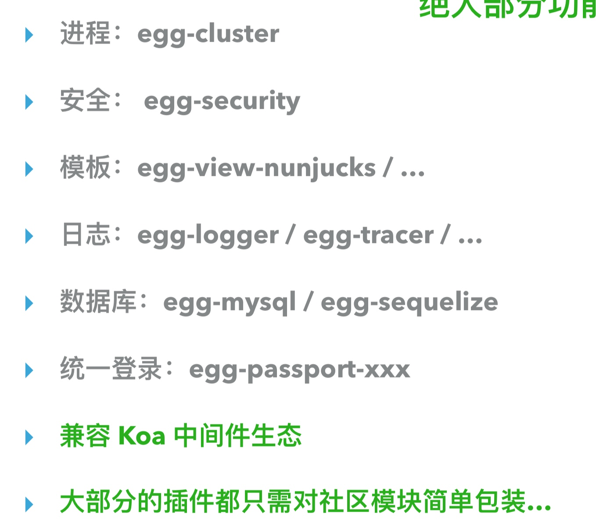

# BFF

# 
## 概念
微服务的场景下，接口过于零碎，前端组装一个页面，需要调用很多后端接口。

BFF，即 Backend For Frontend（服务于前端的后端），也就是服务器设计 API 时会考虑前端的使用，并在服务端直接进行业务逻辑的处理，又称为用户体验适配器。BFF 只是一种逻辑分层，而非一种技术，虽然 BFF 是一个新名词，但它的理念由来已久。

我们加入 BFF 层，原本每次访问发送 3 请求页面，变成一个请求。

## 实战

### 权限控制
将所有服务中的权限控制集中在 BFF 层，使下层服务更加纯粹和独立。

### Node直接调用 Java jar 包
在前端页面与后端 Java 间加入一层 Node，使 Node 直接调用 Java jar 包(hessian)，Node 层完成多端 API 接入、裁剪、格式化、聚合编排，从而控制接口数量，规范数据格式，只把用户关心的数据输出给界面，同时也方便了数据的 mock

### 聚合

### 技术要求
+ 前端和BFF由同一人完成
+ 前端需要具备服务端技能
+ BFF谁用谁开发 - 服务自治
+ 技术栈 Node Python
+ Node框架 koa

### Koa插件生态

### 好处
+ 解决问题变快
+ 业务支持变多
+ 沟通协作变少

### 坏处
+ 学习成本太高哦

> 更新: 2019-01-22 10:25:22  
> 原文: <https://www.yuque.com/u3641/dxlfpu/ibt6vi>