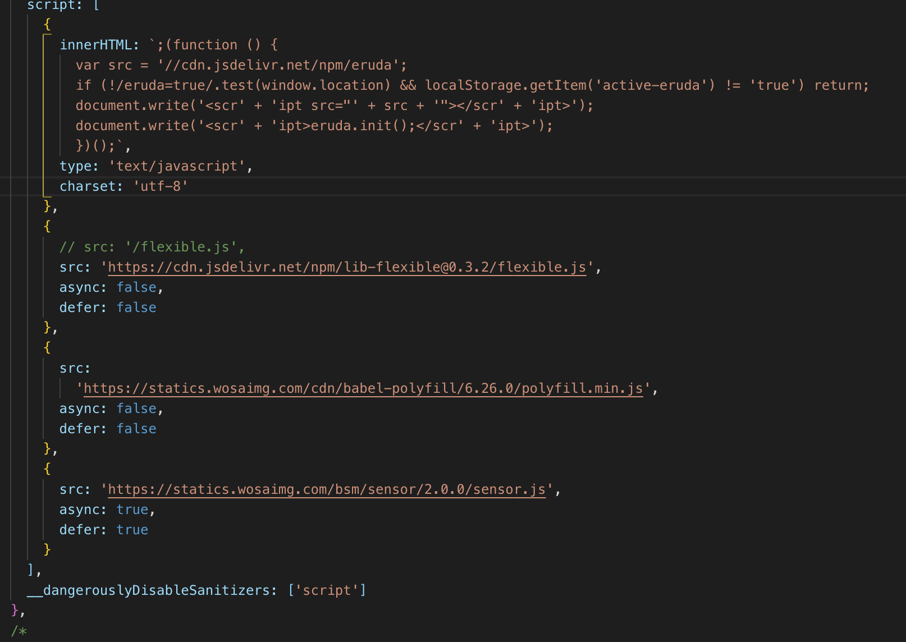
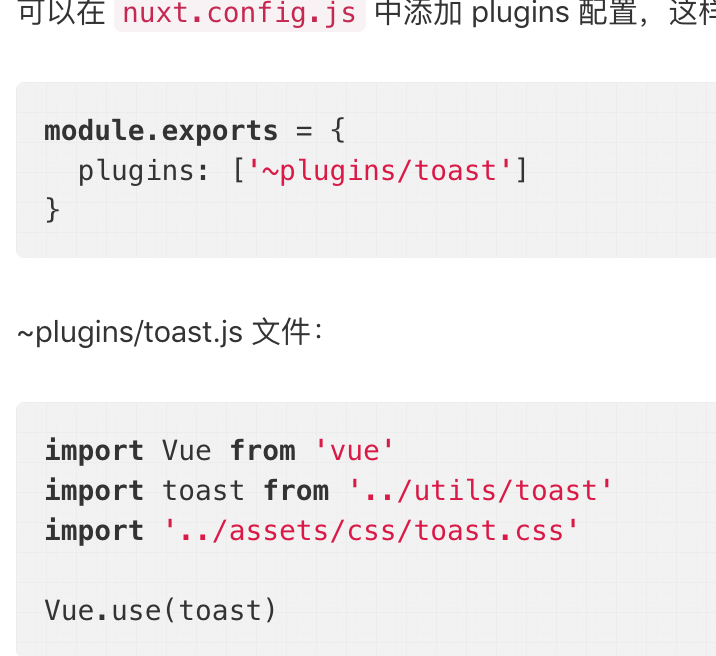
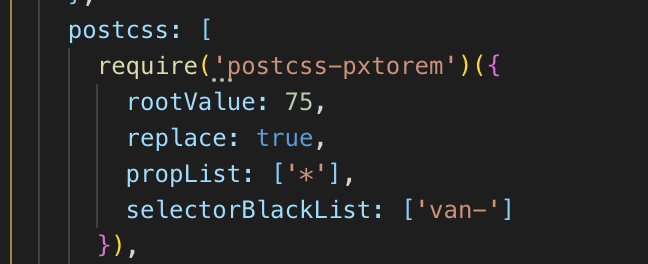
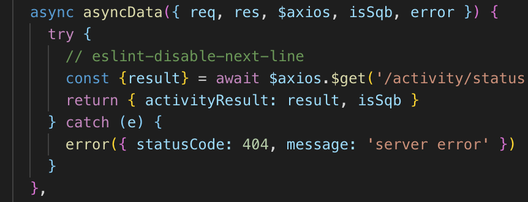
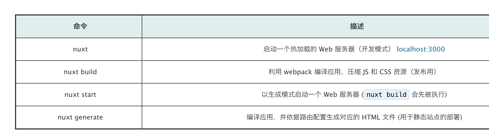

# Nuxt.js 踩坑实录

## 引言


主要的坑在于


1. 服务端的部署 Nginx的配置
2. 不同终端的适配 rem的引入

## 
## HTTP请求的域名问题


在Nuxt中，前后端共用Axios module


配置文件在nuxt.config.js 的Axios module configuration


baseURL是服务端用的Base URL

browserBaseURL是前端用的Base URL


>    baseURL: 'https://tiny-active.xx.com',
>
>    browserBaseURL: 'https://tiny-active.xx.com'
>


API_URL_BROWSER 可以复写 browserBaseURL

API_URL 可以复写 baseURL


因为在构建镜像的时候就需要写入环境变量，通过k8s写入环境变量的方式并不可取，尤其是前端多个请求域名的情况下


所以我们只能区分BUILD_ENV


在Dockerfile中要这样写 将环境变量写入


```bash
    "build:test1": "cross-env BUILD_ENV=test nuxt build",
    "build:test2": "cross-env BUILD_ENV=test2 nuxt build",
    "build:production": "cross-env BUILD_ENV=production nuxt build",
```


在nuxt.config.js中这样通过webpack写入环境变量


```plain
  env: {
    baseUrl: process.env.BASE_URL || 'http://api.test.shouqianba.com/v4'
  },
```


在前端请求的时候直接写绝对路径


## script引入


通过vue-meta


> __dangerouslyDisableSanitizers: ['script']
>

  



## link引入


通过vue-meta


```css
    link: [
      { rel: 'icon', type: 'image/x-icon', href: '/favicon.ico' },
      { rel: 'stylesheet', type: 'text/css', href: '/reset.css' }
    ],
```


## 如何添加 vue plugin
  



## autoprefixer


默认支持，配置一下.browserlistrc即可


## px转rem


在nuxt.config.js build选项中

  



## 中间件


在配置文件中修改


```json
// nuxt.config.js
router: {
  // 在每页渲染前运行 middleware/user-agent.js 中间件的逻辑
  middleware: 'user-agent'
},

//middleware/user-agent.js
import { isSqb } from '@/utils/device'
export default function(context) {
  // 给上下文对象增加 userAgent 属性（增加的属性可在 `asyncData` 和 `fetch` 方法中获取
  const userAgent = process.server
    ? context.req.headers['user-agent']
    : navigator.userAgent
  context.isSqb = isSqb(userAgent)
}


```


**上下文对象的参数可以在asyncData方法中取得**

  



## 部署


  



### package.json要这样设置


```json
"scripts": {
  "build": "npm run lint && nuxt build && npm start",
  "start": "nuxt start"
}
```


### 使用pm2做进程守护
> pm2 start npm --name "nuxt-ssr-demo" -- run bui
>


> 更新: 2020-07-13 10:23:57  
> 原文: <https://www.yuque.com/u3641/dxlfpu/bwr258>