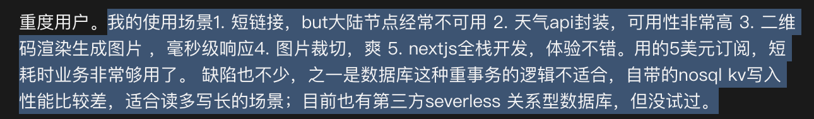

# cloudflare workers

cloudflare 的 workers 真是好东西。

一些新网站，小网站的后端逻辑直接可以用 worker 实现。

省去自己购买服务器成本。

  

Cloudflare Workers 是一个执行环境，可以让开发者在 Cloudflare 的边缘网络中运行 JavaScript 代码。

> 更新: 2023-08-04 11:07:09  
> 原文: <https://www.yuque.com/u3641/dxlfpu/owkt6n7xkt869kn6>