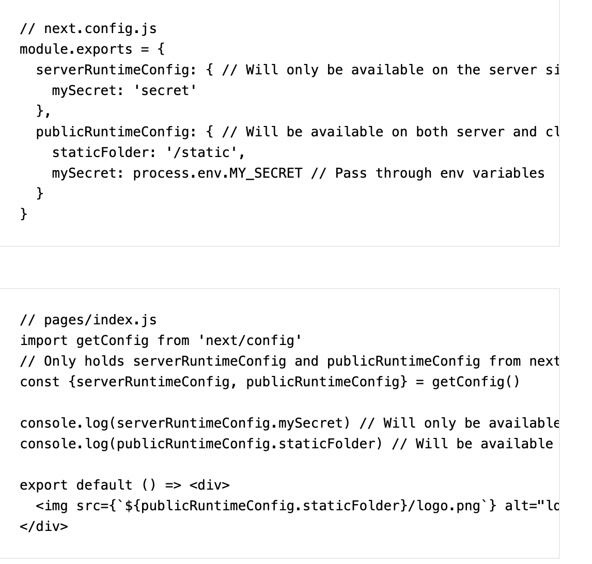
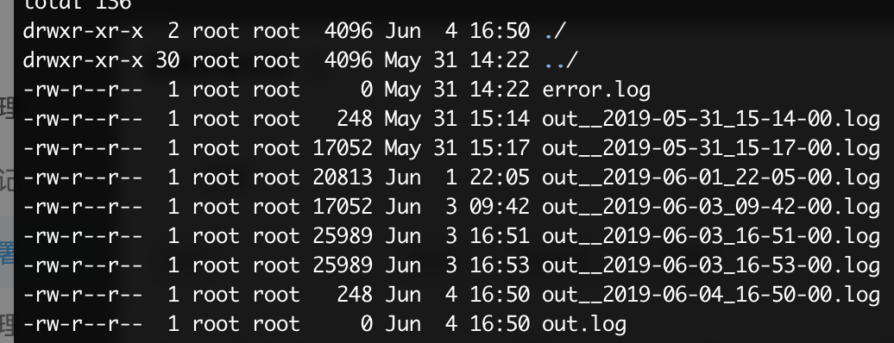

# next.js

## next.js 配置CDN


### /static目录





## next.js 引入andt-mobile 报错的问题解决办法


### 第一步 配置.babelrc 实现按需引入


```javascript
  "plugins": [
    [
      "import",
      {
        "libraryName": "antd-mobile",
        "style": "css"
      }
    ],
  ]
```


### 第二步 配置next.config.js


在module.exports之前加入下面的代码


```javascript
if (typeof require !== 'undefined') {
  // eslint-disable-next-line
  require.extensions['.css'] = (file) => {};
}
```


## pm2部署next.js遇到的坑


### 部署失败？


pm2部署next.js不成功的 今天部署成功了

**升级node版本可以解决问题**


### 日志输出


配置dockerfile


```javascript
# 设置时区
RUN ln -sf /usr/share/zoneinfo/Asia/Shanghai /etc/localtime \
    && echo Asia/Shanghai > /etc/timezone

# 日志
RUN pm2 install pm2-logrotate
RUN pm2 set pm2-logrotate:retain 7
```





## CORS
[https://vercel.com/guides/how-to-enable-cors](https://vercel.com/guides/how-to-enable-cors)


+ vercel.json
+ next.config.js
+ serverless function


```javascript
const allowCors = fn => async (req, res) => {
  res.setHeader('Access-Control-Allow-Credentials', true)
  res.setHeader('Access-Control-Allow-Origin', '*')
  // another common pattern
  // res.setHeader('Access-Control-Allow-Origin', req.headers.origin);
  res.setHeader('Access-Control-Allow-Methods', 'GET,OPTIONS,PATCH,DELETE,POST,PUT')
  res.setHeader(
    'Access-Control-Allow-Headers',
    'X-CSRF-Token, X-Requested-With, Accept, Accept-Version, Content-Length, Content-MD5, Content-Type, Date, X-Api-Version'
  )
  if (req.method === 'OPTIONS') {
    res.status(200).end()
    return
  }
  return await fn(req, res)
}

const handler = (req, res) => {
  const d = new Date()
  res.end(d.toString())
}

module.exports = allowCors(handler)

```

## 


> 更新: 2023-08-04 10:57:25  
> 原文: <https://www.yuque.com/u3641/dxlfpu/plknvq>