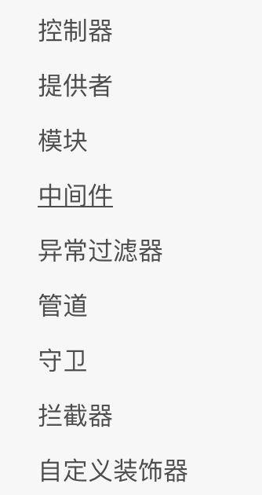
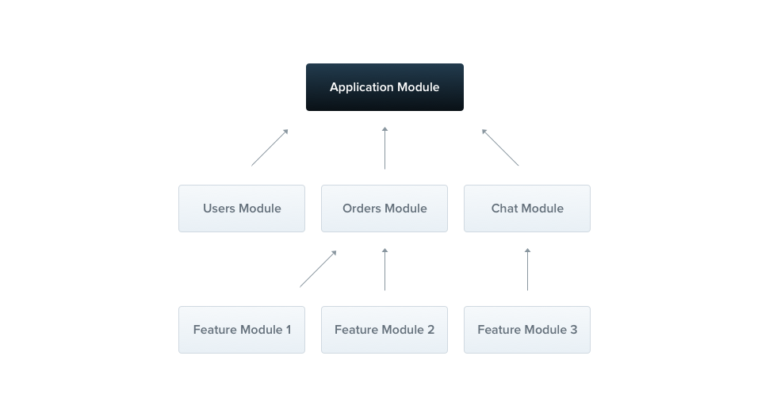
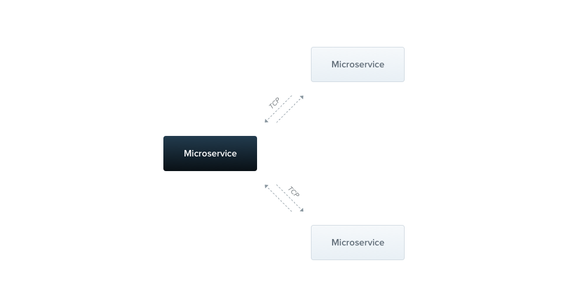
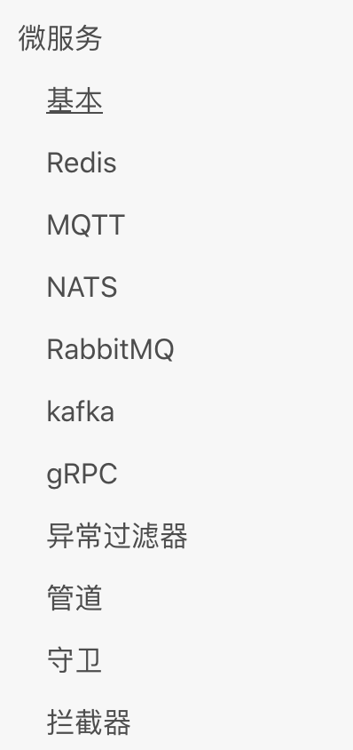
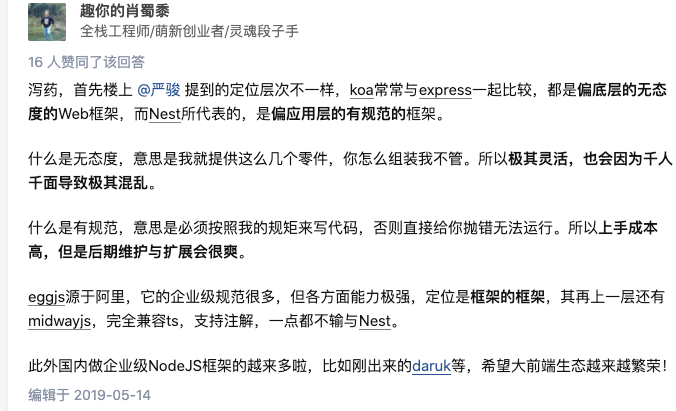

# nest.js

nestjs  midwayjs  darukjs  都是基于Ioc设计的

```typescript
import { Get, Controller, Render } from '@nestjs/common';
import { AppService } from './app.service';

@Controller()
export class AppController {
  constructor(private readonly appService: AppService) {}

  @Get()
  @Render('index')
  render() {
    const message = this.appService.getHello();
    return { message };
  }
}

```

# 概念

如依赖项注入、装饰器、异常过滤器、管道、保护和拦截器



## Controller

Handlers 处理程序/端点

装饰器和普通对象

| `@Request()` | `req` |
| --- | --- |
| `@Response() @Res()*` | `res` |
| `@Next()` | `next` |
| `@Session()` | `req.session` |
| `@Param(key?: string)` | `req.params`<br/> / <br/>`req.params[key]` |
| `@Body(key?: string)` | `req.body`<br/> / <br/>`req.body[key]` |
| `@Query(key?: string)` | `req.query`<br/> / <br/>`req.query[key]` |
| `@Headers(name?: string)` | `req.headers`<br/> / <br/>`req.headers[name]` |
| `@Ip()` | `req.ip` |

DTO(数据传输对象)模式。DTO是一个对象，它定义了如何通过网络发送数据。

## Provider

 Provider 只是一个用 @Injectable() 装饰器注释的类

许多基本的 Nest 类可能被视为 provider - service, repository, factory, helper 等等。 他们都可以通过 constructor 注入依赖关系

**<font style="color:#F5222D;">依赖注入(DI)</font>**

## Module



## Middleware

\*\*中间件是在路由处理程序 之前 调用的函数。 \*\*


中间件函数可以执行以下任务:

* 执行任何代码。
* 对请求和响应对象进行更改。
* 结束请求-响应周期。
* 调用堆栈中的下一个中间件函数。
* 如果当前的中间件函数没有结束请求-响应周期, 它必须调用 `next()` 将控制传递给下一个中间件函数。否则, 请求将被挂起。

## Exception filters

## Pipes

## Guards

## Interceptors

<font style="background-color:#FDFDFD;">拦截器</font>

## decorator

装饰器

## IoC

DI

# 技术

## 配置

## 缓存

## 验证

## 消息队列

Nest 提供了@nestjs/bull包，这是Bull包的一个包装器，Bull 是一个流行的、支持良好的、高性能的基于 Nodejs 的消息队列系统应用。该包将 Bull 队列以 Nest 友好的方式添加到你的应用中。

## MVC

## 序列化

## 日志

## 文件上传

## 定时任务

## SQL(TypeORM)

TypeORM 无疑是 node.js 世界中最成熟的对象关系映射器（ORM ）。由于它是用 TypeScript 编写的，所以它在 Nest 框架下运行得非常好。

```java
import { Entity, PrimaryGeneratedColumn, Column } from 'typeorm';

@Entity()
export default class Movie {

  @PrimaryGeneratedColumn('uuid')
  id: string;

  @Column({ unique: true })
  name: string;

  @Column({ type: 'int', nullable: true, width: 4 })
  releaseYear: number;

  @Column({ type: 'int', nullable: true })
  rating: number;

}
```

## Mongoose

## SQL (Sequelize)

## CRUD生成器

## OpenAPI (Swagger)

# 安全

## Authentication

* JWT

## Authorization 授权

* Basic RBAC implementation
* Integrating CASL

## Encryption and Hashing

**加密**

```java
import { createCipheriv, randomBytes } from 'crypto';
import { promisify } from 'util';

const iv = randomBytes(16);
const password = 'Password used to generate key';

// The key length is dependent on the algorithm.
// In this case for aes256, it is 32 bytes.
const key = (await promisify(scrypt)(password, 'salt', 32)) as Buffer;
const cipher = createCipheriv('aes-256-ctr', key, iv);

const textToEncrypt = 'Nest';
const encryptedText = Buffer.concat([
  cipher.update(textToEncrypt),
  cipher.final(),
]);
```

**哈希**

```java
import * as bcrypt from 'bcrypt';

const saltOrRounds = 10;
const password = 'random_password';
const hash = await bcrypt.hash(password, saltOrRounds);
```

## CORS

## CSRF Protection

## Rate limiting

# FAQ

# 微服务

默认情况下，微服务通过 TCP协议 监听消息。



优势

* Built-in support for microservices & transport layers like TCP, gRPC, MQTT, RabbitMQ



## Redis

## MQTT

## RabbitMQ

## gRPC

# 对比

## 和 koa 对比

<https://www.zhihu.com/question/323525252/answer/690250788>



## midway

<https://github.com/midwayjs/midway/blob/serverless/README.zh-cn.md>

> Midway Serverless 是一个用于构建 Node.js 云函数的 Serverless 框架，可以帮您在云原生时代更专注于产品开发，降低维护成本。

## spring boot 对比

<https://medium.com/better-programming/node-js-vs-spring-boot-which-should-you-choose-2366c2f76587>

# 文档

<https://docs.nestjs.com/>

[https://docs.nestjs.cn](https://docs.nestjs.cn/7/faq?id=%e6%b7%b7%e5%90%88%e5%ba%94%e7%94%a8)


> 更新: 2023-08-02 10:23:44  
> 原文: <https://www.yuque.com/u3641/dxlfpu/cvwe17>