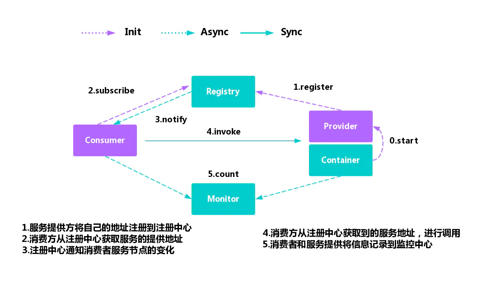

# node 调用 dubbo

# dubbo 做了什么
Dubbo是一款高性能、轻量级的开源Java RPC框架，它提供了三大核心能力：面向接口的远程方法调用，智能容错和负载均衡

服务方 provider

消费方 consumer

Registry 注册中心

[https://juejin.cn/post/6844903805008478215](https://juejin.cn/post/6844903805008478215)

# dubbo-js

[https://github.com/apache/dubbo-js](https://github.com/apache/dubbo-js)

> 更新: 2021-07-04 23:16:24  
> 原文: <https://www.yuque.com/u3641/dxlfpu/mbuagg>