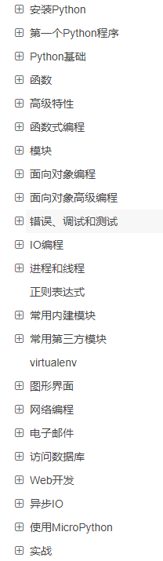
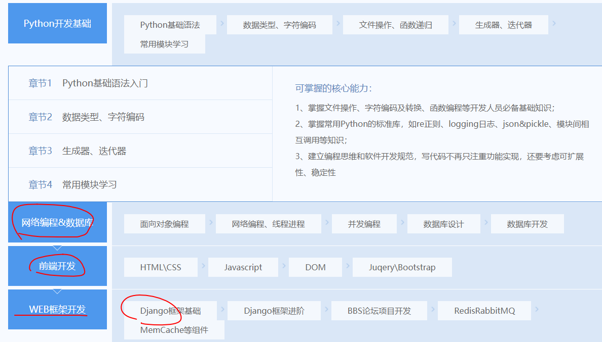
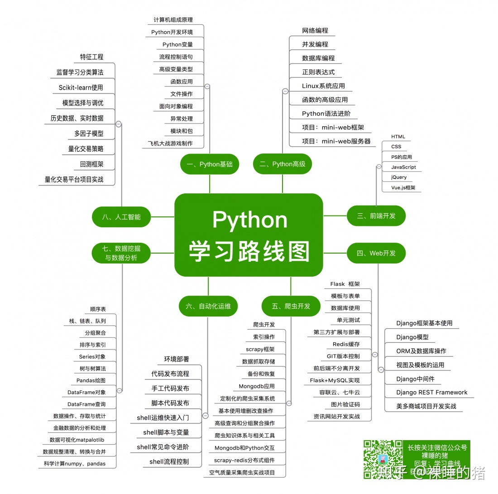

# python

# 怎么学？

刚开始学习简单的语法、然后就可以学习 Django 做 Web 了。

至于别的像爬虫、AI、运维 都是行业应用，

教程方面，可以看廖雪峰的一个教程，是 Python 3.x 的教程

**总结一下**

+ Python 基础
    - 变量、数据类型、运算符等等
    - 特殊的，可以和 JS 对比，比如 Map 和 Array
+ OO
+ 错误处理
+ 文件、JSON 读写
+ 模块
+ 网络
    - TCP
    - HTTP
+ 构建
+ 异步
+ 框架
    - 模板引擎
    - MVC
    - 连接数据库

# 关于学习路线
找了一个培训机构的学习路线

> 更新: 2021-02-02 21:44:48  
> 原文: <https://www.yuque.com/u3641/dxlfpu/zis68d>