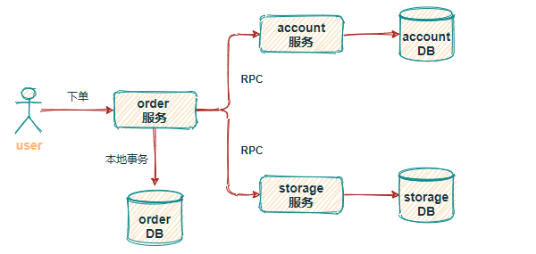

# 分布式事务

[https://www.cnblogs.com/chengxy-nds/p/14046856.html](https://www.cnblogs.com/chengxy-nds/p/14046856.html)

[https://xiaomi-info.github.io/2020/01/02/distributed-transaction/](https://xiaomi-info.github.io/2020/01/02/distributed-transaction/)

[https://zhuanlan.zhihu.com/p/183753774](https://zhuanlan.zhihu.com/p/183753774)

[蚂蚁分布式事务管理](https://tech.antfin.com/docs/2/46887)

# 事务

事务应该具有 4 个属性：原子性、一致性、隔离性、持久性。这四个属性通常称为 ACID 特性。

> 事务是应用程序中一系列严密的操作，所有操作必须成功完成，否则在每个操作中所作的所有更改都会被撤消。也就是事务具有原子性，一个事务中的一系列的操作要么全部成功，要么一个都不做。
>

# CAP

CAP 原则

> CAP 原则又称 CAP 定理，指的是在一个分布式系统中， Consistency（一致性）、 Availability（可用性）、Partition tolerance（分区容错性），三者不可得兼。
>

CAP 原则的精髓就是要么 AP，要么 CP，要么 AC，但是不存在 CAP。

单体架构到分库分表

> 可随着业务量的不断增长，单体架构渐渐扛不住巨大的流量，此时就需要对数据库、表做 分库分表处理，将应用 SOA 服务化拆分。也就产生了订单中心、用户中心、库存中心等，由此带来的问题就是业务间相互隔离，每个业务都维护着自己的数据库，数据的交换只能进行 RPC 调用。
>
> 
>

实现分布式事务的方案比较多，常见的比如基于 XA 协议的 2PC、3PC，基于业务层的 TCC，还有应用消息队列 + 消息表实现的最终一致性方案

# 分布式事务的解决方案
## 两阶段提交/XA

两阶段提交，顾名思义就是要分两步提交。存在一个负责协调各个本地资源管理器的事务管理器，本地资源管理器一般是由数据库实现，事务管理器在第一阶段的时候询问各个资源管理器是否都就绪？如果收到每个资源的回复都是 yes，则在第二阶段提交事务，如果其中任意一个资源的回复是 no, 则回滚事务。

存在问题：

1. 单点故障
2. 

## TCC

# 2PC 3PC

# TCC
# 最终一致性方案
# Seata

Seata 也是从两段提交演变而来的一种分布式事务解决方案，提供了 AT、TCC、SAGA 和 XA 等事务模式，这里重点介绍 AT模式。

> 更新: 2021-07-16 13:54:37  
> 原文: <https://www.yuque.com/u3641/dxlfpu/mq3ug7>