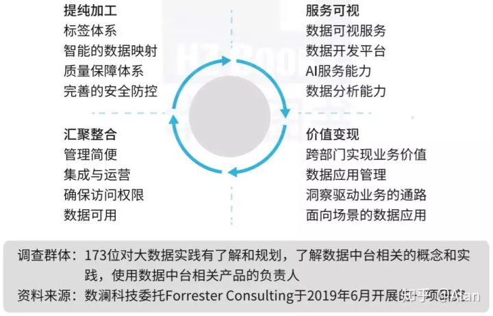
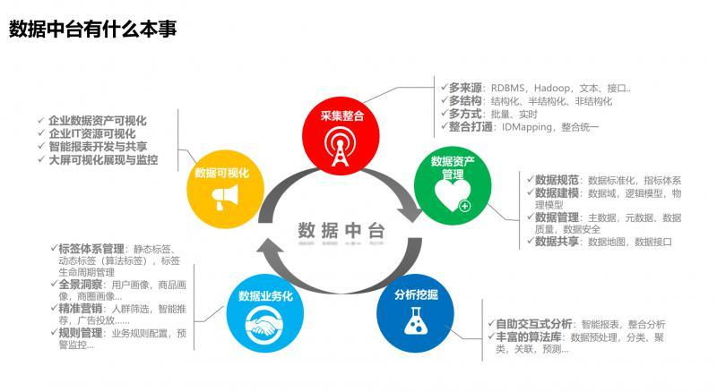

# 数据中台

前台、后台、中台

数据中台

企业数据中台

技术中台、业务中台还是组织中台

> **以用户为中心的持续规模化创新**，是中台建设的核心目标
>

根本上是为了解决企业响应⼒困境， 弥补创新驱动快速变化的前台和稳定可靠驱动变化周期相对较慢的后台之间的⽭盾，提供⼀个中间层来适配前台与后台的配速问题，沉淀能⼒

# 数据中台

> 数据中台是把业务生产资料转变为数据生产力，同时数据生产力反哺业务，不断迭代循环的闭环过程——数据驱动决策、运营
>

## 数据中台的能力

> 更新: 2021-05-04 11:44:26  
> 原文: <https://www.yuque.com/u3641/dxlfpu/dr4s7w>