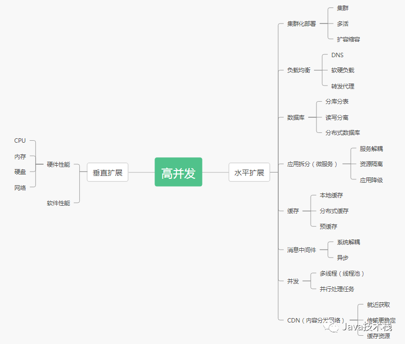

# 性能指标

# 并发
**qps**

QPS即每秒查询率,是对一个特定的查询服务器在规定时间内所处理流量多少的衡量标准

tps

每秒响应事务请求数

**响应时间**：系统对请求做出响应的时间。

**吞吐量**：单位时间内处理的请求数量。

**QPS**：每秒响应查询请求数。

**TPS**：每秒响应事务请求数。

**并发用户数**：同时承载正常使用系统功能的用户数量。

# 机器：
cpu

mem

disk

# 页面：
pv

uv

# 参考
[如何进行容量设计之并发量](http://www.stelin.me/2017/06/01/%E5%A6%82%E4%BD%95%E8%BF%9B%E8%A1%8C%E5%AE%B9%E9%87%8F%E8%AE%BE%E8%AE%A1%E4%B9%8B%E5%B9%B6%E5%8F%91%E9%87%8F)

> 更新: 2021-04-23 13:37:59  
> 原文: <https://www.yuque.com/u3641/dxlfpu/mmmep3>