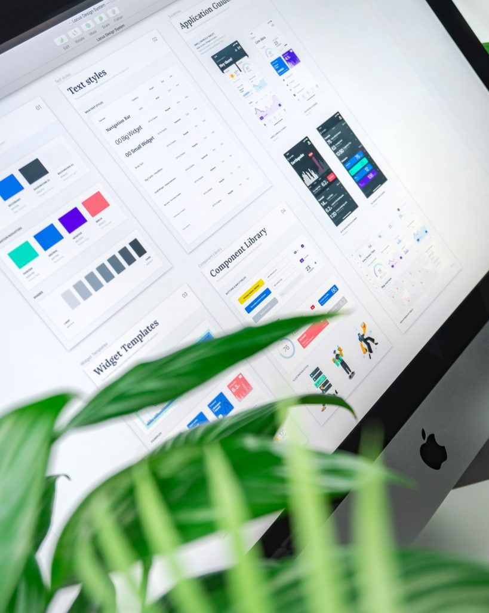

# Design System

[Design Systems vs Pattern Libraries vs Style Guides vs Component Libraries](https://www.uxpin.com/studio/blog/design-systems-vs-pattern-libraries-vs-style-guides-whats-difference/)

颜色，排版，插图，声音，图标，状态，间距

# shopify 北极星
[https://polaris.shopify.com/whats-new](https://polaris.shopify.com/whats-new)

[https://github.com/Shopify/polaris](https://github.com/Shopify/polaris)

# IBM Carbon
[https://carbondesignsystem.com/components/accordion/usage/](https://carbondesignsystem.com/components/accordion/usage/)

# Google Matiral

# Auro 阿拉斯加航空
[https://auro.alaskaair.com/#gsc.tab=0](https://auro.alaskaair.com/#gsc.tab=0)

# Terminology

# Design Language
+ Brand
+ Logo

# Design Token
+ Color
+ Layout
+ Icongraphy
+ Typography

# Core Components
+ Avatar
+ ...

> 更新: 2023-08-16 17:29:43  
> 原文: <https://www.yuque.com/u3641/dxlfpu/mb4zg7qoc1iingqt>